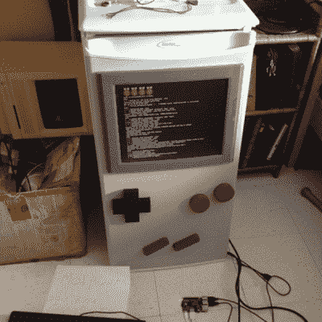

# 迷你冰箱变身 Gameboy 把热门游戏放在冰上

> 原文：<https://hackaday.com/2015/09/03/mini-fridge-turned-gameboy-puts-hot-games-on-ice/>

普通的老式白色迷你冰箱是许多宿舍的主食，可以用一点装饰。一些新奇的贴纸与经典 gameboy 的相似之处并不难想象，但[ModPurist]对他的冷男孩做了额外的努力。

[把一个迷你冰箱变成一个可玩的游戏机](http://modpurist.weebly.com/mod-purist---blog/game-boy-fridge-the-cold-boy)需要拆开冰箱门，一次一个树莓 Pi 2 和一个二手的“方形屏幕”液晶显示器被放进去。门的正面被切割成一些定制的木制按钮，这些按钮与触觉开关相连。一旦所有的东西都装好了，门就重新组装好了，这样冰箱就可以继续正常工作，保持汽水和热狗的新鲜和低温。[ModPurist]在他的工作日志中报道了黑客攻击的进展。

虽然它离地面有点低，但它应该会在大学派对上大受欢迎，在那里躺在地板上并不罕见。休息之后，请加入我们观看演示视频，开始游戏。当然，它遗漏了一件事。在输入 Konami 密码之前，里面需要有某种类型的闩锁来保护饮料。

 [https://www.youtube.com/embed/OCcJpVaLX3s?version=3&rel=1&showsearch=0&showinfo=1&iv_load_policy=1&fs=1&hl=en-US&autohide=2&wmode=transparent](https://www.youtube.com/embed/OCcJpVaLX3s?version=3&rel=1&showsearch=0&showinfo=1&iv_load_policy=1&fs=1&hl=en-US&autohide=2&wmode=transparent)

