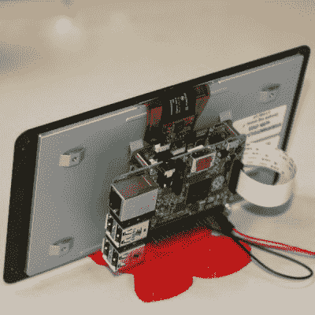

# 最后，树莓派的官方展示

> 原文：<https://hackaday.com/2015/09/08/finally-an-official-display-for-the-raspberry-pi/>

是的，终于，在多年的工作和无数人在论坛上抱怨之后，[树莓派终于有了一个正式的官方展示。](https://www.raspberrypi.org/blog/the-eagerly-awaited-raspberry-pi-display/)

这是一款 7 英寸显示屏，800 x 480 像素分辨率，24 位彩色，10 点多点触摸。显示器的驱动程序已经可以通过简单的调用`sudo apt-get update`获得，显示器本身可以在[纽瓦克](http://www.newark.com/raspberry-pi/raspberrypi-display/raspberry-pi-7inch-touchscreen/dp/49Y1712)、 [Pi 商店](http://swag.raspberrypi.org/products/raspberry-pi-7-inch-touchscreen-display)(已售罄)和 [Element14](http://www.element14.com/community/docs/DOC-78156) 获得。甚至还有[一个箱子](http://www.newark.com/multicomp/cbrpp-ts-blk-wht/raspberrypi-touchscreen-case-blk/dp/55Y8475?MER=ACC_N_L5_SemiconductorsToolsAndAccessories_None)和[一个支架](http://www.thingiverse.com/thing:995394)可以送到 3D 打印机。

至于为什么树莓 Pi 基金会花了这么长时间才推出 Pi 的官方展示，这个答案应该不会让任何工程师感到惊讶。是 EMC，或者电磁兼容。PI 的 DPI(显示并行接口)出现在扩展头上，由 [GertVGA 适配器](https://www.raspberrypi.org/blog/gert-vga-adapter/)使用，允许任何 Pi 以 1920 x 1024，60FPS 驱动*两个*显示器。这种 DPI 接口是一个电气噩梦，无论走到哪里都会产生射频干扰。

新的显示器可以使用 DSI(显示器串行接口)适配器，或者 Pi 上的小连接器，即*而不是*相机连接器。不过，DSI 显示器是为特定设备专门打造的，不会也不应该用于未来几年才会生产的设备。最佳解决方案，也是 Raspberry Pi 基金会选择采用的设计，是一个 DPI 显示器和一个适配器，该适配器将 Pi 的 DSI 输出转换为显示器可以理解的内容。

Pi 基金会最终确定的解决方案是一个适配器板，它将 DSI 总线转换成 DPI 信号。这当然需要一个额外的 PCB，并且基础提供安装孔，以便 Pi 可以直接连接到它。

虽然这是第一台使用 DSI 接口的显示器，但肯定不会是最后一台。Pi 基金会为我们提供了一种使用 DSI 连接器驱动廉价 DPI 显示器的方法。虽然官方显示器的 800×480 分辨率可能有点小，但无疑会有一些铁杆修补者将这种适配器板用于更大的显示器。

[Alex Eames]几周前接触了 Pi 显示器，您可以查看下面他的介绍视频。

 [https://www.youtube.com/embed/hqdz66Y-H7M?version=3&rel=1&showsearch=0&showinfo=1&iv_load_policy=1&fs=1&hl=en-US&autohide=2&wmode=transparent](https://www.youtube.com/embed/hqdz66Y-H7M?version=3&rel=1&showsearch=0&showinfo=1&iv_load_policy=1&fs=1&hl=en-US&autohide=2&wmode=transparent)

