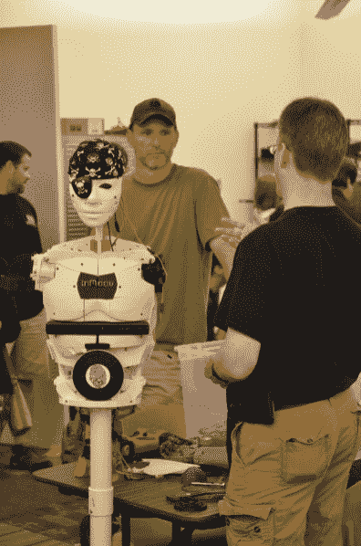
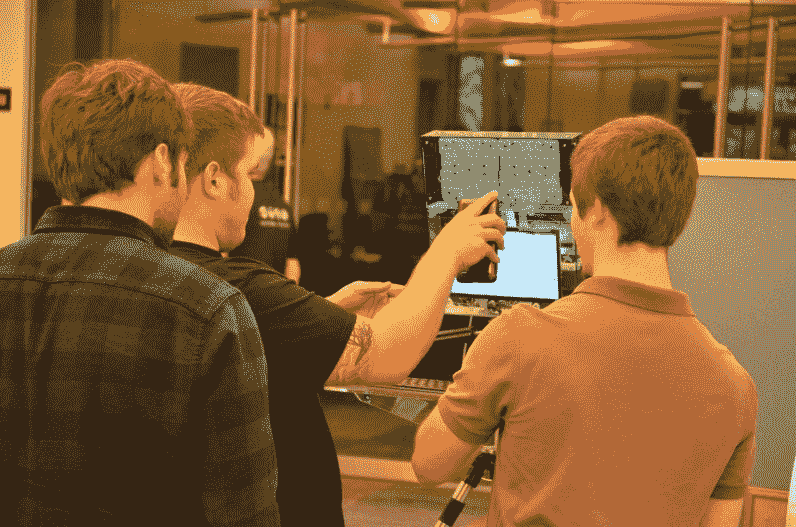

# Hackaday 的 DC 聚会和研讨会

> 原文：<https://hackaday.com/2015/09/14/hackadays-dc-meetup-and-workshops/>

华盛顿 DC 有一个充满活力的硬件黑客社区，它是在周六晚上生效的。在弗吉尼亚州雷斯顿(DC 市区)的 Nova 实验室，我们接待了 100 多人。这个时尚宽敞的黑客空间为黑客日聚会敞开了大门，这是一个充满活动的周末的一部分。

  Blinky hats  RPi powered Teletype machine  LED marquee cube  Wyolum reaction time game

Nova Labs 不久前搬进的大楼是一个非常适合黑客空间的地方。建筑的前半部分包括一个巨大的开放空间，有足够的空间让人们设置他们想要炫耀的硬件。后面有一个完整的木工车间、机械车间等，中间有教室和会议室。

上面是[ [ArsenioDev](https://hackaday.io/ArsenioDev) ]随身携带的一套帽子，上面缠绕着可寻址的 LED 灯串。 [Wyolum](http://wyolum.com/) 团队的几名成员参与了 Nova Labs，他们展示了一些基于 LED 矩阵的项目，如 marquee cube 和 3 人反应时间游戏。整夜咔哒咔哒响着的是一台老式电传打字机，[鲍勃·科格肖尔]修好了它，并把它连到了树莓派上。

  AWS connected kegerator  InMoov robot build  Photobooth

有比萨饼和啤酒供大家享用。这个 kegerator 刚刚配备了一个 ESP8266 模块，该模块使用 [Amazon SNS](https://aws.amazon.com/sns/) 来报告每次水龙头被拉动的情况。背后的平板电脑正在显示这些事件的实时数据。

上个月[我们在波士顿](http://hackaday.com/2015/07/27/the-best-of-boston-hackers-at-artisans-asylum/)时，有人带来了一个 InMoov 机器人，这里有一个不同的。我并不经常遇到这些，但连续两次让我想再看一眼[这个项目](http://www.inmoov.fr/)。

还有一个独立的照相亭，但是是亭式的。它包括点亮不同颜色的 LED 面板，以拍摄一组[安迪·沃霍尔]风格的彩色肖像。

 [![[cnlohr] demonstrating ESP8266 DSP build](img/604633d4246d77267d1927b886e88257.png "DSC_0251")](https://hackaday.com/2015/09/14/hackadays-dc-meetup-and-workshops/dsc_0251-2/) [cnlohr] demonstrating ESP8266 DSP build  Packed house for the lightning talks

由于与 Hackaday 的旅行，我很幸运地遇到了世界上一些我最喜欢的黑客。很高兴见到[查尔斯·洛尔]，你可能知道他的别名[cnlohr]。他是在自己虚构的玻璃滑动印刷电路板上建造《我的世界》服务器的人。最近他用 ESP8266 杀了它，包括他为 Hackaday 写的[裸机编程指南。上图中你可以看到他在展示他添加到](http://hackaday.com/2015/03/18/how-to-directly-program-an-inexpensive-esp8266-wifi-module/) [ColorChord](https://github.com/cnlohr/colorchord) 项目中的功能。在这种情况下，它是一个在驻极体麦克风输入上执行 DSP 的 ESP8266。它驱动 WS2812 条带，通过 WiFi 在他的手机上绘制波形，以实现出色的可视化。你知道…只是简单的东西。

手头还有 Hackaday.io celeb [ArsenioDev]，上面提到过他的 blinky 帽子。不过，他展示了一些更重要的东西，一个火箭主动控制系统。他的反馈回路将 IMU 与火箭鳍的四个伺服系统配对，进展非常顺利。他的下一次测试将是驾驶一辆汽车在当地机场的跑道上行驶(经过许可)，同时将火箭安装在一根棍子上进行测试。不幸的是，这些工作中的一些是 [ITAR](https://en.wikipedia.org/wiki/International_Traffic_in_Arms_Regulations) 受限制的，所以他能发表的关于这个项目的内容是有限的。

还有很多其他有趣和著名的黑客，比如 Stickvise 的 Alex Rich。你必须参加其中的一个活动，才能理解当我们能够聚在一起度过一个愉快的夜晚时，Hackaday 社区是多么的棒！

### 研讨会

 [![[Anool] Shows the steps to get from concept to board fabrication](img/890bd4b46da654185b785dc92b1ff978.png "IMG_20150912_102202")](https://hackaday.com/2015/09/14/hackadays-dc-meetup-and-workshops/img_20150912_102202/) [Anool] Shows the steps to get from concept to board fabrication  A render of my finished design

本周末由[Anool Mahidharia]举办的为期 3 天的 KiCAD 研讨会成为亮点。我很幸运能坐在里面，那真是太壮观了。我使用 KiCAD 已经很多年了，并根据我的设计制作了电路板，但是[Anool]精通 PCB 设计和 KiCAD 本身。

周五下午和周六上午，他带领每个人通过一个基于一对线性调节器的演示电路。他是一位出色的老师，并提供了几个问题来说明 KiCAD 的各个方面。例如，他在设计中使用了一个桶形插孔，它有一个椭圆形的通孔，这是 OSH Park 的 fab 工艺所不支持的。通过这种方式，他能够谈论如何改变足迹，这是立即适用的。

周末剩下的时间里，每个参与者都在做自己的电路和布局。我很高兴地说，每个人都设法在周日结束前将设计送去制作！我匆忙构思的设计(我没有提前计划我想做什么)的渲染见上图。

如果你错过了周六的帖子，你会想点击阅读【鲍勃】在周五和周六举办的几次表面贴装焊接研讨会。

### 许多人要感谢

感谢[Bob Coggeshall]和所有 Nova 实验室成员。他们向我们敞开大门，并确保这个地方挤满了人，并帮助活动顺利进行。

早在其他黑客想到这里之前，我就计划好了这个工作室。感谢您让我们一起分享乐趣，感谢您让开放硬件成为您和 Wyolum 工作的重要组成部分！

非常感谢[[Andrew Albosta](http://www.andbosta.com/)]为这次聚会拍摄了所有照片。他在博客上写了很多很酷的作品，包括几个非常酷的碳纤维物品，如[酒瓶架](http://www.andbosta.com/carbon-fiber-wine-bottle-holder-composites-101-class-build/)，这是 Nova 实验室复合材料课程的一部分。

当然，感谢 Hackaday 奖赞助商 Atmel，Freescale，Microchip，Mouser 和德州仪器，感谢 Hackaday 的母公司 Supplyframe 使 Hackaday 现场活动和教育机会成为可能。