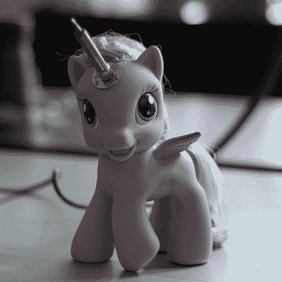

# 超高的 Hackerspace 捐款箱激发了你的热情

> 原文：<https://hackaday.com/2015/09/17/over-the-top-hackerspace-donation-box-brings-out-the-brony-in-you/>

 

“你绝对不会相信这是怎么发生的，医生。”[来源:[CRASH Space](http://blog.crashspace.org/)】

如果你打算向你的黑客空间募捐，你不妨增加价值主张，给潜在的捐赠者一点东西以回报他们的慷慨。还有什么比用一个[我的小马主题的美元钞票漩涡盒](http://tinwhiskers.net/the-crash-space-super-ultra-my-little-pony-donation-box/)来引导你的捐助者内心的 Brony 更好的赚钱方式呢？

厌倦了她的 hackerspace 用作捐赠罐的无聊 cheezy-噗罐，not-a-Brony [Michelle]受到左图所示的 [CRASH Space](http://blog.crashspace.org/) 吉祥物 Sparkles 的启发，建造了一个新的盒子，通过为捐赠者提供多媒体盛会来最大限度地增加捐赠。树脂玻璃盒子上装饰着激光切割的丙烯酸心形图案，上面闪耀着我的小马贴纸，盒子上装有一个传感器，这样捐款就可以触发 MLP 主题曲的 MP3 播放。一个滚动的 LED 字幕闪烁着亲切的感谢信息，为了完成这一体验，一对粉丝在垃圾桶里创造了一个厚厚的现金堆龙卷风。

在你的捐款箱里放一点紫悦有很好的财务意义，就像鼓励你存钞票而不是硬币一样。这个项目让我们想起了我们最近发布的一个关于定制爪机的帖子，它可以作为一个增值捐款箱——只需添加一个投币口。和彩虹。

[https://player.vimeo.com/video/139133036](https://player.vimeo.com/video/139133036)

[谢谢你的提示，萨姆卡姆卡]