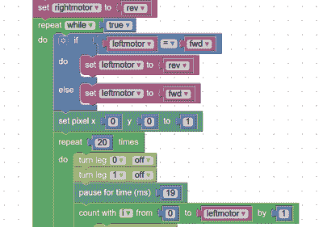

# 我的机器人里有一只虫子

> 原文：<https://hackaday.com/2015/09/17/theres-a-bug-in-my-robot/>

什么东西有六条腿，25 个发光二极管，一个微芯片中央处理器，可以缝在衣服上，甚至插在树莓馅饼上？事实证明，答案是 code bug——一种面向教育市场的低成本计算机主板。这些板是众筹，现在可以购买。[Mike Redrobe]拿了一块电路板，连接了几个伺服系统，[使用 CodeBug 的类似 Scratch 的语言创造了一个小机器人](http://www.codebug.co.uk/explore/codebug/742/code-buggy-servo-rover/)。

你可以在下面的视频中看到这个机器人。通过 USB 下载程序(该板看起来像一个 USB 驱动器)。您也可以通过 USB 发送命令，在系绳模式下工作，或者您可以直接将电路板插入 Raspberry Pi。

 一个有趣的特点是网站开发环境。除了为共享和分叉项目提供一个存储库之外，它还允许对一个程序进行实时仿真，这样你就可以在网页上的一个代码 Bug 的小图形上看到你的代码将会做什么。我们喜欢的另一件事是以块的形式查看代码的能力(就像右边的图片)或者以传统代码的形式查看。

伺服机器人并不是什么新东西(即使是那些[使用单一伺服](http://hackaday.com/2009/10/30/single-servo-robot/)和[机器蛇](http://hackaday.com/2007/04/20/sicksack-atmega-servo-snake-robot/))。然而，对于这些小而便宜的主板来说，这是“hello world”程序的一个很好的替代方案。

 [https://www.youtube.com/embed/-UxDK3HH7Ug?version=3&rel=1&showsearch=0&showinfo=1&iv_load_policy=1&fs=1&hl=en-US&autohide=2&wmode=transparent](https://www.youtube.com/embed/-UxDK3HH7Ug?version=3&rel=1&showsearch=0&showinfo=1&iv_load_policy=1&fs=1&hl=en-US&autohide=2&wmode=transparent)

