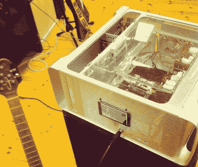

# hack let 75–吉他项目

> 原文：<https://hackaday.com/2015/09/18/hacklet-75-guitar-projects/>

有些事情就是形影不离。黑客和吉他是一个完美的例子。大量的黑客、制作者和工程师至少都涉猎过吉他。连不玩的都听过任性吉他手的绝唱“老弟，你修功放？”。说真的，一旦你弹吉他的朋友发现你在摆弄电子产品，你就永远不会想吃披萨或啤酒了。本周的 Hacklet 是关于 [Hackaday.io](https://hackaday.io) 上一些最好的吉他项目！

 我们从【FiveseveN】和[赛博保罗](https://hackaday.io/project/552)开始，他的定制吉他。赛博保罗开始作为一个共产主义集团时代的莱斯·保罗风格吉他。当然不是真正的莱斯·保罗，这是多年来制造的许多仿制品之一。这把吉他最初的形状很糟糕，但是[FiveseveN]把它拆了下来，重新制作了它，并把它重新建成了一个全新的东西。赛博保罗的完成也许最好被称为技术朋克，银色的油漆工作和到处都是设备。像这样的修补工作可能会出错，就像我们在一些蒸汽朋克作品中看到的那样。[FiveseveN]成功了。

 接下来是【伊莱亚斯·巴肯】和[放大](https://hackaday.io/project/3860)。[Elias]用一个漂亮的铝制 Macintosh G5 外壳做了一个吉他放大器。主放大器是两个 45 瓦的 B 类放大器模块。然而，他并没有止步于放大器。[Elias]添加了一个运行 Linux 的 Arduino Tre。Tre 在其最基本的模式下可以运行音频频谱分析仪。光谱显示在安装在放大器前面的 4.3 英寸 LCD 上。【Elias】还打算加 [Pedalboard.js](http://dashersw.github.io/pedalboard.js/) 给自己一个实时效果库。Linux 的 Jack audio 框架应该允许一个低延迟效果处理器——本质上是一个盒子里的整个踏板。最终的放大器看起来很棒，用那些旧的学校电源板，我们确信它听起来也很棒。

【Andybrownri】需要一把贝斯上路。他走进他的车间，结果是[机翼](https://hackaday.io/project/63-the-wing-travel-bass)。用[安迪]自己的话来说，机翼“正好是 33 英寸低音吉他的一半”。翅膀只有 20 英寸长，与其说是脖子，不如说是身体。弹奏它的感觉很像弹奏第 12 品以上的普通低音。音高移位电路将频率降低一个八度。[安迪]已经在做他的第二个机翼原型，结果看起来令人难以置信。红木指板在红木琴身的衬托下看起来真的很棒。[安迪]已经在计划升级，比如 MIDI 拾音器和内置耳机放大器，以便在酒店房间播放。

 最后，我们得到了【马修·柯克】与[吉他钻机 5 DIY 脚踏板控制器](https://hackaday.io/project/1989)。[马修的]爸爸最近拿起了电吉他。如果你在过去十年左右没有玩过，那你真的错过了。像吉他装备这样的软件已经取代了架子上的效果设备或装满踏板的板子。唯一困难的部分是控制软件。在个人电脑上，这是一个简单的点击界面。不过在平板电脑上，触摸屏让事情变得有点困难。感谢键盘快捷键！[Matthew]使用 Arduino 微处理器创建了一个 HID 键盘接口。4 个按钮允许[马修的]爸爸停止 12 个预设中的任何一个。指示灯显示当前补丁。

如果你想看到更多的吉他、放大器、踏板和效果处理器，请查看我们新的[吉他项目列表](https://hackaday.io/list/7703-guitar-projects)！我错过你的项目了吗？不要害羞，[在 Hackaday.io 上给我留言就行了](https://hackaday.io/adam)。这就是本周的 Hacklet，一如既往，下周见。同样的黑客时间，同样的黑客频道，带给你最好的 [Hackaday.io](https://hackaday.io/) ！