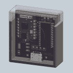

# Hackaday 奖最佳产品:WiFi 定位服务

> 原文：<https://hackaday.com/2015/09/22/hackaday-prize-best-product-wifi-location-services/>

基于 GPS 的定位服务将永远伴随着我们。如果你在内陆，在海洋中，或者甚至只是在一个没有良好的手机信号覆盖的社区，没有比 GPS 更好的方法来确定你在哪里。使用在地球上空数千英里轨道运行的卫星作为定位服务是一个在一些非常不合时宜的时候崩溃的想法。如果你在停车场，你不会用 GPS 来找到你的车。如果你在购物中心，找到去商店的路的最好方法仍然是地图。有人尝试在拉斯维加斯大道的酒店/赌场迷宫中使用 GPS 和谷歌地图吗？

[Blecky]参加 Hackaday 奖的最佳产品竞赛旨在解决这个问题。这是一种室内定位服务，仅使用廉价的 WiFi 模块[称为 sub PS](https://hackaday.io/project/4872-subpos-positioning-system)。只需几个 ESP8266 模块，[Blecky]就可以建立一个精确到半米的 WiFi 定位系统，可以在没有 GPS 的地方使用。

无 GPS 定位系统的想法是[Blecky]在一次洞穴探险后产生的，没有手机信号覆盖和 GPS 的帮助，很难在地下结构中找到导航。这让[Blecky]开始思考在地下环境中建立定位服务需要什么。

A SubPos node, equipped with an ESP8266 WiFi module

这个问题的答案来自于一个廉价的 WiFi 模块。每个子节点都用它们所在位置的 GPS 坐标进行了编码。通过 [WiFi 信标帧](http://www.subpos.org/index.php?title=Coded_Beacon_Frame)传输这个位置，加上传输的功率，任何手机都可以使用三个或更多节点来确定其真实位置，精确到几厘米。所有这些都是在不连接特定 WiFi 网络的情况下完成的；允许定位数据完全是对 WiFi 标准的黑。

与现有地理定位系统最浅显的比较是一个 [WiFi 定位系统](https://en.wikipedia.org/wiki/Wi-Fi_positioning_system) (WPS)，但有几个关键的区别。在 WPS 中，WiFi 接入点不传送自己的位置；AP 只是与数据库中的 GPS 坐标相互参照。其次，接入点不发射自己的发射功率——如果你使用 RSSI 来确定你离接入点有多远，这一点很重要。

与室内定位服务最好的比较来自[一种新的十波模块](http://hackaday.com/2015/06/17/new-part-day-indoor-location-systems/)，它建立“基站”并根据飞行时间计算出传感器的位置。然而，这需要用于接收位置数据的每个设备的额外无线电。SubPos 只需要 WiFi，你甚至不需要连接一个 AP 就可以获取这个位置数据；所有内容都以信标帧的形式广播，每台带 WiFi 的设备都会自动检测一个 SubPos 节点。

作为 Hackaday 奖最佳产品竞赛的参赛作品，不可避免地要考虑该产品将如何营销。商业应用是显而易见的；购物中心可以很容易地建立一个智能手机应用程序，向用户显示他们在购物中心的确切位置，并提供到 Gap 或大楼内几十个游戏站之一的方向。因为 sub PS 节点也可以在 3D 空间中工作，停车场的所有者可以设置十几个 sub PS 节点来指引你找到确切的停车位。我敢肯定，迪斯尼会花大价钱在他们的公园里引进这项技术。

Blecky 已经在和一家想要授权他的技术的公司谈判，但是他不仅仅关注高收入的商业客户。他已经有了一个需要制造的产品，如果他赢得了最佳产品竞赛，他将为黑客/自制软件市场开发一些东西。布莱基看到的价格点是每节点 15 美元左右。这项工作与 ESP WiFi 模块的经济性，但[Blecky]也在寻找替代芯片组，将允许不仅仅是 RSSI 定位；不基于 ESP-8266 的 SubPos 节点的改进版本可以将飞行时间纳入组合中，提供更好的位置精度，同时仍然比当前基于 ESP 的解决方案制造成本更低。

[Blecky]在这里有一个伟大的项目，毫无疑问，我们将在未来看到更多。使用 WiFi 信标帧传输位置数据和接收信号强度来确定位置的想法是开创性的，适用于从洞穴探险到在停车场寻找汽车的所有事情。由于 SubPos 系统不依赖于任何特定的硬件，这甚至可以在商业路由器中实现，为任何具有 WiFi 的设备提供真实的位置数据，无论是在室内还是室外。它也是 Hackaday 奖最佳产品竞赛的前十名入围者之一，和其他产品一样，它是精华。

#### 2015 年[黑客日奖](http://hackaday.io/prize)由以下机构赞助:

 [https://www.youtube.com/embed/NBQ43p_PYY8?version=3&rel=1&showsearch=0&showinfo=1&iv_load_policy=1&fs=1&hl=en-US&autohide=2&wmode=transparent](https://www.youtube.com/embed/NBQ43p_PYY8?version=3&rel=1&showsearch=0&showinfo=1&iv_load_policy=1&fs=1&hl=en-US&autohide=2&wmode=transparent)

