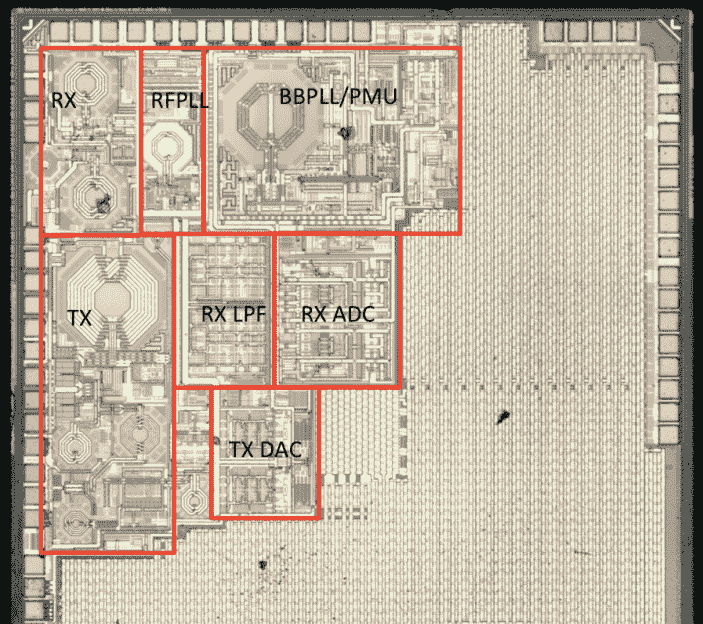
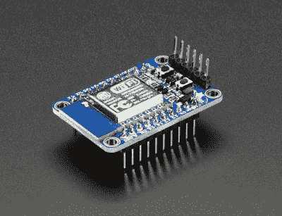

# 黑客字典:ESP8266

> 原文：<https://hackaday.com/2015/09/24/hackaday-dictionary-the-esp8266/>

2014 年 8 月，一些新事物开始出现在中国高科技地区深圳的市场上，世界上大多数电子元件都是在这里制造的。这就是 [ESP8266](http://hackaday.com/2014/08/26/new-chip-alert-the-esp8266-wifi-module-its-5/) ，一个 WiFi SoC(片上系统)，可以在 2.4GHz 频段上连接 802.11b/g/n 网络。它可以通过 SPI 或串行连接来寻址，并具有一个 [AT 命令集，使其行为更像一个老式的调制解调器](https://nurdspace.nl/ESP8266#AT_Commands)。基本上，它拥有将设备连接到 WiFi 网络所需的一切，ESP8266 芯片本身可以处理通过 WiFi 网络查找、加入和传输/接收的复杂业务。

这本身并不是什么特别新的东西:像 TI CC3000 这样的 WiFi 连接设备已经存在了很长时间，并且做着同样的事情。区别在于价格。如果你购买几千个 TI 解决方案，成本大约为 10 美元，而 ESP8266 的成本不到 7 美元，可以直接插入 Arduino 或类似设备。批量购买芯片，不到 2 美元就能拿到。

不过，ESP8266 不仅仅是一个 WiFi 加密狗:它本身是一台完全成熟的计算机，拥有一兆字节的闪存和一个使用 RISC 架构的 32 位处理器。这可以运行应用程序，将 ESP8266 变成一个独立的模块，可以通过互联网收集和发送数据。它可以在消耗相当低的功率的情况下做到这一点:接收数据时，它通常只使用 60mA，通过 802.11n 连接发送数据只使用 145mA。这意味着你可以用一个小电池或其他小电源驱动它，它将保持运行很长一段时间。

不过，在早期编写应用程序并不容易:文档记录很差，[需要一个专用的工具链来与](http://hackaday.com/2015/03/18/how-to-directly-program-an-inexpensive-esp8266-wifi-module/)协同工作。这使得它比许多黑客认为的更具挑战性。然而，今年早些时候，当 [Arduino IDE(集成开发环境)被移植到芯片](http://hackaday.com/2015/03/28/arduino-ide-support-for-the-esp8266/)时，这种情况发生了变化。这意味着你可以使用更容易编写的 Arduino 函数和函数库来为芯片编写代码，即使是最普通的黑客也能做到。

## 为什么 ESP8266 很重要？

ESP8266 几乎实现了电子产品的神圣三连胜:便宜，功能强大，易于使用。在此之前，如果你想给一个项目添加无线连接，你必须使用更多耗电设备，如 USB WiFi 加密狗，或者将所有东西挤成串行连接，并使用[无线串行链路](http://hackaday.com/2012/08/23/more-small-radio-modules-for-your-wireless-needs/)。无论哪种方式都增加了项目的复杂性:你要么需要一个支持 USB 和 WiFI 操作系统的系统，要么必须忍受无线串行链路的限制，无线串行链路通常提供非常有限的带宽。

A decapped ESP8266, with area of interest marked by [Reddit user swimmerdude](http://www.reddit.com/r/electronics/comments/2jq22l/esp8266_wifiserial_chip_decapped_its_actually/). The big area on the right is memory.

WiFi SoCs 的出现消除了这些限制，因为 SoC 承担了重任，WiFi 提供了更多的带宽。ESP8266 以非常低的成本做到了这一切:在易贝做一些挖掘，你就可以用不到 2 美元得到一个 [ESP8266 板。因此，毫不奇怪，我们开始看到 ESP8266](http://search.ebay.com/esp8266) [出现在商业产品](http://hackaday.com/2015/08/25/esp8266-in-commercial-products/)中。

## 如何使用 ESP8266？

随着 ESP8266 在项目中添加 WiFi 的普及，有很多尝试它的选项也就不足为奇了。在硬件方面，ESP8266 开发板可从许多地方获得，包括 [Seeedstudio](http://www.seeedstudio.com/depot/NodeMCU-v2-Lua-based-ESP8266-development-kit-p-2415.html) 、 [Sparkfun](https://www.sparkfun.com/products/13231) 和 [Olimex](https://www.olimex.com/Products/IoT/MOD-WIFI-ESP8266-DEV/open-source-hardware) 。Adafruit 也有一个[漂亮的 ESP8266 板](https://learn.adafruit.com/adafruit-huzzah-esp8266-breakout/overview)，它可以分解所有信号，便于试验板使用，并增加了 3.3V 输出，因此它可以驱动外部设备。它还通过了 FCC 的认证，如果你想出售或使用你自己制造的设备，这一点很重要。一些用户也一直在构建他们自己的开发板，这些开发板增加了诸如 [LCD 显示屏和](http://hackaday.com/2015/06/12/diy-esp8266-development-board/)按钮等功能。

The Adafruit Huzzah ESP8266 dev board

在软件方面，进入 ESP8266 最简单的方法是使用 [Arduino 兼容模式](http://hackaday.com/2015/03/28/arduino-ide-support-for-the-esp8266/)。这包括加载定制固件，将芯片变成中档 Arduino 板，这使得编程更加容易。这个项目背后的人制作了一个受支持的 ESP8266 板的列表:购买其中一个将使安装过程更容易，因为他们已经注意到 Arduino SDK 中的哪些数据线对应于板上的物理引脚。这些板还提供了对复位线的简单访问，您必须使用这些复位线来安装 Arduino 兼容固件。

不过，这确实有一些限制:通过 WiFi 上传新草图相当复杂，而且你不能产生多个 PWM 信号，这将使控制多个设备变得困难。要获得 ESP8266 的全部功能，您需要从源头入手，使用制造商提供的[SDK](http://espressif.com/en/products/esp8266/)。[cnlohr]在这里发表了一篇关于[裸机编程 ESP8266](http://hackaday.com/2015/03/18/how-to-directly-program-an-inexpensive-esp8266-wifi-module/) 的深入指导。Espressif 还提供了一个[很好的入门指南，包括创建一个虚拟 Linux 机器，并将其连接到他们的芯片](http://bbs.espressif.com/viewtopic.php?f=67&t=821)。

第三个选项是将 [NodeMCU](https://github.com/nodemcu/nodemcu-firmware) 闪存到 ESP8266 模块。这就把它变成了一个 Lua 解释器。可以实时编写脚本来构建您的程序原型，然后闪存到 EEPROM，使您的程序持久化，并且不再需要串行连接。

初学者会对 Arduino 和 NodeMCU 方法感到舒适，但有经验的用户应该能够直接进入并开始为这种便宜、强大且相当容易使用的芯片编写代码。