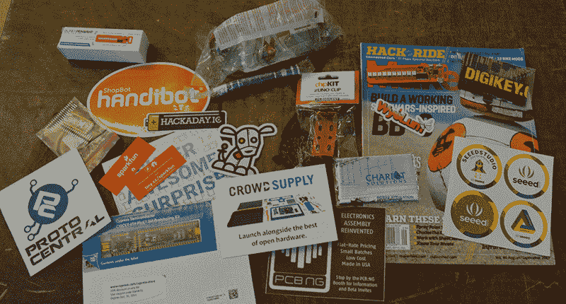

# 2015 年开放硬件峰会现场直播

> 原文：<https://hackaday.com/2015/09/19/live-from-open-hardware-summit-2015/>

现在，Hackaday 和 Tindie 正在费城参加 2015 年开放硬件峰会。这些是我喜欢的会议；与会者不多，只有几百人，但这里的每个人都很棒。人群中有[Mitch Altman]，[的[Johnny]RAMPS fame](http://reprap.org/wiki/RAMPS)，Parallax 的家伙([忙于编程徽章](http://hackaday.com/2015/09/14/the-open-hackable-electronic-conference-badge/))，Lulzbot 的[Harris Kenny]，Michigan Tech 的[Joshua Pearce]，以及几乎所有其他负责所有开源硬件的人。

会谈？他们很棒。你会看到很多人重申，修补和破解电子和机械是一项有价值和值得追求的事业，但[每个人都有自己的事情](http://2015.oshwa.org/program/)，从开源实验室设备到构建真正的开放硬件芯片。[这里是会议直播的链接](http://ustre.am/1riMc)。

我想应该提一下礼品袋，这是你期待已久的照片:

其中包括:

*   [Hackaday 品牌 Adafruit Pro 饰品 5V](http://store.hackaday.com/products/trinket-pro-with-black-solder-mask-and-the-hackaday-io-logo)
*   闪烁期间
*   [赛普拉斯 PSOC 5LP](http://www.cypress.com/documentation/development-kitsboards/cy8ckit-059-psoc-5lp-prototyping-kit)
*   [SeeMeCNC 一字螺丝刀](http://seemecnc.com/products/seemecnc-screw-driver)
*   一张 [SparkFun ESP8266 东西的优惠券](https://www.sparkfun.com/products/13231)
*   谷歌安全眼镜
*   [乐高形状的 LED](http://www.lunchboxelectronics.com/product/build-upons-pth-edition)
*   [祖诺夹子](https://digilentinc.com/Products/Detail.cfm?NavPath=2,393,1260&Prod=ZUNO-CLIP)
*   制作第 46 卷
*   贴纸/传单来自:
    *   哈卡戴&廷迪
    *   怀奥姆
    *   多氯联苯
    *   西迪工作室
    *   Handibot
    *   原型中央
    *   人群供给
    *   八分之一
*   清洁布来自:
    *   迪基
    *   战车解决方案

### 进一步的事件

昨晚，我们向电之父扔了一便士在[本·富兰克林]的坟墓上，以此表达我们的敬意。不要问*为什么*那是传统，因为我想没人知道。我们要去 Skookil 旁边的图书馆买块冰吃。OHS 的比赛场地就在[一家医学古怪博物馆](http://muttermuseum.org/)附近，非常方便。是的，它完全与任何种类的开放硬件无关，但像这样的会议的全部意义在于与志同道合的人一起闲逛和交谈。在这一点上，你是否和最大的人类骨骼在同一个房间里并不重要。