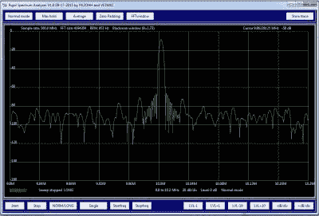

# 适合您的 Rigol 示波器的更好的频谱分析仪

> 原文：<https://hackaday.com/2015/09/22/a-better-spectrum-analyzer-for-your-rigol-scope/>

Rigol DS1000 系列示波器很受爱好者的欢迎，这是有充分理由的:它们以低廉的价格提供了不错的规格。然而，他们缺乏频谱分析能力。虽然这些示波器具有快速傅立叶变换(FFT)功能，但它是有限的，对射频几乎没有用处。

【Rich】想要一台用于业余无线电的频谱分析仪，但不想为其构建自己的采样硬件。相反，他写了 [PyDSA](http://rheslip.blogspot.ca/2015/09/software-spectrum-analyzer-for-rigol.html) ，一个用于 Rigol DS1000 示波器的软件频谱分析仪。该工具使用示波器上的 USB 连接来获取样本，并在功能强大得多的 PC 上进行数据处理。当在一台像样的计算机上运行时，它能够以每秒两次扫描的速度绘制 16，000 点的 FFT。

PyDSA 是一个 Python 脚本，它利用[虚拟仪器软件架构](http://www.ni.com/visa/) (VISA)接口来控制范围和获取样本数据。幸运的是，有一些 Python 库负责这个协议。

[Rich]现在能够使用他的示波器来测量业余无线电信号，这是他现有的基于青少年的 SDR 项目的一个很好的伙伴。如果你有一个 Rigol，你可以在 Github 上抓取[源码并试用。](https://github.com/rheslip/PyDSA)