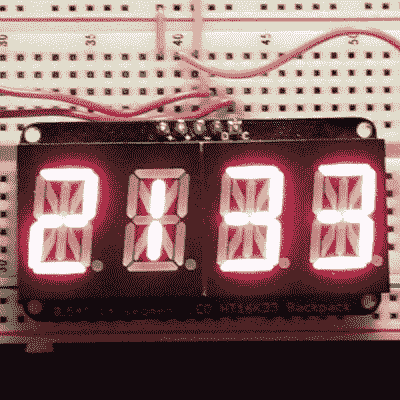

# 为社会公益服务的钟表

> 原文：<https://hackaday.com/2015/09/22/clocks-for-social-good/>

在过去的五天里，我们一直在挑战 Hackaday 社区，让他们建造一个时钟并展示它。这是为了提高日常生活中电子设计的意识，希望你能找到一个非黑客加入你的项目。关键是，我们的社会——几乎普遍接受复杂电子产品的日常携带——不知道电子设计包含什么。如果孩子们永远也不能拉开帷幕，看到工程的运行，我们怎么能让他们对工程感兴趣呢？

制作一些每个人都能理解的简单的东西，并以一种让外行人兴奋的方式展示出来。有什么比时钟更简单？我认为这是技术背后的推动力。标记时间的流逝可以追溯到我们的根源，即原始人类跟随迁徙的兽群，并预测作物生长的季节变化。我们的现代生活比以往任何时候都更受时间的支配。这些用于社会公益的[时钟](https://hackaday.io/list/7675-clocks-for-social-good)证明任何人都可以理解这项技术是如何工作的。每个想学习制造自己电子设备的人都能发现如何以低成本和合理的努力做到这一点。这就是我们培养下一代工程师的方式，所以让我们来看看我们在周末都想出了什么。

这个[显而易见的钟是显而易见的](https://hackaday.io/project/7775-obvious-clock-is-obvious)——这个标题非常好地描述了这个钟，这也是我选择它作为第一个特征的原因。除了这个 14 段显示器的特写图像，请确保您看一看帖子顶部显示的试验电路板电路。

就电子学而言，这是一种非常简单的方法。几个试验板友好的模块组合在一起:一个 Adafruit 小饰品，一个旋转编码器，实时时钟模块，I2C 显示器，以及接受 USB 输入的电源。这是任何想要“通过数字来建造”的人的蓝图，但是一旦这个第一个项目被说了并做了，还有很大的发展空间。

软件方面的事情可能更具挑战性。这个小饰品确实可以在 Arduino IDE 上使用，但是[Douglas Henke]写的一切都是普通的 C 语言(一个合我心意的黑客)。旋转编码器提供了一个菜单系统——对于初学者来说，这些东西可能会令人毛骨悚然。但是他在注释代码方面做得很好，这意味着找到可以帮助你一行一行地完成它的朋友将会使你的 C 理解技能迅速提高。

CGA 钟是一种倒退。我想知道有多少读者不会将这三个字母与视频标准联系在一起？希望没有多少人理解计算机图形这些年来的史诗般的发展会让你在阅读这篇文章时对你手中的手机显示屏感到惊叹。

从表面上看，这只是一个添加了一些颜色的二进制时钟。每一列使用二进制代码读出一位数字的小时、分钟和秒。

但是如果你不擅长快速地将这些二进制值转换成十进制值，你可能只记得 CGA 颜色值。不是跟踪像素的位置，而是将调色板值相加，如果进行二进制计算，应该会得到相同的数字。

对于那些一直关注。这个由 PIC16F688 驱动，使用交流电源频率来保持准确的时间。

不是每个时钟都专注于电子产品。这个[慧鱼钟](https://hackaday.io/project/7679-fischertechnik-clock)用超级棒的玩具制造模拟指针。我不认为我以前遇到过这些，但它们似乎是我们上周看到的 FAC 机器制造公司的的[的平价业余版本。](http://hackaday.com/2015/09/15/rubiks-solver-uses-fac-machine-building-system/)

在这张图片中，分针很容易看到指向“6”的位置。稍微难一点的是指向“7”和“9”位置之间的时针。

[Jac Goudsmit]全力以赴，推出了一套庞大的构建指令。他计划稍后进行更新，展示如何添加电子部件来驱动它。

在文章顶部的链接列表中还有很多可以细读的，但我认为以另一个简单的时钟结束是合适的，这个时钟对于黑客来说几乎是陈词滥调。另一个时钟项目结合了这里最受欢迎的部件:WS2812B LEDs 和 ESP8266 模块。

模块通过 WiFi 带来互联网连接；考虑到我们生活中的大多数时钟都是使用网络时间协议(NTP)来保持正确的，这是一个很好的选择。led 在一条级联数据线上驱动，这使得布线相当简单，锂电池和维护电路使其便于携带。最终版本——用 Lua 编程——把所有东西都装在一个形状有趣的丙烯酸盒子里。

我知道我在用这个帖子向唱诗班布道。但是你有能力将电子产品推向主流。在你的社区中寻找一个机会，把制造电子产品提升为一种爱好。它不一定复杂、昂贵或耗时。引导你第一次点亮 LED 灯时感受到的惊奇，然后想办法把这种兴奋传递给任何愿意给你一天时间的人。

现在加入这个列表还为时不晚，[当你发布你的项目时请告诉我](http://hackaday.io/mike)，我会确保它加入收藏。