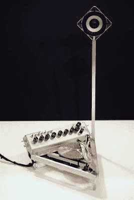

# 为艺术编织一张黄铁矿唱片

> 原文：<https://hackaday.com/2015/09/26/spinning-a-pyrite-record-for-art/>

任何有电唱机的人都熟悉将表面的不规则转化为声音的概念。而且，任何曾经打开过 CD 播放器或 DVD 播放器的人都知道激光是如何被用于数字复制声音的。将这两者结合起来本身就是一个有趣的项目，但是[Dimitry Morozov]通过他的黄铁矿圆盘声音对象项目更进一步。

黄铁矿圆盘又称黄铁矿太阳或黄铁矿美元，是黄铁矿的一种形态，其结晶结构形成具有放射状条纹的圆盘。黄铁矿盘是伊利诺伊州斯巴达周围地区特有的，通常在那里的煤矿中发现。它们没有真正的实际用途，但由于其有趣的美学特征而成为矿物收藏家的最爱。

[Dmitry]从科罗拉多州博尔德的一个这样的矿物收藏家那里收到了他的黄铁矿圆盘，请求他将它用于一个有趣的项目。[Dmitry]本人专门研究艺术装置和独特的乐器，并将这些激情结合在他的名为 Ra 的黄铁矿圆盘声音物体中。

这个概念本身很简单:旋转黄铁矿光盘，用激光将表面条纹转换成音频。但是，正如你在照片和视频中看到的，执行过程远非简单明了。据我们所知，[Dimitry]在伺服臂上使用了 Arduino Nano 和 DIY 激光拾取器来扫描黄铁矿光盘，因为它是由步进电机旋转的。这些数据然后被发送到 Raspberry Pi，在那里进行合成(使用各种调制和效果控制)，以产生声音，通过连接到对象的单个扬声器输出。从不同寻常的声源发出声音对普通读者来说当然不是什么新鲜事，但是这个项目的美妙之处绝对值得称赞。

[https://player.vimeo.com/video/140167278](https://player.vimeo.com/video/140167278)