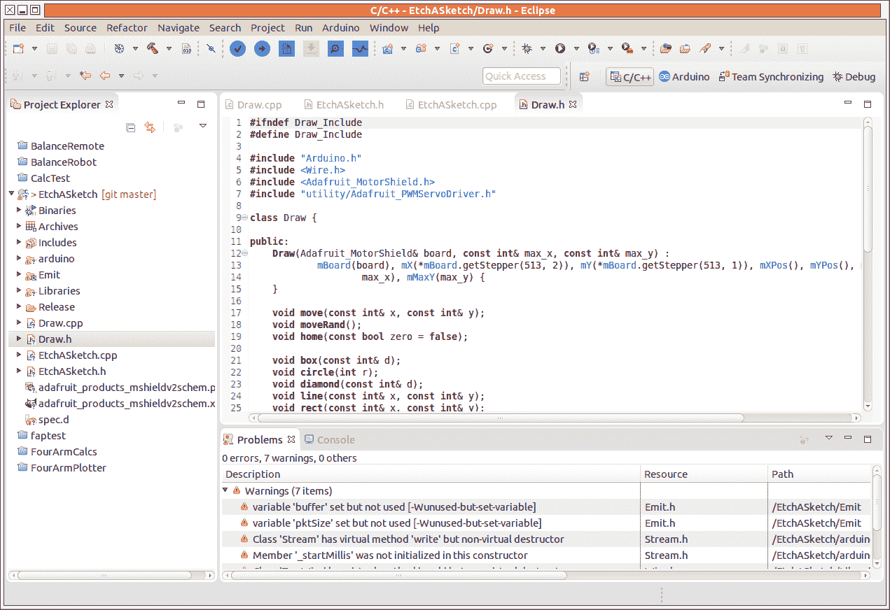
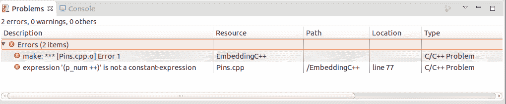
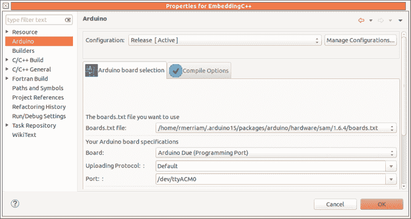

# 代码工艺:使用 Eclipse 进行 Arduino 开发

> 原文：<https://hackaday.com/2015/10/30/code-craft-using-eclipse-for-arduino-development/>

当我们在项目中工作时，我们经常升级我们的工具。那个基本的烙铁让位于带温度控制的烙铁。入门的 3D 打印机让位于速度更快、功能更强的打印机。其中一个原因是我们并不真正理解初级工具的限制。有时，当工具在任务中失败时，我们会直接意识到这一点。其他时候，我们看到另一个黑客使用更好的工具，并意识到我们必须有一个！。

软件工具也是如此。Arduino IDE 是一个不错的入门工具。它很容易使用，这是伟大的，如果你从来没有写软件。这些库以及它与硬件生态系统完美结合的方式是一个福音。

当你开始一个更大的项目时，比方说你升级到 Due 或 Teensy 以获得更多的代码或内存空间，Arduino IDE 会妨碍你的工作效率。超越这些限制需要一种新的、更好的工具。

我们在哪里可以找到更好的工具？首先，要认识到，正如[ [埃利奥特](https://hackaday.io/hexagon5un) ]指出的 *[没有 Arduino“语言”](http://hackaday.com/2015/07/28/embed-with-elliot-there-is-no-arduino-language/)，我们实际上是在用 C 或 C++编程。我们通过文件的扩展名来选择语言，“C”代表 C,“CPP”代表 C++。Arduino 支持库可以用 C 或 C++编写，这取决于开发者的偏好。都是混搭。*

任何支持 C/C++的环境都有可能取代 Arduino IDE。不幸的是，这并不容易做到，至少对于没有经验的开发人员来说是这样，因为这意味着要设置语言工具链和上传到板上的工具。拥有如此丰富经验的开发人员可能会完全避开集成开发环境，直接使用 makefiles，就像[Joshua]在 *[Arduino 开发中描述的那样；有一个](http://hackaday.com/2015/10/01/arduino-development-theres-a-makefile-for-that/)T3 的 Makefile 文件。*

事实上，Arduino IDE 只不过是一个文本编辑器，能够调用编译和下载代码到 Arduino 所需的工具。专业的 IDE 不仅处理这些细节，还提供了使软件开发过程更容易的附加功能。

# Eclipse CDT & Arduino 插件

### [](https://hackaday.com/wp-content/uploads/2015/09/eclipse-ide.png)

Arduino IDE 的一个替代品是 Eclipse，这是一个由专业和业余开发人员使用的开发环境。它是开源软件，可以通过插件进行扩展。许多开发者为它的开发做出了贡献，包括一些公司支持的开发者。

基于 Eclipse 的 Arduino 开发使用了对基本 Eclipse IDE 的两个补充。一个是 [C/C++开发工具](https://eclipse.org/cdt/) (CDT)。CDT 不仅增加了 C/C++开发能力，还增加了自动代码完成和插入的工具，以及一些代码重构。相信我，一旦你明白如何使用这些能力，当它们不可用时，你会非常想念它们。

另外增加的是一个[插件，由【Jantje Baeyens】](http://www.baeyens.it/eclipse/)开发。该插件是免费和开源的。

此设置与 Arduino IDE 的构建环境结合使用。您仍然需要安装 IDE 你只是不需要用它。

今年早些时候，我在运行 Ubuntu 14.04 的同时安装了带有插件的 Eclipse Luna 和 Arduino 1.6.0 IDE。我只是按照 Eclipse 和插件网站上的安装说明进行操作，一切都很顺利。此后[Jantze]发布了一个版本的 [Eclipse Luna，预装了最新版本的插件](http://eclipse.baeyens.it/installAdvice.shtml)。最近下载了它和 1.6.5r5 Arduino IDE。它运行良好，插件的更新安装由 Eclipse 自动处理。

当进行这样的转换时，您需要知道当前工具的不足之处，新工具如何解决这些限制，以及会产生哪些额外的好处。我们将首先解决这些限制以及如何解决这些限制，然后是额外的好处。

## Arduino IDE 限制

### 编辑器选项卡

当项目变得更大时，他们显然有更多的代码行。在一个文件中有成百上千行代码是一场噩梦。在这么大的文件中滚动查找一行代码是非常耗时的。这就是编译器支持将代码分成多个文件的原因。在编辑器窗口之间移动远比滚动容易。

Arduino IDE 通过添加更多选项卡来支持多个文件。如果你使用 INO 文件，你一次只能添加一个，但是如果你使用 C/C++头文件和源文件，你一次只能添加两个。对于 Arduino IDE，所有文件都必须在打开的窗口中，以便由编译器处理。迟早你会用尽屏幕顶部的空间来容纳更多的标签。

我的 23 英寸显示器支持大约 18 个标签，我的 19 英寸显示器支持大约 12 个标签。附加文件的标签向右滚动。可以使用 *Ctrl-ALT-Right、*或者通过右边的下拉列表来找到它们，使用起来很麻烦。雪上加霜的是，在我的 Ubuntu 系统上， *Ctrl-ALT-Right* 用于改变工作区，所以不能用于改变标签。

Eclipse 也使用选项卡，但是它们只涉及编辑。项目的文件列在项目浏览器子窗口中。任何文件都可以在编辑器中打开，并在编辑或查看完成后关闭。只打开与你当前活动相关的文件可以减少分心。Eclipse 还允许同时访问多个项目。如果您想要从旧项目中获取当前项目的代码片段，或者如果您正在使用两个相互协作的 Arduinos，这将非常有用。

### 编译速度

作为构建过程的早期步骤，Arduino IDE 会将每个文件复制到一个临时目录中。这迫使构建环境将每个文件都视为已更改，这反过来意味着所有文件都已编译。

在 Eclipse 下，构建不会移动文件。工具链认识到，一旦文件被编译，就不需要再次编译，直到在源代码中做出改变。在非常大的商业项目中，这确实可以节省数小时的时间。即使在大型爱好项目中，节省的时间也是可观的。

### 寻找错误

Arduino IDE 底部的控制台显示编译过程和出现的错误。错误与文件、行号和错误列一起列出:

```
somefile.cpp:11:3: error: expected '}' before 'else'
```

要修复这个错误，你需要找到这个文件——哎哟！如果它在下拉列表中，然后在文件中找到该行。这很费时间。

Eclipse 以两种方式报告错误。第一个是类似 Arduino 的控制台窗口。不同之处在于，你可以点击一个错误，然后转到代码行。如果文件当前没有在编辑器中处于活动状态，Eclipse 甚至会打开它。真正节省时间的人。

第二个是一个“问题”窗口中的错误列表，去掉了所有的编译器术语。阅读这个列表比任何一个 IDE 的控制台窗口都要快得多。通过浏览列表，您可能会发现报告的错误不是需要修复的错误。有时，错误，例如打字错误，会在多个位置报告，但更正却在其他地方。控制台窗口仍然很重要，因为它提供了额外的信息，有时需要这些信息来准确了解问题的原因。

[](https://hackaday.com/wp-content/uploads/2015/10/problem-window.png)

### 极度烦恼

Arduino IDE 的一个烦恼是，当你想上传新代码时，需要关闭串行端口终端。Eclipse 解决方案在保持终端窗口打开的同时对此进行管理。

注意:这似乎已经从 Arduino IDE 的 1.60 版本更改为 1.6.5 版本。如果您使用的是旧版本，并且坚持使用 Arduino IDE，您应该升级到最新版本。

# Eclipse 增强功能

除了上面讨论的改进之外，Eclipse 还提供了增强。有些能力你并没有意识到你需要，但是一旦你拥有了，你就会爱上它们。

代码补全是一个简单的增强，它通过添加右括号、引号、方括号、圆括号等来节省击键次数并防止错误。这减少了由于遗漏而导致的错误，并有助于更好地组织代码。(你确实把 if 从句用括号括起来了，不是吗？苹果没有，这在他们的 SSL 处理中创造了一个[安全漏洞，尽管该代码存在许多其他问题。)](https://blog.codecentric.de/en/2014/02/curly-braces/)

当你工作时，你经常会意识到函数、变量或类的名字并不完全正确。它需要改变。在多个文件中寻找一个名字是令人生畏的，所以你就让它去吧。Eclipse 允许您选择一个名称，告诉它进行更改，所有事件都将被更改。

添加新类需要创建新的头文件和源文件。一个向导会为你做这件事。输入类名，如果需要的话输入基类名，并选择是否创建构造函数和析构函数。这些文件是用框架源代码创建的，并被添加到项目中。

向导还可以创建新的源文件或头文件。

一旦声明了函数，创建函数体或类成员也是自动的。首先在头文件中创建声明:

```
 int something(const int a); 
```

然后你右击，选择‘源’和‘实现方法’。骨架定义被插入到源文件中:

```

int something(const int a) {
}

```

当函数有很长的参数列表时，这尤其方便。

通常你会意识到一些代码行作为一个新函数会更好。这可能是因为它们可以在其他位置重复使用，或者只是为了简化当前位置的流程。将代码提升到一个新函数中只需要选择代码，右键单击，选择“重构”，然后选择“提取函数”。将打开一个向导，让您批准新函数参数列表，当您接受该列表时，对该函数的调用将替换这些行，并创建新函数。

举例来说，可以将 *loop()* 中的一组重复代码提取到函数 *outPins* 中，并且可以通过调用新函数来手动替换重复代码。诚然，这不是一个惊天动地的例子，但它展示了可能性。代码以如下形式开始:

```

void loop() {
	static unsigned char cnt = 0;
	static bool state = false;

	analogWrite(pin09, cnt);

	// code to extract to make new function
	digitalWrite(pin11, state);
	digitalWrite(pin13, state);
	delay(blink_time);

	state = !state;

	// duplicate code
	digitalWrite(pin11, state);
	digitalWrite(pin13, state);
	delay(blink_time);
}

```

重构之后就变成了:

```

void loop() {
	static unsigned char cnt = 0;
	static bool state = false;

	analogWrite(pin09, cnt);

	outPins(state);
	state = !state;
	// replace next three lines with outPins(state);
	digitalWrite(pin11, state);
	digitalWrite(pin13, state);
	delay(blink_time);
}

```

经过一点点剪切和粘贴之后 *loop()* 变得简单多了，现在 *outPins()* 中的代码行的维护也更容易了:

```

void loop() {
	static unsigned char cnt = 0;
	static bool state = false;

	analogWrite(pin09, cnt);
	outPins(state);
	state = !state;
	outPins(state);
}

```

这些功能中有许多是对代码的重构，如果你将从事更大的项目，这是一个非常值得研究的复杂主题。所涉及的技术在不改变操作的情况下改进了您的代码组织。

注意:Eclipse 会做出你要求的改变，所以要确保你做对了。修复大规模自动变更可能是一场噩梦。去过那里，做过那个。

这只是在大型项目中使用 Eclipse 的优势的概述。如果您熟悉 Eclipse，请在评论中加入其他功能。

# 插件细节

[](https://hackaday.com/wp-content/uploads/2015/10/plugin-dialog.png) 以上都是月蚀带来的。Arduino 插件还提供了一个对话框，通过替换 Arduino IDE 下拉菜单，您可以控制开发参数。您不再需要先进入菜单选择板，然后再返回选择端口。此外，该对话框允许您指定隐藏在 Arduino IDE 配置文件中的编译器选项。例如，您可以从标准的空间优化改为速度优化。

插件带来的一个附加功能是一个“示波器”图形窗口，它将正确格式化的数据显示为曲线。这有利于观察传感器对环境的反应。

## 包裹

对于我的 Arduino 项目，我已经完全改用 Eclipse 了。我在其他项目中已经习惯了 Eclipse，所以在 Arduino 中使用它感觉很好。重构和自动代码完成功能被严重遗漏，其他功能只是锦上添花。