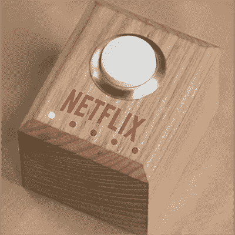

# 网飞和冷藏按钮

> 原文：<https://hackaday.com/2015/09/27/the-netflix-and-chill-button/>

当网飞的人们忙于在世界各地马拉松式地观看 90 年代的情景喜剧来消磨周末时，他们也抽出时间来发行《网飞开关》。这是一个只有一个按钮的小装置，可以控制你的电视，关灯，还可以点披萨。记住，你喜欢浪费的时间不是浪费的时间。

网飞开关是一个相对简单的设备，由一个[粒子核心](https://www.particle.io/prototype)驱动，这是一个兼容 Arduino 的开发板，带有板载 WiFi。这个盒子里还有一个 LiPo 电池、几个 led 和一个红外发射器，如果你的遥控器*有*的网飞按钮，它将发送与电视遥控器上的网飞按钮相同的红外信号。

在一个前所未有的脱离现实的情况下，这个精明的电子修补公司品牌也有设计文件，示意图，和真正的说明。网飞发布了 Solidworks 格式的交换机的所有机械文件；每张 Solidworks 许可证的价格非常低，只有 4000 美元，你也可以网飞和 Chill。

尽管网飞在利用已有 100 年历史的 DIY 电子产品运动方面有所欠缺，但这种精神是值得称赞的。一个连接到互联网的按钮是一个通用工具，无论你是想订购披萨还是为你的手机设置一个“请勿打扰”按钮，网飞和冷藏按钮的唯一限制是你的想象力。