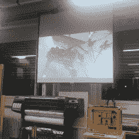
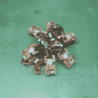
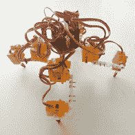
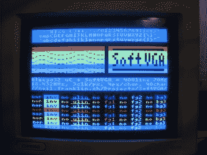
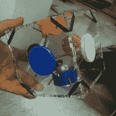
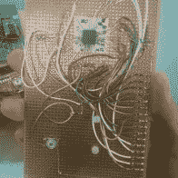
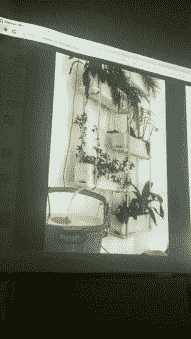

# 聚集苏黎世的黑客社区

> 原文：<https://hackaday.com/2015/09/29/hackaday-meetup-zurich/>

当我的瑞士表妹给我们发来结婚请柬时，我并没有马上想到我会在交易中看到 Hackaday.io 用户[[antti . lukats](https://hackaday.io/Antti)']微型 FPGA 项目。我真的很高兴我来瑞士参加婚礼，并且成为了在[苏黎士私人实验室](http://zurich.fablab.ch/)的一个很棒的聚会的一部分。[Antti]也参加了 meetup，上图是他拿着一个装满 FPGA 的小管，他是 Hackaday 奖最佳产品决赛选手，参与了 FPGA 项目[迪西](https://hackaday.io/project/6592-dipsy)。

随着黑客日聚会逐渐成为常态，我们要求人们带来项目。然后，我们统计所有想做报告的人，把所有的报告压缩到 90 分钟左右。在闪电谈话前后，总有足够的时间四处走走，看看个别项目，见见人们，当然还有吃喝。

展示了 3 个行走机器人和 2 个滚动机器人。(阿里安的)Roomba 让流行的 ESP8266 侵入了它。[西蒙]带来了一个 RaspberryPi 动力滚动机器人。[ [Thomas](https://hackaday.io/thom1986) 带来了一个[步行机器人](https://hackaday.io/project/7910-anypod)，它走得相当不错。当晚最后一个行走机器人刚刚在视频中出现。[ [拉多米尔·多皮耶拉斯基](https://hackaday.io/hacker/35249) ]带来了他的 Hackaday 奖参赛作品，这款[非常酷且易于使用的搬运机器人](https://hackaday.io/project/6050-tote-affordable-spider-robot)。Tote 旨在通过创建一个简单的平台来构建行走机器人，从而解决世界上行走机器人数量不足的问题。在这次聚会上，拉多米尔的许多步行机器人的梦想似乎实现了。

  Last robot of the night  Thomas’ walking robot  Radomir’s Tote robot  #3 barely lives on

奥斯卡带来了酷毙了的 PiDP。 [PiDP-8/I](https://hackaday.io/project/4434-pidp-8i) 是另一个 Hackaday 奖最佳产品入围者，它是[第一台小型机](https://en.wikipedia.org/wiki/PDP-8)的复制品。[奥斯卡的]版本使用一个树莓 Pi 来重现所有的操作。SoftVGA 是一个纯软件的 VGA 发生器。我期待下周在柏林举行的[复古计算节](http://www.vcfb.de/2015/)上看到更多像这两个这样酷的项目。我会和[[Elliot](https://hackaday.io/hexagon5un)和[[Bilke](https://hackaday.io/bilke)一起去，我们会在 10 月 3 日和 VCF 的朋友们开一个聚会。

  PiDP-8/I  SoftVGA

[ [tamberg](https://hackaday.io/tamberg) ]展示了一个制作精美的透明立方体，里面有开关，一个金属球滚动并启动开关。旁边的[拉森扫描仪](http://www.evilmadscientist.com/2009/the-larson-scanner-kit/)是由 [stefan-xp](https://hackaday.io/stefan-xp) 设计的。[Yvonne]讨论了她最近的光画“光的拓扑结构”，[Isaac]厌倦了一个人连续玩 4 个，所以他造了一个机器人来玩这个游戏！

  @tamberg’s clear cube  @stefan-xp’s Larson scanner  Topology of Light  Isaac’s 4 in a row robot

一个流行的黑客项目是室内或室外花园的自动浇水。[Effi]做了一个关于湿度传感器的精彩演示，同时向我们展示了她的植物长得有多好。

    

有太多的项目要在这里一一列出，但是[[thi bault](http://www.thibault.io/)的位移项目确实吸引了我的眼球。这个项目有几个面板菊花链在一起，白色底漆上有蓝色热色颜料层。每个面板都是一个 PCB，一个由 ATtinys 供电的定时加热序列控制的加热垫。每个面板加热后，下一个面板加热前会有 20 秒的延迟。当蓝色热色颜料达到 37°c 时，它会变成透明的，白色的底漆会透出来。随着正方形冷却下来，透明颜料再次变成蓝色。你可以在这里看到[的视频。](https://vimeo.com/122733919)

我希望在柏林见到你们中的一些人，如果你错过了，我们刚刚为 Hackaday 的[第一次硬件会议](https://hackaday.io/event/7777-hackaday-superconference)发出了[征集提案](https://docs.google.com/forms/d/1h4Ynpmah9vA1fYu0Lrm_wzOq8EzAEnc4TWtyXvjJ6Iw/viewform)。

#### 2015 年[黑客日奖](http://hackaday.io/prize)由以下机构赞助:

