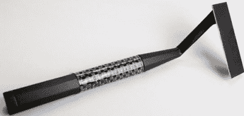
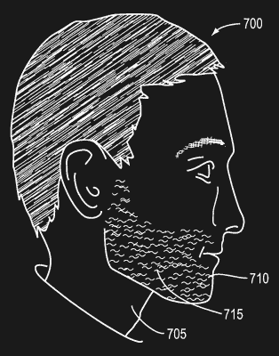

# 问哈卡黛:我喜欢早上头发烧焦的味道

> 原文：<https://hackaday.com/2015/10/01/ask-hackaday-i-love-the-smell-of-burnt-hair-in-the-morning/>

在 19 世纪末，[金·坎普·吉列]有了创造一种不需要磨刀的一次性剃须刀刀片的想法。这个想法有一个问题:冶金技术还不够先进，无法生产出像纸一样薄的碳钢刀片，也无法把它们磨得锋利。1901 年，[威廉·尼克森]解决了这个问题，一次性剃须刀的时代开始了。

The Skarp laser razor

这个 Kickstarter 会让你相信胡须技术的新时代已经到来。这是一个名为 Skarp 的激光剃须刀，它有望成为有史以来最受资助的 Kickstarters 之一。唯一的问题？即使有 Kickstarter 活动的相对较好的文档、演示视频、专利和美容激光领域的专家，只有创作者才能弄清楚它是如何工作的。

Skarp 没有使用经过数千年试验和测试的技术，而是使用激光直接在皮肤表面剃掉毛发。你只需要看看激光脱毛的广告牌就能意识到这是可能的，但制造激光剃须刀却是我们几十年来一直无法实现的事情。这项始于 1986 年的专利至少展示了这个想法的开端——将一束激光放入一个手持包装中，然后插入胡须中。[这项始于 2005 年的专利](https://www.google.com/patents/US20080201954?dq=laser+laser+light+shaving&hl=en&sa=X&ved=0CB0Q6AFqFQoTCLmBn6PBncgCFcsXkgodDDQNbQ)利用光纤向手持剃须刀发送激光束。像任何科幻类型的东西一样，激光剃须刀在发明领域是一个很受欢迎的想法。

但是 Skarp 认为它已经解决了以前阻碍激光在你的医药箱中找到位置的所有问题。

A side view of an unshaven man. [Source](https://www.google.com/patents/US20080244912)

所有早期的激光系统都有一个问题，至少根据 Skarp 的创造者和强脉冲光的发明者摩根·古斯塔夫森所说，这是一种用于脱毛和治疗皮肤病的技术。以前的激光剃须刀没有一个能切割所有类型的毛发。金色、灰色、红色和金色的头发都是基于激光的剃须刀的问题，直到在人类头发中发现了“*特殊发色团”*，它们会对特定频率的激光做出反应。

在 Skarp 中，这种激光通过一根长度相当于刀片的光纤传输。当一根头发接触到这种光纤时，少量的光会通过光纤泄漏，烧掉头发。Skarp 团队[甚至发布了一个过程的演示视频](https://www.kickstarter.com/projects/skarp/the-skarp-laser-razor-21st-century-shaving/posts/1364296)，展示了一个剃刀形状的物体确实可以比金属刀片慢很多倍地理发。

所以我们有了一个价值数百万美元的问题:斯卡普是真的吗？这通常是明智的猜测开始的部分，但这一次我不知所措。

尽管如此，使用未屏蔽的光纤来剪头发还是无法通过嗅觉测试。用一节 AAA 电池驱动一个二极管激光器一个月都通不过嗅探测试。设计光学系统，可能制造新的激光二极管，并将所有这些封装到一个难以置信的小外壳中的纯粹工程没有通过嗅探测试。因此，我把这个问题交给了互联网上最博学、有时甚至可疑的愤世嫉俗者——黑客评论区。你怎么说？有没有人知道剃胡子需要多大的激光功率，什么频率？一个知名的发明家——他所在领域的领导者——为什么会去 Kickstarter？这个项目到底是如何达到募集 400 万美元的目标的？这里有足够的*细节来以某种方式进行论证。您可以在下面这样做。*