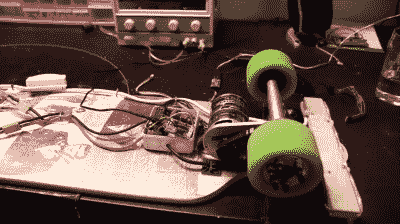

# 为长板通勤开发的开源 ESC

> 原文：<https://hackaday.com/2015/10/01/open-source-esc-developed-for-longboard-commute/>

对于电动和遥控车辆——从四轴飞行器到电动长板——装备的大脑是电子速度控制器(ESC)。电子稳定控制系统只是一个驱动无刷电机以响应伺服信号的设备，但这种简单性需要大量的技术。在过去的几个月里，[Ben] [一直致力于一个完全开源的 ESC](http://vedder.se/2015/01/vesc-open-source-esc/) ，现在他骑着一个电动长板到处跑，这个长板是由他亲手创造的驱动程序驱动的。

ESC[Ben]是围绕 STM32F4 构建的，这是一款强大的 ARM 微控制器，能够在一个小封装中进行大量计算。固件基于 [ChibiOS](http://www.chibios.org/dokuwiki/doku.php) ，还有一个 USB 端口用于连接到一个敏感的桌面绑定 UI 来调整参数。

虽然大多数爱好 ESC 本质上是从中国运来的黑匣子，但有相当数量的高性能 RC pilots 修改这些设备上的固件。虽然这些新的固件确实提高了现成 ESC 的性能和响应，但从头开始构建一个新的 ESC 打开了许多大门。[Ben]的 ESC 可以通过 I2C、UART 甚至 can 总线来控制，这极大地打开了有趣的电子飞行器的潜力。即使对于地面车辆，该 ESC 也支持再生制动、传感器驱动操作和车载里程表。

虽然这不是小型赛车四轴飞行器的电子稳定控制系统(对于这项任务来说，这完全是大材小用)，但对于大型地面电动车辆和大型航空相机平台来说，这是一个非常好的电子稳定控制系统。它甚至可以用来驱动一个小型的数控铣床，当然也是我们很久以来见过的最有趣的开源硬件之一。

 [https://www.youtube.com/embed/G8f0xg7DNmM?version=3&rel=1&showsearch=0&showinfo=1&iv_load_policy=1&fs=1&hl=en-US&autohide=2&wmode=transparent](https://www.youtube.com/embed/G8f0xg7DNmM?version=3&rel=1&showsearch=0&showinfo=1&iv_load_policy=1&fs=1&hl=en-US&autohide=2&wmode=transparent)

谢谢[Totalis]送来这个。