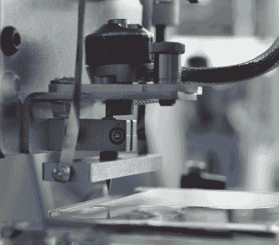
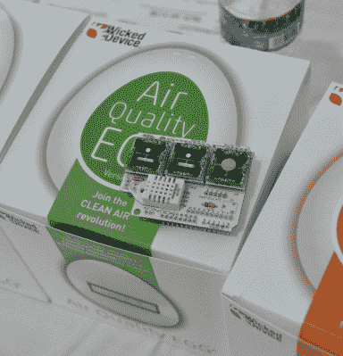

# 2015 年世界创客大会:普罗米修斯和新的空气质量鸡蛋

> 原文：<https://hackaday.com/2015/09/30/world-maker-faire-2015-prometheus-and-the-new-air-quality-egg/>

在 2015 年世界创客大会上，有大量的项目和产品可以看到。在创客馆，我们发现[Rocco Tuccio]正在展示他的 PCB CNC 路由器。像这样的机器使电路原型制作变得容易。只需将一块空白的覆铜板放入机器，加载你的设计，几分钟后你就可以准备好一块板了。普罗米修斯 sp 拥有一些令人印象深刻的规格:7 密耳(0.18 毫米)的迹线和空间，总指示跳动(TIR)为 0.0001 英寸(2.5 微米)。对于转速为 40，000 转/分的主轴来说已经不错了。[Rocco]花了两年时间设计这台机器，并从美国当地供应商那里采购了大部分零件。普罗米修斯的独特之处在于纺锤形设计。像许多其他小型 PCB 路由器一样，Prometheus 使用无刷四轴电机作为动力。[Rocco]没有使用皮带系统，而是将事情简化为简单的摩擦驱动。他唯一需要担心的精密部件是固定切割钻头的轴承。普罗米修斯还没有出售。[Rocco]计划在未来几个月启动 Kickstarter 活动。

几分钟后，我们遇到了来自 Wicked Device 的【Victor Aprea】，展示了[空气质量鸡蛋 V2](http://shop.wickeddevice.com/product-category/air-quality-egg/) 。[Victor]和他的合作伙伴[Dirk]负责空气质量鸡蛋的设计和制造，该产品在 2012 年的 Kickstarter 上获得了成功。在该项目的网站上可以在线[找到该活动的彩蛋。从那以后，维克多和德克在鸡蛋上有了很大的进步。最大的更新是传感器。臭氧、二氧化氮和二氧化硫的传感器现在是更加敏感的单元。然而这些传感器并不便宜。为了降低成本，[Victor 和 Dirk]发布了三个不同版本的产品，配备了不同的传感器套件。在连接方面，egg 现在基于 Wicked Device 的 Wildfire，允许它连接到 WiFi 网络。这些鸡蛋也很重要——[ Victor 和 Dirk]获得许可，将三个鸡蛋放在一个正式的纽约州/环保局空气质量传感装置旁边。这些鸡蛋的一氧化碳含量都在百万分之二以内，二氧化硫含量在十亿分之十以内。和最初的 Egg 一样，这些设备都是开源硬件。源代码可在](http://airqualityegg.com/) [Wicked Device 的 Github](https://github.com/WickedDevice) 上获得。