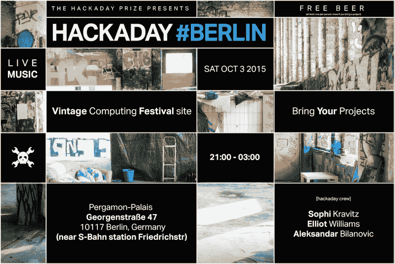

# 世界黑客日奖:德国柏林

> 原文：<https://hackaday.com/2015/09/30/hackaday-prize-worldwide-berlin-germany/>

本周六加入柏林的 Hackaday 团队，参加一个聚会！

这个周末，在德国柏林，至少有两件事情正在发生，而[[索菲](https://hackaday.io/sophikravitz)]、[[埃利奥特](https://hackaday.io/hexagon5un)和[[比尔克](https://hackaday.io/bilke)将会去看看。复古计算节是一项重大活动，看起来将会有很多极客魔术可以玩。这个周末也是柏林的[Maker Faire](http://makerfaire.berlin/en/)，我们期待着与来自 [Hackaday.io](https://hackaday.io) 的朋友们一起出去玩，我们很高兴见到新的人和项目。

Hackaday 经常在 Maker Faire 之后举办派对来庆祝我们所有的社区项目，周六晚上我们又举办了一次。我们将与 [Vintage Computing Festival](http://www.vcfb.de/2015/) 联合举办一场派对，地点与 Festival 相同，欢迎所有人参加。我们会喝点饮料，吃点小吃，VCF 为晚上准备了现场音乐。这个活动是免费的，但是我们希望你[回复](http://worldwide-berlin.hackaday.io/)，这样我们就知道需要多少茶点。

你的第一杯酒我们请客，当然，如果你带来一个项目，你的第二杯也是我们请客！请告诉你的朋友，在社交媒体上分享，并动员你的黑客空间的所有人来帮助传播这个消息。周六见！

#### 2015 年[黑客日奖](http://hackaday.io/prize)由以下机构赞助:

