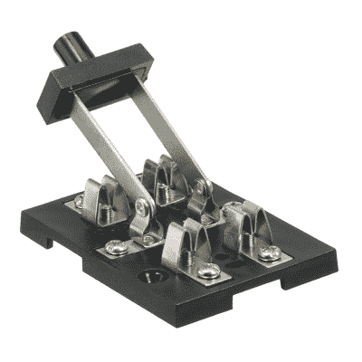

# 把你的网络从我的东西上拿开

> 原文：<https://hackaday.com/2015/10/08/get-your-internet-out-of-my-things/>

2014 年是物联网(IoT)在 Gartner 炒作周期的[达到“膨胀预期峰值”的一年。到 2015 年，](http://www.gartner.com/newsroom/id/2819918)[只朝着“幻灭低谷”前进了一点点](http://www.gartner.com/newsroom/id/3114217)。我们会试着把它推到边缘。

取决于你问的是谁，物联网似乎意味着无论是什么东西，它内部都有一台连接互联网的微型计算机，并且可以自主发送或接收数据。在你的烤面包机里放一台电脑，然后把它连上互联网！你的恒温器？[把它连上互联网！](https://nest.com/)？瑜伽垫？[互联网！](https://www.indiegogo.com/projects/smartmat-the-world-s-first-intelligent-yoga-mat#/)床褥？[到管间！](http://lunasleep.com/)

先不说 Snark，为了让你度过膨胀的期望阶段，然后走向幻灭，我们将只使用一个词:“安全”。(你醒悟了吗？每当有人说“安全”的时候，我们个人就很沮丧。这很像说“税”或“牙医的预约”，因为它意味着我们将不得不做一些不愉快但却是必要的事情。这是一个充满现实的扫兴话题。)

特别是，我们将重点关注东西内部的联网自主计算机的安全性，以及它如何与被推入的真实世界作出反应。现在，我们已经有了一个词来形容连接到互联网上的自主计算机，那就是“服务器”。因此，物联网革命真正做的是将服务器放入烤面包机。或者更糟，物联网正在把服务器放进你岳父的烤面包机里。

让我们使用两对原型:代表计算机安全知识的极端的*颈链*和*岳父*，以及代表不同连接水平和相应网络安全需求的*烤面包机*和*服务器*。你已经可以看到这是如何进行的:领子属于服务器，岳父属于烤面包机。把简单的烤面包机送给脖子上的人并不是什么大问题，但是当岳父不得不照看服务器时就糟糕了。

这是物联网的内在问题。我们把服务员伪装成烤面包机，把他们交给隐喻的岳父。最坏的情况会是什么？我们先问问联邦调查局。

## 联邦调查局、物联网和网络犯罪

物联网安全开始成为一个足够严重的问题，以至于联邦调查局在 9 月初发布了关于物联网犯罪“机会”的警报。该警报首先解释说，向烤面包机添加服务器大大扩大了“恶意网络行为者”的攻击面，并指出了许多最常见的物联网安全漏洞。它们还提供了非常合理的补救措施来消除许多漏洞。

美国联邦调查局对通用即插即用(UPnP)给予了极大的关注。UPnP 的伟大之处在于它支持自动发现和远程配置，因此使用 UPnP 的设备很容易被本地网络中的其他计算机访问。特别是对于 Windows 用户来说，这是“添加设备”向导赖以施展法术的魔杖。

最糟糕的问题是，默认情况下，UPnP 设备通常信任正在配置它们的人，这种信任可能会被滥用，从而在防火墙上打一个洞。UPnP 还有许多其他问题，安全公司 Rapid7 的这份报告是一份必不可少的读物。

因此，面向外部的设备上的 UPnP 是危及网络其余部分的立足点。难怪 FBI 想让你关掉它。假设您能够关闭 UPnP，这意味着您可以手动配置所有新的联网物联网设备，而无需奇妙向导的帮助。FBI 名单上的其他建议包括更改默认密码，跟上家庭 WiFi 安全的“当前最佳实践”，以及“在可用时”用补丁更新物联网设备。(“如果有的话”听起来不那么幼稚。)

无论如何，联邦调查局的名单是对领口的忠告。我们的岳父听说要贴膏药，拿起针线。他脑子里全是这个，这意味着尽管联邦调查局的意图是好的，烤面包机还是因为一个有缺陷的 UPnP 实现而无法修补。犯罪分子从烤面包机进来，[接管打印机](http://arstechnica.com/security/2014/09/hacker-exploits-printer-web-interface-to-install-run-doom/)，然后跳到我们岳母的瑜伽垫上，它的余生[都在发送垃圾邮件](http://investors.proofpoint.com/releasedetail.cfm?releaseid=819799)。

## 网络盗版和婴儿摄像头

我们相信你们都听说过这样的案例:一些人把他们的联网婴儿监视器和摄像机给了混蛋，然后这些混蛋会对着婴儿大喊大叫或者骚扰母亲。至少在一个案例中，问题是所有者没有更改显示器的默认密码，这可以通过快速的网络搜索找到。不更改默认密码是一个常见的岳父安全威胁。

根据记录，Foscam 是第一批受到冲击的婴儿监视器供应商之一，它后来做了正确的事情，完全取消了默认密码。(过去十年来，许多路由器制造商一直受到默认管理员密码的困扰。)但是修复多个供应商的安全漏洞就像玩打地鼠游戏:每当一个新问题被击倒时，另一个新问题就会出现。否则，在对婴儿监视器的安全性进行了两年的热炒后，你会认为 Rapid7 的[“视频婴儿监视器的十个新漏洞”](https://www.rapid7.com/resources/iot/index.jsp)会是一份更短的白皮书。

能做些什么？Sophos Security 的这篇关于保护您的婴儿监视器的文章，正如 FBI 的报告一样，建议您锁定您的家庭网络，实施安全最佳实践，并选择独特而复杂的密码。再说一次，这些都是真实的，但不完全是对岳父友好的建议。显而易见的是，没有一个“修复”实际上与物联网设备本身直接相关，而是对衣领的良好管理技巧。

## 你的冰箱漏了(你的 Gmail 密码)

今年夏天的 DEF CON 还包括一个拥有自己的迷你会谈轨道的物联网村。在一次谈话中，14 台物联网家庭自动化设备被调查[，它们(大部分)被拥有](https://www.iotvillage.org/slides_DC23/IoT11-slides.pdf)。一些攻击涉及通过物理串行控制台进入设备，我们认为这比远程可利用的缺陷更不值得关注。另一方面，在本地挖掘设备有助于发现可能被远程滥用的问题，因此本地访问不应该被完全忽视。

除了会谈之外，DEF CON 物联网村还摆了一台三星物联网冰箱，任何人都可以自由地开始入侵。在一天的工作中，[这些家伙在冰箱上有了一个可利用的角度](http://www.pentestpartners.com/blog/hacking-defcon-23s-iot-village-samsung-fridge/)。

冰箱棒极了；你不必在冰箱门上贴提醒条，因为冰箱有一个内置显示屏，可以自动与你的谷歌日历同步。只是，冰箱懒得验证它在调用谷歌时获得的 SSL 证书，这意味着窃听者可以[中间人](https://en.wikipedia.org/wiki/Man-in-the-middle_attack)你的冰箱，获得你的谷歌证书。如果你不认为窃取你的 Gmail 账户密码是个坏消息，想想你的银行的密码重置程序，以及他们是如何给你发送新密码的。

有了冰箱，再多的领带，再好的家务管理也救不了你。问题出在冰箱内部的迷你服务器本身，或者至少是它运行的软件。你的岳父要么在升级出来的时候给软件打补丁，要么自己承担后果。

## 怎么办？

如果物联网把服务器藏在烤面包机里面，交给你岳父，能做什么？将保护设备和家庭网络的责任留给他是不公平的，因为这不是他擅长的事情，而且他对供应商的安全实现中的缺陷也无能为力。我们得去别处看看。

创造绝对安全的物联网设备将是一个开端。然后，使用非常安全的云服务将它们连接起来，添加非常安全的移动应用程序来控制它们，并确保所有这些设备之间的所有通信都非常安全。完美！理论上。

在实践中，总是会有缺陷和补丁。当您将更多不同类型的计算机添加到家庭网络中时，安全漏洞就会出现。这里有一个简单的解决方案:首先不要把服务器放入烤面包机，如果你这样做了，让它很容易从互联网上取下这些东西。

这并不像听起来那样是一个勒德分子的立场。事实上，这篇 [Register 文章](http://www.theregister.co.uk/2015/06/05/kaspersky_says_airgap_industrial_systems_why_not_airgap_baby_monitors_as_well/)声称，正是尤金·卡巴斯基，一家著名的反病毒和防火墙软件公司的创始人兼首席执行官，认为这是正确的选择。更具体地说，他建议[建立能够接入互联网和婴儿监视器的无线网络。也就是说，在家中维护两个完全不通过任何设备连接的网络:一个网络用于您的婴儿监视器和其他家庭物联网设备，另一个完全独立且不连接的网络连接到互联网。毕竟，这就是像美国军方这样更懂安全的机构对他们的系统所做的事情。](https://en.wikipedia.org/wiki/Air_gap_%28networking%29)

空中双网是一个足够简单的程序，即使是岳父也有机会遵循，唯一的额外费用是第二个 WiFi 路由器。烤面包机仍然可以与冰箱对话，但它们都不能与互联网及其网络罪犯对话。但是，如果你的岳父是那种对两个独立的、有空隙的家庭网络听起来太多的人，或者如果他真的真的需要为他的烤面包机连接互联网，你还有最后一个希望。

## 关掉它

物联网设备需要一个带有本地控制覆盖的物理互联网关闭开关。物联网的部分承诺是，事物的物理性符合互联网的空间性，那么为什么所有这些事物的安全配置都在网页上呢？他们需要一个按钮！当联网的婴儿摄像头开始对着朱尼尔喊脏话时，只要按一下按钮，就切断了监视器与外界的连接。或者对于注重隐私的人来说，鸟巢侧面的一个小开关可以关闭与谷歌的所有信息共享。

如果我们要在我们的设备中体现互联网，它们应该有物理模拟的安全控制，它们也应该有在线的，从最原始的开关开始是一个很好的地方。引用联邦调查局的报告:“消费者应该意识到安装在他们家里和公司的设备和电器的功能”。没有什么比物理开关更能“感知功能”了，它能让你打开和关闭功能。否则，我们的岳父会被愚弄，认为内部服务器不在那里，烤面包机只是一个烤面包机。

(我们从这个关于物联网和我们的监控社会的[演讲中获得了这个激进解决方案的灵感](http://idlewords.com/talks/what_happens_next_will_amaze_you.htm)，这个社会在保护个人隐私方面比设备安全走得更远。这是一本很好的读物，而且[Maciej ceg owski]的六个修复中的一些可能也与安全有关，但互联网关闭开关是最明显的。)

## 顶嘴！

我们走得太远了吗？还是不够远？你对物联网设备的普及感到失望了吗？有没有其他想法可以让烤面包机内部服务器的安全参数控制更加公公友好？