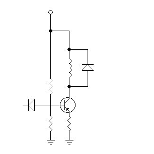

# 有史以来最差的 CAD 软件包仍然很好用

> 原文：<https://hackaday.com/2015/10/05/the-worst-cad-package-ever-is-still-handy/>

很多很棒的图表出现在酒吧餐巾纸或餐垫的背面。毕竟，当灵感来临时，你必须抓住它。今天，你可以在电脑上画图表，而且有很多选择；如果你能安装软件，你的选择几乎是无限的。如果你有一个现代的网络浏览器，有很多甚至不需要安装的好选择。

但是，当你需要一个快速的示意图来进行演示时，该怎么办呢？你在某个古老的会议室电脑上，你不能安装任何东西，但它仍然运行着一个能理解<blink>标签的浏览器？试用一下[残旧的原理图编辑器](http://www.qsl.net/wd9eyb/klunky/framed.html)。你的浏览器需要 Javascript，但仅此而已。没有 HTML 5 或任何花哨的东西。</blink>

 真如其名，这位编辑几乎用任何定义来说都是残旧的。它是这样工作的。屏幕的上半部分成为原理图符号的调色板。下半部分有一个不可见的正方形网格，与符号大小相同(37×37)。单击一个符号，然后单击下方将该符号放置在网格中。您可以不断添加更多相同的符号，直到您选择另一个符号。你可以看到一个简单的示意图创建残次品的权利。

擦除？使用空白组件(正方形中的新组件覆盖以前的组件)。布线？有电线穿过正方形的角落。旋转？大多数组件都有垂直和水平的化身。

储蓄？做一个打印屏幕，并将其粘贴到您最喜欢的程序中，用于裁剪和添加文本。您可能会注意到组件底部的空白行。您可以使用组件面板底部的链接用特殊符号填充该行。逻辑门、盒子、电子管，甚至 PCB 的尺寸。有一套完整的说明，但是除非你打算认真使用这个东西，否则你可能不需要它们。

如果你有更强大的电脑和浏览器，你可以试试 Schem-it(见下面的视频)或 [EasyEDA](http://hackaday.com/2015/08/21/a-tale-of-two-browser-pcb-tools/) 。或者也许你宁愿[安装 KiCAD](http://hackaday.com/2012/02/17/kicad-symbol-generating-script-shows-promise/) 或另一个真正的原理图捕获包。但是，尽管是残旧的，残旧的示意图编辑器可以令人惊讶地有用。

 [https://www.youtube.com/embed/otr9Pf_ecak?version=3&rel=1&showsearch=0&showinfo=1&iv_load_policy=1&fs=1&hl=en-US&autohide=2&wmode=transparent](https://www.youtube.com/embed/otr9Pf_ecak?version=3&rel=1&showsearch=0&showinfo=1&iv_load_policy=1&fs=1&hl=en-US&autohide=2&wmode=transparent)

