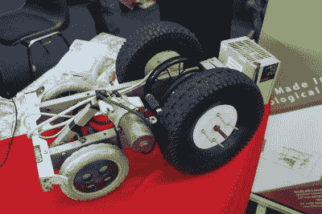
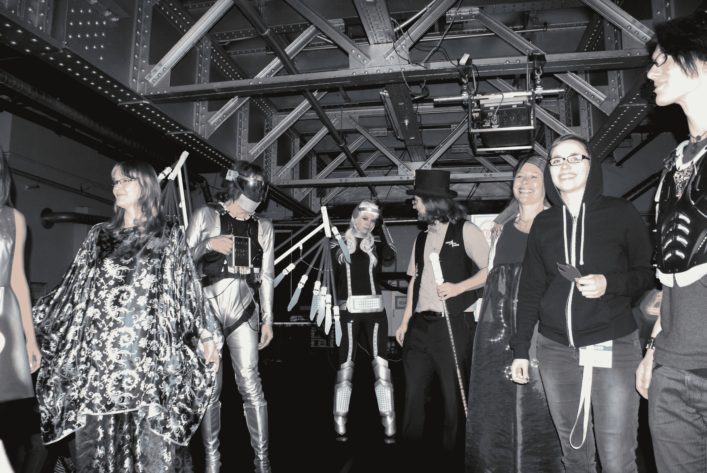
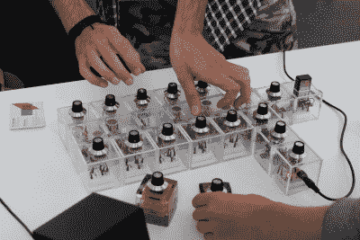
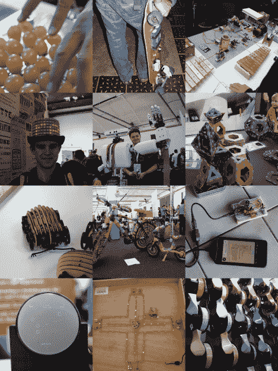

# 柏林创客节的黑客日

> 原文：<https://hackaday.com/2015/10/08/hackaday-visited-berlin-maker-faire/>

首届柏林创客节于上周末举行，Hackaday 也在那里。柏林是一个有着令人难以置信的创意氛围的城市，所以展出好东西也就不足为奇了。然而，令人惊讶的是，许多主持人不远万里来到这里。我拿着相机和笔记本到处逛，下面是我们看到的。

就在会场入口处的外面，旧邮政火车站，迎接我的是一个集装箱，它变成了一个喷火的气动怪物。“凯文”是[迈克·韦斯林]的创造，他从荷兰把它运过来参加活动。以真正的黑客风格，[迈克]接受了这个项目，说他可以为一个只有几周时间的聚会做这样的东西。然后必须弄清楚他到底要怎么做。他在容器里度过了不眠之夜，建造了这个机制，然后把盒子切开，它工作了！现在，他和“凯文”一起在节日期间巡回演出，因为你不能把这样的东西放在你的后院生锈。

 Agro-Drone 是一个简单的机器人，完全由多哥的一个创客空间 [Woelab](http://www.woelabo.com/) 的人们用废料制成。这并不意味着做太多，只是滚动和传播种子，但如果你不得不在阳光下自己做，那就太棒了。Woelab 的项目专注于低高科技:在人们的生活中添加足够的技术来解决他们的问题，但所有这些都可以通过手头的材料来实现。(电源盒已经报废，只装电池。)他们还展出了一台废弃的 3D 打印机，但在一个充满高科技 3D 打印机的 Maker Faire 中，一个简单有效的想法，如播种机器人，实际上是最突出的。

 当然有一场时装秀，而且“光彩夺目”。展出的大多数 led 灯的最大赢家是中心的受创宇航服，但最右边的胸板给了它很好的性价比。翼服上发光的羽毛在现实生活中也非常好看。最古怪奖授予了凯蒂·海皮亚的[可穿戴试验板](http://katihyyppa.com/dress-to-prototype-workshop/)(不在照片中)，嗯，可穿戴试验板。

一些柏林高中学生和他们的机器人足球赛少年[T4【足球机器人】坐在一张桌子上。这些东西是真正的机器人，绘制自己的轨迹，并在一个小足球场上完全自主地追逐一个发光的球。几乎所有的设计都有全向轮和与主人笔记本电脑的蓝牙连接。除此之外，尽管许多机器人看起来相似，但它们都是从头开始建造的。在现实生活中从未见过这些，看着它把球带回家，并试图把它推进球门，给人留下了深刻的印象。](http://rcj.robocup.org/soccer.html)

 Hypercubes 是一个完整的模块化噪音合成模块系统，是 Faire 中最好听的项目。因为这是我的拿手好戏，我和马特奥·梅纳(Mateo Mena)详细讨论了这个非常巧妙的设计，最后问他是否读过我的[逻辑噪音](http://hackaday.com/?s=logic+noise)专栏。他的眼睛亮了起来，展示了他从 Hackaday 学到的几个电路。希望在[Mateo]结束他的欧洲制造商博览会之旅后，他会有时间为我们其他人记录这些立方体！

展出的有趣项目比我们单独写出来的要多得多，所以这里有一个名人大杂烩，从左到右，从上到下。

*   8×8 电容传感器阵列连接到顶部放有葡萄的洗衣机？加上微控制器，你就有了我们见过的最奇怪的 MIDI 控制器。
*   改装过的滑板随处可见:展示着，被游客们带着到处走。
*   Dadamachines 的螺线管和伺服驱动板有一个漂亮的平板驱动前端，让你可以立刻把任何东西变成打击乐器。
*   亮闪闪的礼帽？水里有东西。这个是通过 BTLE 用主人的手机控制的。
*   [Pierre Braun]的机器人有一只[灵巧的抓爪手](https://www.youtube.com/watch?v=wp52WHuhBo8)。
*   周围有很多很棒的儿童玩具。边缘带有钩环的几何形状很酷。
*   这些激光切割和 3D 打印的“木头机器人”非常可爱。
*   没有织不出来的。
*   甚至咖啡馆区都挤满了黑客。这名男子被抓到使用 BTLE 加密狗和他的手机调试 AVR ATtiny85 over serial。
*   小行星在老式 CRT 上看起来不错。
*   这是一台电脑在裸线、谢妮和 LED 版本的“[Mensch rgere dich nicht](https://en.wikipedia.org/wiki/Mensch_%C3%A4rgere_dich_nicht)”(就像德语的 Parcheesi)中玩自己。
*   3D 打印机、打印机公司和打印机供应公司的数量比你摇动一根 3 毫米的细丝还多。

这就差不多结束了。我看到的比我们能写的多得多，所以如果你在那里，有什么让你特别感兴趣的，请在评论中发表。