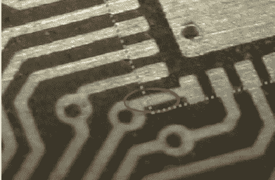

# 本周失败:边缘记录焊盘短路到无掩模 PCB

> 原文：<https://hackaday.com/2015/10/13/fail-of-the-week-marginally-documented-pad-shorts-to-maskless-pcb/>

[Erich Styger]在焊接 QFN 表面贴装芯片时被[一个讨厌的陷阱咬了一口。当把一个有无焊盘导体的芯片和一个没有阻焊层的 PCB 结合起来时，这个问题又出现了。正如您在上面的图像中看到的，有一个导体从塑料 QFN 的侧面伸出，但没有与之相关联的焊盘。因此，数据手册中不会将该导体记录为引脚。它记录在包装的机械图纸中，没有明确提及它的存在。这是包装怪癖的杰森·伯恩。](http://mcuoneclipse.com/2015/09/29/learning-from-failure-qfn-package-corner-problem/)

PCB 布局布线恰好有一条走线位于该导体的正下方。这两个并不接触，但在没有阻焊膜的情况下，一点熔化的金属能够注意到间隙并连接两个导体。[Eric]注意到，虽然没有记录非焊盘，但很容易证明它连接到地，并且有效地拉低了该走线上的信号。

在最近一篇关于 Hackaday 的文章中，我谈到了[“悬空指针”和当中断](http://hackaday.com/2015/10/09/code-craft-subtle-interrupt-problems-stack-up/)暴露 bug 时的挑战。[Erich 的]报道了大量关于嵌入式软件的帖子。我做了一些调查，很高兴地发现他用一个叫做 *cppcheck* 的程序涵盖了相同的概念和一个[解决方案。](http://mcuoneclipse.com/2015/07/02/open-source-static-code-analysis-cppcheck-with-eclipse/#more-15433)