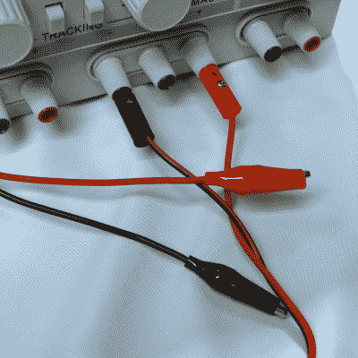
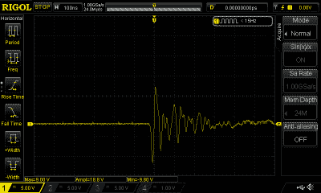
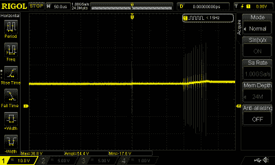
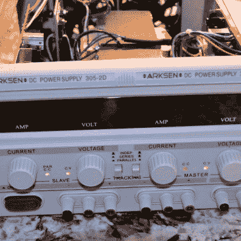
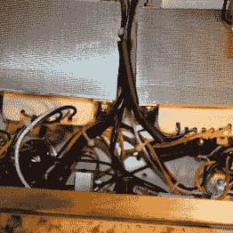
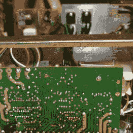
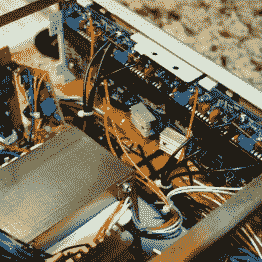
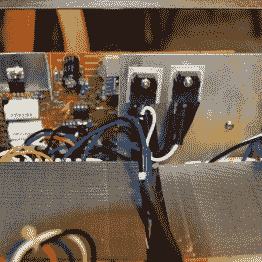
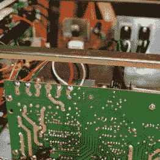
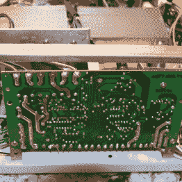

# 查看 Arksen 双电源内部

> 原文：<https://hackaday.com/2015/10/15/looking-inside-the-arksen-dual-power-supply/>

我最近买了一个 Arksen 双电源。我敢肯定，你以前在从电子商店到易贝的各种地方，以各种各样的名字见过这些东西。它们看起来价格惊人，虽然我不希望它符合我的一些专业用品，但我只是想在我的桌子下面放点东西，而不是把东西搬到长凳上，或者更糟的是，把沉重的电源拖到我的桌子上。

当我组装[声波运动传感器](http://hackaday.com/2015/10/07/bootstrapping-motion-input-with-cheap-components/)时，我发现 HC-SR04 模块需要的电流超过了我从 Arduino Leonardo 中提取的电流。我想这是一个在愤怒中使用新供给的好机会。它似乎没有太多的问题。但是，如果你有类似的供货或者正在考虑购买类似的产品，你可能想知道一些事情。

## 第一印象

 东西很重。真的很重。不过，这很好，因为它应该是一个相当大的电源(最大 30V 时为 5A)。用电压表快速检查显示，车载显示器上的电压非常接近(在 100 毫伏以内)。盒子里有一组导线。这些基本上都是垃圾。轻薄的香蕉插头，带有拧紧式连接器和焊接非常差的鳄鱼夹(见右图)。他们最终被重建，并已被接受，从那时起，但在 5A 电源引线不应该有 4 欧姆的电阻！

说到引线，电源上的接线柱内部有漂亮的小色环，指示接线柱是正还是负(红色或黑色)。问题是，在一些柱子上，几乎每次你拔出香蕉插头时，环就会突然断裂。一点强力胶就可以解决这个问题，但是粘一个全新的齿轮确实很烦人。

该电源有几个很好的特性，包括限流模式和一个电源串行或并行从属于另一个电源的模式。少了什么？如果你需要长电缆(或者想要使用随设备附带的劣质电缆)，没有 sense 输入会很好。如果没有外部电表，也无法读取专用 5V 电源上的电流。然而，对于价格(约 130 美元)，你不能抱怨太多。

## 烟雾被释放出来

电源很好地点亮了 HC-SR04，我开始从该模块获得我期望的输出。直到第二天。声纳模块出了点问题。用另一个替换它，第二天一切都恢复正常。结论:死模块。

声纳模块很便宜，所以它们的死亡率并不奇怪。但为了安全起见，我决定我最好看看电源电压时，该单位是打开和关闭。做了那件事之后，我明白声纳模块怎么了！

 在输出电容放电的情况下(也就是我把引线碰在一起)，开机还不算太差。在 12V 输出设置下，您可以在右侧看到，开始有一点点噪声。虽然接近 10 伏的负电压有点令人担忧，但正电压偏移还不错。教训:在设备打开之前，不要连接负载。在电压逐渐上升到设定电压之前，会有几次这样的爆发。即使连接了小负载(LED ),也会产生这种效应。

当然，我不会在电源连到电路上的时候打开它。你应该确保在接上电源之前就把它装好。当然，电源记得其最后的设置，但是具有真正的锅的电源可能在关闭时改变设置。对于这些电源来说，这可能不是真的，但即使电源可以干净启动，我可能也不会在连接时打开它。

 然而真正的故事，是当你看着电源关闭的时候！你可以看到输出电压约为 12V，但看看那些尖峰(在左边)！在供应完全停止之前，会有几次爆发。教训:在关闭设备前断开负载！

无论有无负载，都会出现这些垂死挣扎的峰值(在电源关闭之前会有几次)。并不是所有的都是极端的，但是在我观察到的每一种情况下，它们都超过设定电压很多。这是一个问题，因为虽然我可能不会在连接时打开电源，但我会将其关闭。即使我决定不关掉它，一点点烟雾或其他危险信号也可能让我关掉开关。我想如果停电了，你会在输出端看到同样的尖峰。

## 里面的

你可以在下面的画廊里看到一些我拍的单元内部的照片。变压器又大又重。如果你想把其中一个拆开来调整显示器或维修，最好知道手柄的背部螺栓连接到主机箱上。因此，除了侧面的八个螺栓(四个在左边，四个在右边)之外，后面的螺栓也必须出来。

构建质量是关于你对这个价位的东西的期望。然而，我听人说过，这类电源的制造质量可能会有很大差异，因此这一个样本点可能不足以得出结论。

  Power supply with lid removed  Big heavy transformers  Big transformers  Identical boards on both sides  Display board  Pass transistors  Power supply board  Power supply board

## 最后

说到结论，我还会再买这个吗？我不确定。它肯定是有用的。我不确定它会随着时间的推移漂移多少，也不知道我是否会信任它在无人看管的情况下驱动大量负载。断电时的输出峰值几乎会破坏交易。如果你有一个昂贵的样机连接到它和交流电源死亡，这可能是一个真正的问题。

当然，修改电源是可能的。即使在输出端跨接一个快速反向二极管，也会将负偏移箝位在一定水平(不过，你必须确保不要弄乱两个电源的组合)。如果你能装配一个比电路其他部分关断更快的继电器，它就能在关断尖峰发生之前断开输出。稍微延迟一下可能也会有帮助。

尽管如此，这看起来还是有很多工作要做。如果你搜索剩余市场，有一些优秀的主要品牌电源(如 Lambda，Power Designs 或 HP)可以用这个价格买到，特别是如果你可以降低当前的处理预期。当然，它们会被高度使用，但是它们也会被很好地建造和设计。

另一方面，对于我想要的东西——我办公桌上的一个受监管的权力来源——来说，这似乎不错。停电时，我可能会吸 3 美元的 ARM 芯片或 2 美元的声纳传感器，但这是我愿意冒的风险。