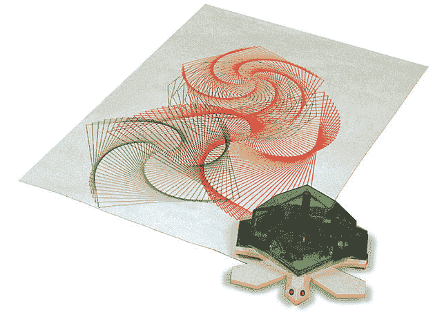

# 低成本、兼容 Arduino 的绘图机器人

> 原文：<https://hackaday.com/2015/10/24/low-cost-arduino-compatible-drawing-robot/>

让女性接受技术教育有时似乎是一个无法克服的挑战。作为一个计数器，一个由[MakersBox]创造的小型绘图机器人可能会有所帮助。这个机器人被用于 T2 一个为少女开设的 ChickTech 工作室。

“Turtle draw” by Valiant Technology Ltd..

机器人的目标是拥有一个易于制造、易于编程的机器人，它可以做一些有趣的事情，并且成本低廉，因此研讨会参与者可以将它带回家继续学习。这些要求促使[MakersBox]采用 Adafruit Pro Trinket 3V、步进电机以提高精确度，以及 3d 打印底盘以实现定制。

[MakersBox]建议，Arduino 的另一个版本应该没有任何问题，甚至可能是树莓 Pi。后者更加多样化的编程环境带来了许多可能性

像这样用于教育的绘图机器人并不新鲜。20 世纪 80 年代，西蒙·派珀特创造了第一批海龟机器人之一，如左图所示。他甚至创造了徽标编程语言，并将其用于海龟。[MakersBox 的]和最初的海龟有一个有趣的相似之处，那就是两者的中心都是绘图笔。

向我们在 [Adafruit](https://www.adafruit.com/) 的朋友致敬。

一朵玫瑰，是一朵玫瑰，是一朵玫瑰，即使是机器人画的，折了之后。

 [https://www.youtube.com/embed/Uo2aUUNhdKs?version=3&rel=1&showsearch=0&showinfo=1&iv_load_policy=1&fs=1&hl=en-US&autohide=2&wmode=transparent](https://www.youtube.com/embed/Uo2aUUNhdKs?version=3&rel=1&showsearch=0&showinfo=1&iv_load_policy=1&fs=1&hl=en-US&autohide=2&wmode=transparent)

