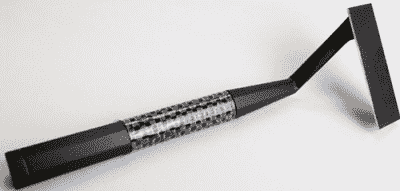

# Skarp 激光剃须刀 Kickstarter 暂停，跳转到 Indiegogo

> 原文：<https://hackaday.com/2015/10/13/skarp-laser-razor-kickstarter-suspended-jumps-to-indiegogo/>

千百年来，人们一直梦想有一种无刺激、刮得很干净的剃须刀。[吉列]已经很接近了，而且随着多刀片的出现，甚至更接近了，但今天所有的剃刀仍然只是在皮肤上拖动的锋利的钢。这是 21 世纪，当然有一个激光剃须刀迎合你的 moola 的概念。[我们最近报道了 Skarp 激光剃须刀及其 Kickstarter 活动](http://hackaday.com/2015/10/01/ask-hackaday-i-love-the-smell-of-burnt-hair-in-the-morning/)，今天该活动已被关闭。

发送给 Skarp 活动所有参与者的电子邮件如下:

> 你好，
> 
> 这是 Kickstarter 的诚信团队发来的消息。我们写信通知你，斯卡普激光剃刀项目已经暂停，你的承诺已经取消。
> 
> 在向项目创建者请求并审查了额外的材料后，我们得出结论，这违反了我们要求提供实物产品工作原型作为奖励的规定。因此，所有资助都已停止，支持者不会因其承诺而被收费。你不需要采取进一步的行动。暂停是不可撤销的。
> 
> 我们非常重视 Kickstarter 系统的完整性。只有当我们发现有证据表明我们的规则被违反时，我们才会暂停项目。
> 
> 问候 Kickstarter 诚信团队

Skarp 团队仅用了八个小时就在 Indiegogo 上重新发起了众筹活动。截至本文撰写之时，已有超过 900 人(表面上来自最初 Kickstarter 活动的 20，000 名支持者)承诺加入新的活动。

虽然我们永远不会知道 Kickstarter 暂停最初 Skarp 活动的确切原因，但 Kickstarter Integrity 团队给出的原因指向缺乏工作原型，这是 Kickstarter 上技术活动的要求之一。有趣的是，Skarp 确实发布了一些他们剃须刀工作的视频。这些视频的白平衡很差，看起来像是通过绿色玻璃纸拍摄的，一些人声称这种技术用于隐藏原型理发方法背后的实际机制。Skarp Kickstarter 活动和 Hackaday 上的一些评论者猜测，Skarp 原型没有使用激光，而是一段加热的镍铬合金线。虽然这将烧掉头发，但在任何正常的照明条件下拍摄时，电线的颜色将是暗红色。据推测，Skarp 原型视频的低质量是为了掩盖他们没有工作原型的事实。

The Skarp laser razor. Source

Skarp 向 Indiegogo 的转移受到了一些人的称赞——主要是在 Indiegogo 运动的评论区——也受到了互联网上所有其他论坛的嘲笑。Indiegogo 通常被视为众筹骗子的最后避难所，但有几个合理的原因可以解释为什么一个活动会选择去 Indiegogo。并非所有国家的活动创始人都可以使用 Kickstarter，对于一些人来说，立即从卡上扣款，而不是像 Kickstarter 那样在活动结束后扣款，是一种合法的众筹策略。

但是对于一个众筹活动在 Kickstarter 上暂停，马上转移到 Indiegogo？这几乎不会有好结果。最著名的例子之一，[Anonabox，在被发现创造者只是简单地重新标记了一个现成的路由器后，其 Kickstarter 活动被暂停。](http://hackaday.com/2014/10/17/anonabox-how-to-fail-horribly-at-kickstarter/)[anona box 随后转移到 Indiegogo](https://www.indiegogo.com/projects/anonabox-access-deep-web-tor-privacy-router#/) ，在那里筹集了超过 8 万美元。Skarp 激光剃须刀的活动已经从 Indiegogo 筹集了 135，000 美元，此前其 Kickstarter 活动筹集了 400 多万美元。不，Skarp 不会是有史以来最成功的科技 Kickstarter 活动之一。我们只能希望这不会是 Indiegogo 最成功的活动之一。