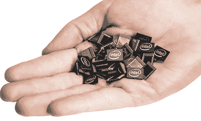

# 英特尔和 Arduino 推出基于 Curie 的教育板

> 原文：<https://hackaday.com/2015/10/16/intel-and-arduino-introduce-curie-based-educational-board/>

本周，英特尔和 Arduino 发布了他们第一款直接推向教育市场的产品，由英特尔 Curie 模块驱动的 [Arduino/Genuino 101 主板](https://www.arduino.cc/en/Main/ArduinoBoard101)。

### 英特尔 Curie 模块

Arduino/genu ino 101 是英特尔 Curie 模块的第一个开发平台，该模块是英特尔制造商和创新者小组最近开发的。纽扣大小的 Curie 是一个封装微控制器、蓝牙、6 自由度 IMU 和电池充电电路的单一封装；任何以“可穿戴”为卖点的必备硬件。Curie 的大脑是一个 32 位英特尔 Quark 微控制器，带有 384kB 的闪存 80kB SRAM，使其与低端 ARM Cortex 微控制器的存储和 RAM 大致相同。

称为模块，它需要一个载板与硬件接口。这就是 Arduino/Genuino 101 的用武之地。该主板是英特尔和 Arduino 的第三次合作，提供了与最流行的 Arduino 产品相同的外形和引脚排列。虽然基于 Curie 的 Arduino/Genuino 101 不会取代非常受欢迎的 Arduino Uno 和 Leonardo，但它会以类似的价格(30 美元或€27)追逐相同的市场——教育工作者和制造商。与 Arduino Uno 的价格相同，Arduino/Genuino 101 提供蓝牙、IMU 和奇怪的是相同的 USB 标准 B 插座。

英特尔对 Curie 模块有进一步的计划；2016 年，因真人秀出名的英特尔、[马克·布奈特]和联合艺术家媒体集团将制作[美国最伟大的制造商](https://www-ssl.intel.com/content/www/us/en/wearables/americas-greatest-makers.html)，这是一个以制造商开发电视可穿戴电子产品为特色的真人秀节目。不，这不是*垃圾场大战*，但在 *MacGyver* 重新开机之前，这是我们在电视上最接近人们建造东西的场景。

### 英特尔之前的 Arduino 产品

2013 年，英特尔和 Arduino 推出了 Galileo 板，这是一款集成了 I/o、以太网、PCIe 和英特尔指令集的开发板。这是远离近年来制造的所有 ARM、AVR 或 PIC dev 板的重大举措，标志着英特尔首次涉足教育、制造和物联网领域。2014 年，[英特尔和 Arduino 发布了 Edison](http://hackaday.com/2014/09/10/hands-on-with-the-intel-edison/) ，这是一款为嵌入式市场和企业家设计的微型主板。

Arduino 101 和 genu ino 101——同一事物的不同名称，也是 arduino.cc 商标问题和 [Arduino vs Arduino](http://hackaday.com/2015/05/22/arduino-vs-arduino-these-are-not-the-droids/) 战争的第一次伟大表达——专门针对“创客”市场，无论这个市场多么短暂和难以定义。Arduino 101 的外形直接追随 Arduino Uno 和 Leonardo 的脚步；101 与 Leonardo 具有相同的尺寸、相同的引脚排列和单个 USB 端口。

作为“maker market Arduino ”,该板旨在将技术带入课堂。在本周早些时候的一次会议上，[Massimo]将 Arduino 101 定位为技术、编码、艺术和设计之间的教育交叉点。不学习微控制器开发的学生将学习为艺术和设计项目编写 Arduino 程序。Arduino/Genuino 101 是 STEM 教育的推动力。

### 居里夫人要去哪里

英特尔对 Curie 模块有很大的计划，已经有一些产品在生产中。英特尔爱迪生已经进军消费电子产品和可穿戴设备领域，[包括一个电子滑雪教练](http://snowcookie.eu/)，它会告诉你什么时候吃披萨，什么时候吃薯条。居里*将*独立于 Arduino/Genuino 101 上市，两款产品都将于 2016 年初发布。