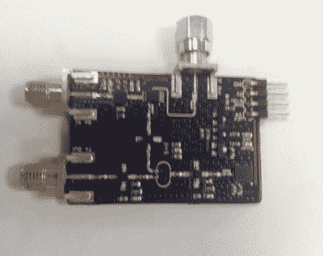
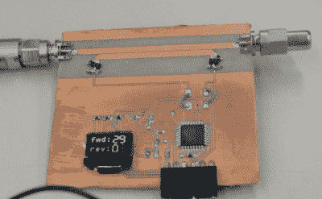
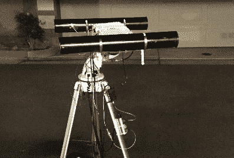
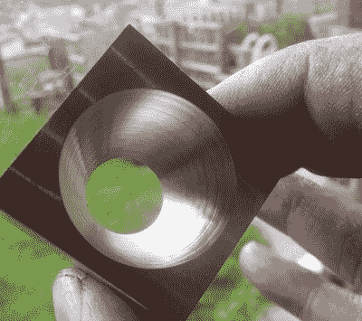

# Hacklet 80 千兆赫项目

> 原文：<https://hackaday.com/2015/10/16/hacklet-80-gigahertz-projects/>

介于我们许多人参与的高频项目和可见光谱之间的是超高频、e HF、SHF 和 THF。对于那些不了解内情的人来说，这是非常非常高的频率。所有这些都涉及千兆赫和太赫范围内的频率。虽然现代计算机已经使千兆赫成为一个家喻户晓的术语，但实际上在千兆赫频率范围内处理信号仍然是一个令人生畏的前景。总有一群精英黑客、制造商和工程师在修补使用 GHz 频率的项目。本周的 Hacklet 是关于 Hackaday.io 上一些最好的 GHz 项目！

 我们先从【卢克韦斯顿】和[简单、低成本的 FMCW 雷达](https://hackaday.io/project/1682)说起。多年来，像 Hackaday 自己的[Gregory L. Charvat]这样的人一直在建造[简化的雷达系统](https://hackaday.com/2015/04/07/build-a-phased-array-radar-in-your-garage-that-sees-through-walls/)并为我们其余的人记录它们。[Luke]的目标是让像这样的雷达系统对普通黑客来说更容易接近。他把所有的专业部件都放在一块板上。[卢克]没有采用大型[微型电路](http://www.minicircuits.com/homepage/homepage.html)模块，而是采用芯片级封装的[Hittite](https://www.hittite.com/)微波部件。调制来自微芯片 MCP4921 混合信号 DAC。该系统工作正常，并演示了 5 GHz 至 6 GHz 频段的发射和接收。[Luke]甚至演示了使用观测仪探测近距离物体。

 接下来是【kodera2t】带着一个全新的项目，他的[微波阻抗分析仪](https://hackaday.io/project/8041)。我们喜欢早上新磨的印刷电路板的味道。不过，为了[kodera2t 的]工厂，我们希望他剥离掉 PCB 中的大部分铜。该板使用一对耦合走线来测量微波传输线上的正向和反向阻抗。[kodera2t]通过在连接 50 欧姆终端时发送信号来演示这一点。仅显示正向电流。不过，去掉终结器后，信号会反射回传输线。反向电流上升以匹配正向电流。当使用射频设备时，即使是低功率 QRP 发射机，这样的工具也是无价之宝。

【Majolsurf】带着 [ISM S 波段 LFMCW 雷达原型机](https://hackaday.io/project/147)上移至 GHz 频段。Hackaday.io 上的首批 200 个项目之一，这个雷达是[majolsurf]的一个长期项目。他的车道附近有一个危险的十字路口。在路上超速行驶的汽车使得倒车成为一项危险的操作。坚持 2.4 GHz 可以让[Majolsurf]使用廉价的现成 WiFi 组件。然而，随着时间的推移，他发现有时商业部分并不完全符合要求。八木 WiFi 天线被自制食堂胜过。一个低成本的 WiFi TX/RX 功率放大器在 TX 端产生的功率远没有它宣传的那么多。RX 端居然把信号衰减了！即使遇到这些挫折，[majolsurf]已经从他附近的汽车上捕捉到了多普勒频移。下一步是在战场上尝试更远距离的目标。

 最后，我们有请【保罗·科奇拉】与 [EM-Drive](https://hackaday.io/project/5596) ，一位 2015 年黑客日奖半决赛选手，一起工作在科学的前沿。电磁或 EM 驱动器，有时称为 RF 共振腔推进器，是一种仍在研究中的新技术。将射频能量注入共振腔，似乎会产生微小但可测量的净推力。[Paul]正在家里复制这个，但不是在 2.4 GHz ISM 频段。他把频率提高到了 24 GHz。更高的频率导致更短的波长，以及更小、更易管理的实验。到目前为止，测试很有希望。[保罗]正在用干涉仪测量运动，他看到了变化。我们第一次报道这个项目是在八月，我们急切地期待着更新。

如果你想看到更多可笑的高频实验，请查看我们新的[千兆赫项目列表](https://hackaday.io/list/8087-gigahertz-projects)。我错过你的项目了吗？别害羞，就在 Hackaday.io 上给我留言吧，本周的 Hacklet 到此为止，一如既往，下周见。同样的黑客时间，同样的黑客频道，带给你最好的 [Hackaday.io](https://hackaday.io) ！