# 可编程逻辑:为自己构建一个 CPLD 模块

> 原文：<https://hackaday.com/2015/10/28/programmable-logic-build-yourself-a-cpld-module/>

复杂可编程逻辑器件(CPLD)是一个很好的硬件。顾名思义，你可以对这些芯片进行编程，以服务于你所需要的逻辑功能。这可能是替换一个过时的芯片，或者只是一种学习和尝试不同技术的方法。有什么比拿到 CPLD 并试一试更好的学习方法呢？

我创建了一个 CPLD 模块，目的是能够将其插入许多东西，包括无焊试验板，但我搞砸了。看起来无焊试验板上可用的插件空间是 1.1 英寸，我把尺寸做成了 1 英寸宽，两边都没有空间放一排电线。咄。

但是，让我回顾一下，展示一下我正在做的事情，我想制作一个可编程的逻辑部件，可以作为一个套件来构建，可以在家里轻松焊接，可以在线编程，可以在 3.3 或 5 伏下工作。

 [https://www.youtube.com/embed/oQwsclx3UbA?version=3&rel=1&showsearch=0&showinfo=1&iv_load_policy=1&fs=1&hl=en-US&autohide=2&wmode=transparent](https://www.youtube.com/embed/oQwsclx3UbA?version=3&rel=1&showsearch=0&showinfo=1&iv_load_policy=1&fs=1&hl=en-US&autohide=2&wmode=transparent)


[](https://hackaday.com/wp-content/uploads/2015/10/image5b1.jpg) 为了实现一个易于焊接的套件，我使用了一个较旧的 CPLD 器件，它也有 3.3v 和 5v 版本，无论功率如何都可以保持编程。逻辑本身是 Altera Max 系列的 CPLD IC，有两个版本，适合 32 或 64 宏单元电路板。宏单元是基本的逻辑构建块，它用逻辑“术语”编程，然后通过可编程互连与其他宏单元互连。

### 项目文件

[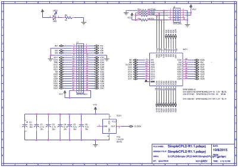](https://hackaday.com/wp-content/uploads/2015/10/cpld-version-1-schematic.png) 看着原理图，你会发现其实没什么大不了的:基本上就是 CPLD，用于在线编程的电路和一个驱动 CPLD 中逻辑的振荡器。

*   [简单 CPLD 原理图](https://hackaday.com/wp-content/uploads/2015/10/cpld-version-1-schematic.pdf)
*   [简单的 CPLD PCB 布局](https://hackaday.com/wp-content/uploads/2015/10/cpld-version-1-pcb-layout.pdf)
*   [简单 CPLD BOM](https://hackaday.com/wp-content/uploads/2015/10/bill-of-materials-simplecpld-r1-1.pdf)
*   [简单的 CPLD Gerbers](https://hackaday.com/wp-content/uploads/2015/10/simplecpld.zip)

### 复杂可编程逻辑器件:安装在通孔插座上的表面贴装器件

[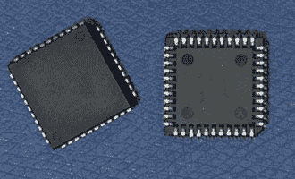](https://hackaday.com/wp-content/uploads/2015/10/image-j-lead1.jpg) 这款器件称为 EPM7032 和 EPM7064，采用 44 引脚塑料引脚芯片载体(PLCC)封装，由于引脚呈 J 形，有时也称为 J 引脚。这种封装可以插入通孔插座或直接焊接到 PCB 上。

### 振荡器

内置片上振荡器，因此 CPLD 可以有状态地工作，并自行创建快速计数器，而无需外部时钟。如果有外部时钟可用，可以使用模块上的高速时钟在外部时钟的每个上升沿或下降沿创建一个时钟事件，同时仍然遵守 CPLD/FPGA 的准则，即应该使用内部全局时钟网络，而不是“异步”驱动时钟输入。该振荡器的额定电源电压在 1.8 至 5.5 伏之间。

如果你看视频，你会看到我讨论我的个人偏好如何对待振荡器上的启用“INH”引脚；简单地说，我倾向于让它浮动，在我检查规格表，这样做是合法的。

[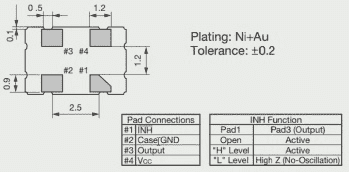](https://hackaday.com/wp-content/uploads/2015/10/image25.jpg)

处理这类功能时，我脑海中闪过的原因包括，如果可以的话，我不喜欢将输入引脚直接连接到电源轨。也就是说，我更喜欢使用一个串联电阻来限制瞬变过程中的电流，即使这是不必要的。

这些年来，我在生产(大规模生产)中见过一些问题，有时像电源循环这样的事情会让直接连接到电源轨的引脚具有比芯片本身更高的电压，这是不好的。最后，通过一个电阻将一个引脚连接到电源轨，无论是电源还是地，人们都可以在以后改变主意并使用该引脚。根据我的经验，对于未使用的栅极来说尤其如此，您可能知道，这些栅极永远不应该悬空或断开。通过使用上拉电阻，您可以连接信号并使用栅极，而不必切割铜走线。

## CPLD 编程

10 针连接器和一些电阻组成了编程电路。如果所有电阻都是上拉电阻，我会使用一个电阻网络，但遗憾的是，其中一个是接地的。

[](https://hackaday.com/wp-content/uploads/2015/10/image8b.jpg) 要像这样对一个独立的 CPLD 编程，需要一个专门的程序员。这对我来说很容易，因为我通常有几个，但如果你没有一个，进入游戏也不会太痛苦。一个被认可的“Altera USB Blaster”售价 50 美元，可以从 Digikey 等地方买到。我有几个从易趣上得到的克隆，包括一个支持 Altera，Xilinx 和 Lattice 的克隆。互联网上有一个项目和代码可以用来制作你自己的克隆体，我把它放在我的视频列表中，用来做一个程序员克隆体的项目。我还将展示一个盾牌设计，其中主板，Arduino，PIC 等。，可以进行编程

对 CPLD 进行编译和编程所需的软件可以从 Altera 免费获得[,尽管这个旧的部分需要旧的](https://wl.altera.com/download/software/quartus-ii-we/9.1sp2)[版本 9.1](https://wl.altera.com/download/software/quartus-ii-we/9.1sp2) 。好消息是，这是我最喜欢的旧版本，有一个直观的时间分析器，在后来的版本中被删除。

### 印刷电路板

[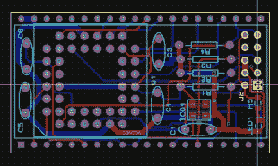](https://hackaday.com/wp-content/uploads/2015/10/image14c.jpg)PCB 是一个简单的双面设计，我倾向于做一个铜浇注的地，有时电源，只要电路板适合它。有时倒得太碎了，以至于实际上可能会引发问题，或者只是最终结果太草率，所以铜倒也是一种工具，但需要加以管理。

### 3D 视图

[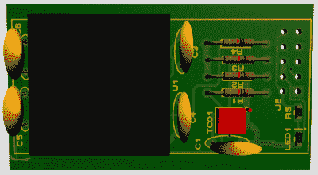](https://hackaday.com/2015/10/28/programmable-logic-build-yourself-a-cpld-module/3d-block/)

Default 3D

[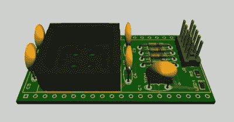](https://hackaday.com/2015/10/28/programmable-logic-build-yourself-a-cpld-module/3d1/)

Custom 3D Objects

[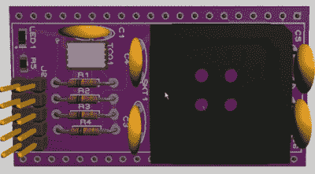](https://hackaday.com/2015/10/28/programmable-logic-build-yourself-a-cpld-module/image27b/)

OSH Park Colors

如今，许多(如果不是大多数的话)CAD 软件包都包含了最终产品的 3D 视图，尽管图像的准确性仅与用于表示零件的 3D 模型一样准确。在这里可以看到，我为 44 针插座、编程连接器和振荡器选择了 3D 模型。以下是我喜欢使用的一些 3D 软件包:

*   [www.pcb-3d.com/](http://www.pcb-3d.com/)
*   [www.3dcontentcentral.com/](http://www.3dcontentcentral.com/)
*   [www.pcblibraries.com/Products/FPX/3D-STEP_TH.asp](https://www.pcblibraries.com/Products/FPX/3D-STEP_TH.asp)

此外，许多公司都有其组件的 3D 模型。Molex 只是在这方面做得相当好的公司之一。

## 错误

[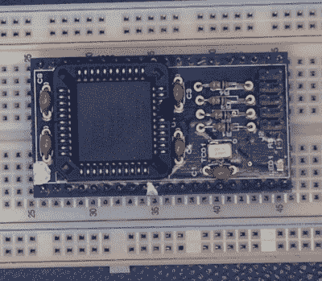](https://hackaday.com/wp-content/uploads/2015/10/image11b.jpg)

Only room for one row.

我犯的错误对功能的影响不如对美观的影响大，这还不算主要问题，那就是它不太适合一个无焊的试验板。

一旦我想到我可能会与任何人分享设计，我立刻对 CPLD 的原理图符号和 40 引脚连接器的引脚排列感到不满意，这是它的整体足迹。我找到了一个 40 引脚的双排连接器符号，并将其改造为 1 英寸的尺寸，但是它的引脚编号不是像 DIP 封装那样编号为 1、2、3、4，而是像带状电缆连接器那样编号为 1、3、5、7。因此，对于计算如何连接到模块和故障排除来说，这是一个不直观的足迹。

[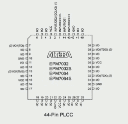](https://hackaday.com/wp-content/uploads/2015/10/image211.png) 同样的 CPLD 引脚排列也有点混乱，我用了一套依赖边界扫描描述语言(BSDL)的实用程序来创建这个符号。大多数大厂商的主流零件都有可用的 BSDL 文件，这些文件允许你(半)自动创建符号和封装外形。像任何自动化产品一样，它需要像工具一样对待，可能需要进一步按摩才能达到最佳效果。在这种情况下，我让它按字母顺序列出引脚，这在跟踪电路板上的引脚时几乎是随机的。只能说我那天很匆忙。

在未来的某个时候，你会为这些捷径付出代价。当我去修改这个模块时，我会确保给它一个与零件本身匹配的引脚位置，以便知道在哪里放置您的示波器探头就像看一眼原理图符号一样容易。

还有其他一些改进，主要是美观或者在使用主板时有用。对于几个封装，引脚 1 指示器需要更加普遍，我总是喜欢一个简单的接地点来连接示波器接地或 VOM 引线。我可能会添加一个双引脚连接器，以便电源和接地可以直接应用于电路板，而不是夹在底部引脚上。

### 修订前测试

在我修改板子之前，我想确保它能正常工作，尽管存在物理和美学问题。通电后，验证振荡器工作正常，我插入编程器，它感应到 CPLD，尽管 3.3v 版本比编程软件更新，并显示为“未知”设备。

接下来，我在 Quartus 中创建了一个计数器，并分配了 pin 号。快速编译和下载以及计数器功能(如示波器所示)验证了该设计的可行性。

[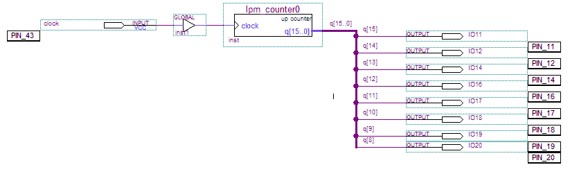](https://hackaday.com/wp-content/uploads/2015/10/top-sch.png)

## 

Verilog 中的快速测试电路非常简单。代码如下所示，您可以下载一个包含原理图和 Verilog 测试电路的 [ZIP 文件作为 Quartus II 项目(需要版本 9.1)。](https://hackaday.com/wp-content/uploads/2015/10/u1-design.zip)

```
module block1
(
 clock,
 IO11,
 IO12,
 IO14,
 IO16,
 IO17,
 IO18,
 IO19,
 IO20
);
```

```
input clock;
output IO11;
output IO12;
output IO14;
output IO16;
output IO17;
output IO18;
output IO19;
output IO20;
reg [15:0] q;
```

```
assign IO11 = q[15];
assign IO12 = q[14];
assign IO14 = q[13];
assign IO16 = q[12];
assign IO17 = q[11];
assign IO18 = q[10];
assign IO19 = q[9];
assign IO20 = q[8];
```

```
always @ (posedge clock)
 begin
 q <= q + 1;
 end
```

```
endmodule
```

## 从这里去哪里

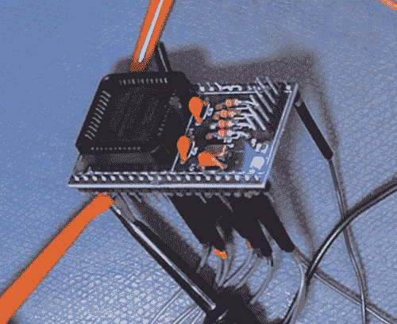正如我提到的，我将对主板进行第二次修改，更多地关注分享设计或进行任何故障排除时所需的细节。由于我需要将底部连接器的宽度设为 0.9 英寸或更小，因此我可以将其设为 0.6 英寸，这是一个标准的“宽”DIP 尺寸。这样做意味着下侧引脚会从 CPLD 插座中伸出来。我不会在生产情况下这样做，因为当时是手工组装，但目标之一是制作一个手工可焊接套件。手工焊接的折衷方案是，振荡器确实需要在 SMD 表面贴装外壳中，通孔版本非常大，通常不支持我想要的电压范围。

此外，我真的很喜欢表面贴装发光二极管，我认为他们看起来很酷。