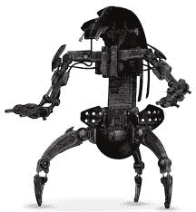

# 球形机器人滚动，然后进入行动

> 原文：<https://hackaday.com/2015/10/19/spherical-robot-rolls-then-walks-into-action/>

 

Droideka【来源:[wookiepedia](http://starwars.wikia.com/wiki/Droideka/Canon)】

如果有任何科幻机器人外形比*星球大战*系列中的 Droideka 更有意义，我们不确定它会是什么。这位好莱坞战斗机器人能够从一个在战场上快速滚动的球体变成一个布满冲击波的三脚架步行机，展现了丰富的想象力，并产生了一个非常可行的设计。现在，这个基本设计已经在一个球形四足机器人[中展示出来，这个机器人](http://spectrum.ieee.org/automaton/robotics/robotics-hardware/robot-unfolds-legs-to-walk)可以从滚动变成行走。

来自日本千叶理工学院的 QRoSS 机器人旨在证明混合滚动行走运动系统的概念，它已经能够做一些非常惊人的事情。QRoSS 被一个独立于机器人腿的钢丝滚笼包围着，能够滚动到位，张开腿，并走到它需要去的地方。四条独立的腿使它在崎岖的地形上步履稳健，在城市搜索和救援等领域有明显的应用；硬化版可以被扔进倒塌的建筑物或其他危险的环境中，四处走动以提供情报或提供援助。这个机器人的自我扶正功能对于这种使用情况来说尤其方便，正如你在下面的视频中看到的，它有一个动力滚动模式，比它的行走速度快 6 倍。

对于类似的球形变形机器人，一定要看看具有六足设计的 [MorpHex 机器人](https://hackaday.com/2014/04/24/sphere-morphing-hexabot-takes-on-the-wilderness/)。

 [https://www.youtube.com/embed/fR3idpUlKhs?version=3&rel=1&showsearch=0&showinfo=1&iv_load_policy=1&fs=1&hl=en-US&autohide=2&wmode=transparent](https://www.youtube.com/embed/fR3idpUlKhs?version=3&rel=1&showsearch=0&showinfo=1&iv_load_policy=1&fs=1&hl=en-US&autohide=2&wmode=transparent)

[通过 [Gizmodo](http://gizmodo.com/this-spherical-robot-can-unfurl-its-four-legs-after-bei-1736909960)