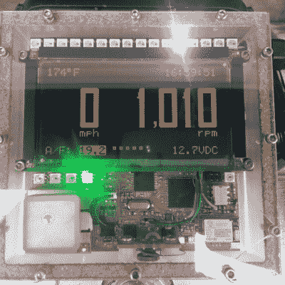

# 超级摩托车获得自举仪器改装

> 原文：<https://hackaday.com/2015/10/27/superbike-gets-bootstrapped-instrument-refit/>

[Josh]在他的 GSXR 超级自行车上去掉了标准的工厂仪表，安装了一个[定制仪表板](http://www.imsolidstate.com/archives/1566)，它显示一些常规仪表组没有的附加参数。他正致力于将他的自行车改装成[街头霸王](https://en.wikipedia.org/wiki/Streetfighter)——一种精简的、好斗的、卑鄙的机器。除了其他几个模块，稳重的仪表必须去给他的自行车正确的外观。

幸运的是，他有合适的技能和工具来确保这个 DIY 的黑客不辜负他自行车的街头霸王信誉。对他来说，重要的参数是记录空气/燃料混合比，这样他就可以进行汽化工作。一路走来，他似乎有点过分了，但最终的结果是相当不错的。这个建筑以一个放在他零件箱里的[平面](http://www.planar.com/products/) 160×80 EL 图形显示器为中心。显示器没有控制器，所以他使用[爱普生 S1D13700 图形控制器](http://global.epson.com/products/semicon/products/lcd_controllers/#ac01)将其与微控制器接口。一台 Atmel ATmega128L 运行该系统，[Josh]用“C”编写了他的所有代码。

自行车速度是通过 GPS 模块获得的。空燃比从宽带氧传感器读取。显示屏上显示的其他数据包括发动机温度、蓄电池电压、时间(来自 GPS)和发动机转速。环境光传感器用于自动调暗显示器。显示器的高刷新率高达 240Hz，允许无闪烁的大调光范围。光传感器还控制其他指示灯的亮度。一个 [BC127 蓝牙模块](https://www.sparkfun.com/products/11927)允许通过串行端口配置文件(SPP)进行数据记录。将来，这可能允许他在显示器上显示来自他的电话的 SMS 消息。一组可寻址的 LED 可以被驱动，以显示几种功能-指示灯，转速，电池电压，发动机温度或空气/燃料比-使用按钮选择。

[Josh]用他的 CNC 用 1”厚的丙烯酸铣出外壳。好看的 PCB 是用 Eagle 设计的，用同样的 CNC 加工出来的。它全部是 SMD，带有大量的 0805 器件，显示的是 rev B——所以他可能对 rev A 进行了改进。查看下面的视频，其中[Josh]演示了一些功能。

 [https://www.youtube.com/embed/nbPcdx6BBSA?version=3&rel=1&showsearch=0&showinfo=1&iv_load_policy=1&fs=1&hl=en-US&autohide=2&wmode=transparent](https://www.youtube.com/embed/nbPcdx6BBSA?version=3&rel=1&showsearch=0&showinfo=1&iv_load_policy=1&fs=1&hl=en-US&autohide=2&wmode=transparent)

