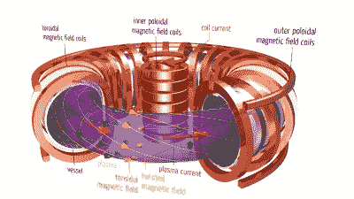
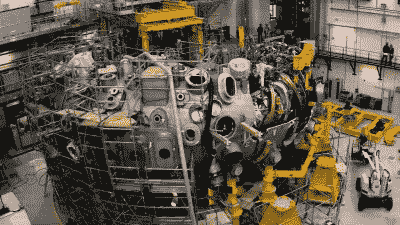

# Stellarator 是德国极其复杂的核聚变

> 原文：<https://hackaday.com/2015/11/02/stellarator-is-germanys-devilishly-complex-nuclear-fusion/>

你以前可能没有听说过 Stellarator，但是如果本月晚些时候在德国东北部的一个小大学城一切顺利，你会知道的。这是因为温德尔斯坦 7-X 终于要火了。如果它能够保持聚变等离子体的热量，这将是一个巨大的突破。

那么什么是星状器呢？这是一种特殊类型的核聚变容器几何结构，虽然建造和维护极其复杂，但有机会成为第一个实现收支平衡的核聚变发生器，从核聚变反应中提取的能量大于或等于创造必要的热等离子体所用的能量。

W7-X 上有一个很棒的视频，以及破裂处下方反应堆背后的一些理论。

 [https://www.youtube.com/embed/u-fbBRAxJNk?version=3&rel=1&showsearch=0&showinfo=1&iv_load_policy=1&fs=1&hl=en-US&autohide=2&wmode=transparent](https://www.youtube.com/embed/u-fbBRAxJNk?version=3&rel=1&showsearch=0&showinfo=1&iv_load_policy=1&fs=1&hl=en-US&autohide=2&wmode=transparent)

大多数聚变反应堆是托卡马克，这是包裹在超导磁体中的环形反应堆，超导磁体将等离子体包含在回路中。托卡马克的问题是，它们内部没有本质上均匀的磁场，简单地说，因为甜甜圈孔上的线圈比外面的线圈靠得更近。这使得等离子体想要向外游走并撞击墙壁，这并不好。

 为了补偿，托卡马克也会在等离子体中感应出一个环形电流，将等离子体向内拉。这样做的问题是，当电流流过等离子体本身时，部件中的热量会引起电流以及电流的不稳定性。这意味着托卡马克不能运行很长时间:我们说的最多几分钟。这使得托卡马克产生的能量很难超过激发等离子体所需的能量。(托卡马克示意图由马克斯·普朗克研究所提供。)

星状体通过扭曲等离子体的路径来绕过这个问题。由全能物理学家[ [莱曼·斯必泽](https://en.wikipedia.org/wiki/Lyman_Spitzer) ]发明的最初的星状器设计是将一个环扭曲成 8 字形。重点是八个轨道中一半轨道内侧的等离子体在另一半轨道外侧，不需要托卡马克的环形等离子体流。W7-X 在围绕一个基本上是圆形的物体运动时，将等离子体带扭曲了五次。

这意味着等离子体有可能在恒星形成器中保持更长的时间，并最终在启动能量上达到平衡。唯一的问题是，即使有 10 亿欧元的资金和德国最好的工程技术，制造一个这样的机器人也非常困难。只要看看 W7-X 上的接入端口数量，就能让您了解这台机器有多复杂。 ****

 根据科学杂志的[报道，W7-X 项目在 1994 年被批准，预计在 2006 年完成，耗资€5 . 5 亿英镑。但是这个反应堆包括 425 吨特殊形状的超导磁体和随后的冷却设备。他们在磁铁的制造上遇到了麻烦，三分之一的磁铁没有通过检查，其中一家生产磁铁的公司破产了。](http://www.sciencemag.org/content/350/6259/369.full)

这并不是说延迟或成本超支在聚变反应堆中并不罕见——超大型 [ITER](https://en.wikipedia.org/wiki/ITER) 托卡马克很可能会花费大约 130 亿欧元(是最初预算的三倍),并且在 2020 年发射等离子体时会推迟 11 年。创造稳定的核聚变并不容易。

但是 W7-X 看起来已经准备好迎接真正的等离子点火了。他们已经预先测试了(冷)电子的安全壳，据报道一切都很完美。如果他们能够长时间保持热等离子体稳定，这可能为实际的聚变发电铺平道路。祈祷好运吧！