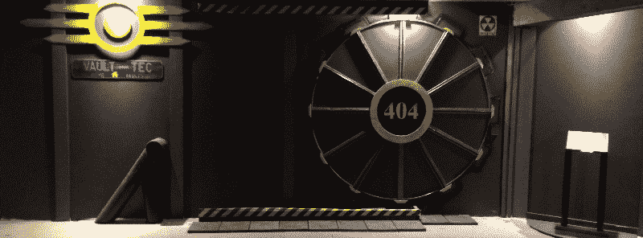

# 应对辐射尘

> 原文：<https://hackaday.com/2015/11/04/dealing-with-fallout/>

短短几天后，《辐射 4》将会上映，相当一部分 Hackaday 员工将会休假。正如你所料，很多有 3D 打印机、烙铁和太多空闲时间的人都在为辐射释放而紧张。以下是我们在过去几周发现的一些负面影响:

### Pip-Boys

在辐射游戏中，你会发现最具标志性的东西是 Pip-Boy，玩家的用户界面和一台为玩家角色准备的整洁的腕戴式电脑(我猜里面有一台 CRT 显示器)。哈卡戴自己的【威尔·斯韦特曼】[建造了自己的 Pip-Boy 3000](https://hackaday.io/project/3482-pipboy-3000) ，功能齐全。该建筑使用了 4.3 英寸的触摸显示屏、10 个位置的旋转开关和一系列 3D 打印部件。

在 Hackaday.io 的其他地方，[Karl]正在为辐射开发一个功能性的 Pip-Boy 控制器，[cody]用树莓 Pi 制作了一个。当然，如果你超级特别，并且有[2000 美元可以挥霍](http://www.techtimes.com/articles/102327/20151103/fallout-4-pip-boy-edition-available-on-ebay-for-a-whopping-2-000.htm)，贝塞斯达发布了限量版的《T4》辐射 4 ，它与大多数手机兼容。

### 不是皮普男孩

辐射不仅仅是腕戴式电脑，对于真正的爱好者来说，还有巨大的齿轮形门。[特雷希尔]有一个部分完工的地下室，在他自己的保险库门后面藏着一个游戏室。门本身由胶合板制成，沿着安装在地板上的齿条滚动。它经得起核爆炸吗？大概不会。是否符合规范？至少看起来很酷。

Thingiverse 上的[Lilykill]非常有能力用 solidworks 的副本制作了一堆来自辐射宇宙的 3D 模型，包括[动力装甲](http://www.thingiverse.com/thing:990409)、[射线枪](http://www.thingiverse.com/thing:1025405)，更多的 [Pip-Boys](http://www.thingiverse.com/thing:969317) 、[等离子手榴弹](http://www.thingiverse.com/thing:954116)、[一辆努卡可乐卡车](http://www.thingiverse.com/thing:943004)。

### Apple II 的辐射 4

辐射 4 将适用于 PS4、Xbox One 和 PC，从而排除了一大批复古游戏玩家。不要害怕，6502 的爱好者们:苹果 II 有一个版本:

 [https://www.youtube.com/embed/vQlH8InUuz4?version=3&rel=1&showsearch=0&showinfo=1&iv_load_policy=1&fs=1&hl=en-US&autohide=2&wmode=transparent](https://www.youtube.com/embed/vQlH8InUuz4?version=3&rel=1&showsearch=0&showinfo=1&iv_load_policy=1&fs=1&hl=en-US&autohide=2&wmode=transparent)

这种对 Apple II 和辐射的致敬是由 [Outlaw Editor](https://www.facebook.com/outlaweditor) 完成的，这是一个在非常旧的硬件上开发伪 3D 游戏的 SDK。在这个致敬中有实际的光线投射发生，它的工作就像 *Wolfenstein 3D* 或类似的。