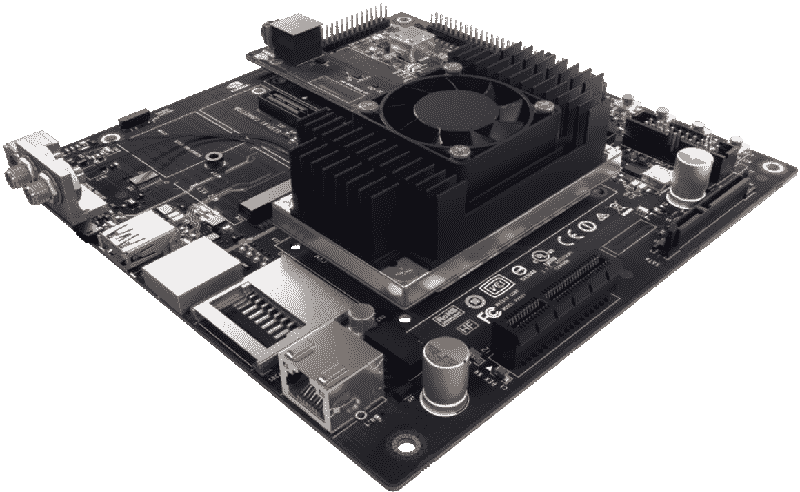
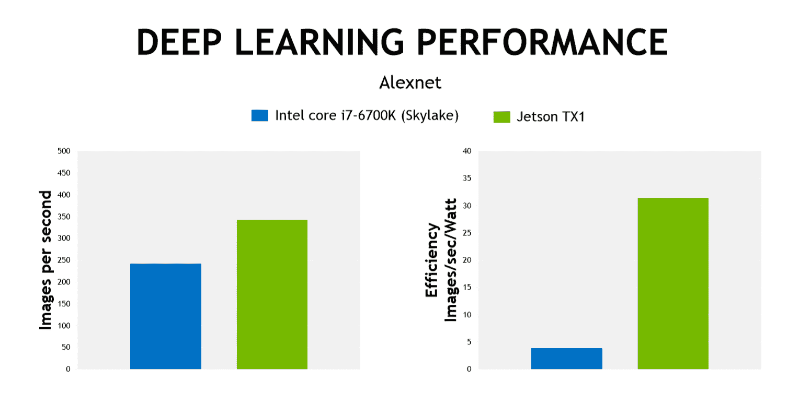

# Nvidia 为嵌入式世界带来了计算机视觉和深度学习

> 原文：<https://hackaday.com/2015/11/10/nvidia-brings-computer-vision-and-deep-learning-to-the-embedded-world/>

今天， [Nvidia 宣布了他们最新的自主机器先进技术平台](http://nvidianews.nvidia.com/)。他们称之为 Jetson TX1，它将现代 GPU 硬件放在一个小而节能的模块中。为什么会有人想要嵌入式格式的 GPU？这与每秒帧数无关；相反，Nvidia 专注于高性能计算任务，特别是计算机视觉和分类，平台功耗低于 10 瓦。

在过去的几年里，微型信用卡大小的 ARM 计算机充斥着市场。虽然这些 Raspberry Pis、BeagleBones 和基于路由器的开发板非常适合运行 Linux，但它们并不十分强大。x86 主板也存在，但同样，这些都是低级原子和其他英特尔嵌入式处理器。这些不是你想要的用于计算繁重任务的主板。在低功耗硬件上实现高性能计算的选择实在不多。

The Jetson TX1 and Developer Kit. Image Credit: Nvidia

信用卡大小的微型 ARM 计算机很好地服务于我们所有人的一般计算任务，这导致了一个显而易见的问题——在如此小的板上放置如此大的马力的目的是什么。至少根据英伟达的说法，答案是无人机、自动驾驶汽车和图像分类。

图像分类是计算量最大的任务之一，但对于自主机器人来说，没有其他方法可以区分骑自行车的人和邮箱。要在嵌入式平台上做到这一点，你要么需要一个强大的通用 CPU，功耗约为 60 瓦，要么构建一个更小、更高效的基于 GPU 的解决方案，功耗仅为 10 瓦。

### 规范

Jetson TX1 使用 1 TFLOP/s 256 核 Maxwell GPU、64 位 ARM A57 CPU、4 GB DDR 4 RAM 和 16 GB eMMC 闪存进行存储，所有这些都在一个信用卡大小的模块中。Jetson TX1 运行 Ubuntu 14.04，并兼容适用于任何其他英伟达平台的[计算机视觉和深度学习工具](https://developer.nvidia.com/embedded-computing)。这包括 Nvidia Visionworks、OpenCV、OpenVX、OpenGL、机器学习工具、CUDA 编程，以及你期望从标准桌面 Linux 机器中得到的一切。

为了测试 Jetson TX1，Nvidia 将其深度学习性能与最新一代英特尔 i7 处理器进行了比较。这个深度学习任务使用一个经过训练的神经网络来区分对象；行人、汽车、摩托车和骑自行车的人(如果 TX1 将控制自动驾驶汽车)，或者包裹和车道(如果 TX1 将用于第一代送货无人机)。在这项图像分类任务中，TX1 的性能优于 i7，而功耗却低得多。

重要的是要注意 Nvidia 在这里追求的能效。要在一个配有现代 CPU 的机器人上实现如此高的计算性能，你必须使用一个功耗为 65 瓦的部件。这需要一个大的电源，一个大的散热器，以及比 Nvidia 提供的更大的质量。

### 有效性

到目前为止，Jetson TX1 的核心已经找到了进入商业产品的方法。唯一有点令人毛骨悚然的 [Jibo 社交机器人](https://www.jibo.com/)使用 TX1 进行人脸跟踪和图像分类。新发布的 [DJI 歧管](https://developer.dji.com/manifold/)也使用了 Nvidia Jetson。

Jetson TX1 开发者套件将于 11 月 12 日在新蛋、亚马逊、Microcenter 和 Nvidia 商店出售，零售价为 599 美元，或 299 美元，含教育折扣。TX1 模块本身——带有一个 400 引脚板对板连接器，我目前无法获得——将通过全球分销商以 299 美元/千片的价格上市。单个模块还没有定价，尽管我预计不久就会在互联网上出现团购。

虽然 600 美元的开发板零售价对于我们通常看到的 Hackaday Tip 线的产品来说是一个很大的要求，但将 Jetson TX1 与 30 美元的 Raspberry Pi 进行比较是有害的；这绝不是一个通用设备，除了少数仍然在他们的 GPU(以及 Nvidia 卡)上挖掘比特币的离群者之外，除了用显卡玩视频游戏之外，做任何事情*都是专业工作。*

就嵌入式计算的发展而言，这是一个重大的进步。在过去 10 年左右的时间里，台式机和服务器最酷的部分是 GPU 可以解决问题的原始能力。将如此强大的模块放在一个功耗仅为 10 瓦的封装中是一个巨大的进步，尽管这并不真正意味着车库里的修补匠，但嵌入式平台上计算机视觉领域的进步是巨大的。