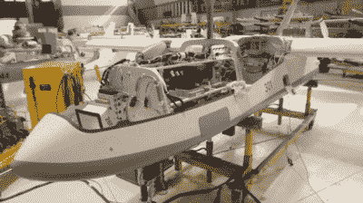

# 机器杀人谁负责？

> 原文：<https://hackaday.com/2015/11/09/who-is-responsible-when-machines-kill/>

今天早上，我希望你们能和我一起思考未来。这个机制让我们讨论一些关于自动化技术的难题。我说的不是恒温器、门廊灯和咖啡机。我们真正需要考虑的是那些会造成伤害的机器。比如自动驾驶汽车。最近，我们研究了这些汽车做出的决策背后的道德规范，但这只是冰山一角。

很大一部分技术是由军事研究推动的(互联网、太空竞赛、双足机器人、甚至通过 DARPA 大挑战的自动驾驶汽车)。很容易想象，第一批棘手的伦理问题将来自军事自主和不幸的事故。

## 我们虚构的无人机场景

Sundancer-3 不是普通的无人机。基于 MQ-1 捕食者无人机，我们的虚拟模型执行许多相同的功能。然而，它有几个关键的区别。最主要的一点是它可以在没有飞行员的情况下操作。它的主要任务是使用机载摄像头和面部识别软件来识别敌方战斗人员并将其干掉——所有这些都没有任何人工干预。如果遭到攻击，它有自卫的能力，也能识别周围环境，即使平民伤亡的可能性极小，它也不会开火。Sundancer 被誉为人类创造力的奇迹，被视为军用战斗车辆的未来。世界各地的军队开始投资于他们自己真正自主的机器人平台。但这一切将在一个世界之外的偏远村庄的一个决定性的夜晚改变。

批评者说事故是可以预见的。他们从一开始就说，将人类决策从致命行动中抽离出来，将导致无辜者的意外死亡。这正是所发生的事情。一群学生用一些非法获得的烟花庆祝当地节日。一名太阳舞者正在该地区巡逻，误将其中一枚高射烟花视为攻击，并发射了一枚导弹进行自卫。几个小时后，初升的太阳暴露在世人面前——这是一场不应该发生的悲剧。

历史上第一次，一个自主机器人完全依靠自己做出决定，对一个无辜的目标采取致命行动。愤怒是严重的，每个人都想知道答案。怎么会这样？或许更重要的是，谁该为此负责？

虽然我们的故事不是真实的，但很难说类似的场景不会在不久的将来上演。我们可以推测，后果将是相似的，公众将希望有人负责。我们的工作是讨论当一台机器自动伤害或夺走一个人的生命时，谁应该受到责备。不仅在法律上，在道德上也是如此。那么到底是谁的错呢？

## 机器

虽然很明显，机器不能因为它的行为而受到惩罚，但当从机器的角度来看这个致命的场景时，一些有趣的问题出现了。在我们的故事中，太阳舞者误将烟火当成了攻击，并做出了相应的回应。从它的角度来看，它正被一枚肩射导弹瞄准。它被设定为存活，就它而言，没有做错任何事。它根本没有能力区分导弹和无害的烟花。问题就出在这种无能上。

在“警察自杀”事件中也可以看到类似的问题。在生死攸关的情况下，警察没有能力分辨真枪和假枪。这位警官每次都会以致命的武力回应，在执行任务时受到威胁时保护自己。

## 制造商

Sundancer 的生产商对学生的死亡是否有过错？的确，是他们的机器犯了错误。他们建造了它。有人可能会说，如果他们没有造出这台机器，事故就不会发生。看看类似的案例，这个论点很快就被搁置了。一个开车撞向人群的人对这起事故负有责任。不是车，也不是车的制造商。

Israeli drone during manufacture

然而，Sundancer 的情况有点不同。它做出了发射导弹的决定。没有人会去责备操作者。这是关键。如果制造商事先知道它正在制造一台可以在没有人类干预的情况下夺取人类生命的机器，它对死亡负有任何责任吗？

让我们更深入地探讨一下这个概念。在电影*刚果*中，一组研究人员使用动作激活机枪炮塔来保护自己免受危险猿猴的攻击。这些枪基本上可以射杀任何移动的东西。在现实生活中，这将是一个极其不负责任的机器。如果制造了这样一个装置，并夺走了一条无辜的生命，你可以放心，制造商将承担部分责任。

现在让我们在我们的炮塔上安装某种假想的传感器，这样它就能检测出猿和人之间的区别。这将改变一切。如果一个错误发生了，并夺走了一个无辜者的生命，制造商可以清楚地说它没有责任。它可以说在区分人类和猿类的传感器中有一个未知的缺陷。Sundancer 的制造商可以提出类似的论点。这不是制造问题。这是一个工程问题。

## 工程师

几年前，我做了一个定制闹钟作为给朋友的恶作剧礼物。这个东西消耗了太多的电流，以至于我找不到 DC 的“壁式电源”来驱动它。长话短说，我自己做了一个电源，并把它嵌入了时钟。我向我的朋友明确表示，她不能在无人看管的时候让闹钟插着电源。我这样做是因为我没有接受过如何安全设计电源的培训。如果出了问题，着火了，那就是我的错。我是设计师。我是工程师。如果我的项目伤害了某人，我将承担最终责任。

任何工程师都是如此，包括设计 Sundancer 的工程师。他们应该考虑如何处理错误的攻击。应该有协议…制衡到位，以防止这样的悲剧。这当然是说起来容易做起来难。如果你让它太安全，机器就变得无效。它永远不会发射导弹，因为它会不断问自己是否可以发射。到那时，一切都太晚了，它会从天空中消失。但这仍然是一个比误向学生发射导弹更好的结果。

我认为工程师应对圣丹瑟事故负责。

这让我们被困在高压变压器和 1 法拉电容之间。如果工程师对他或她的机器的错误负有最终责任，他们会造一台会犯这种错误的机器吗？你会吗？