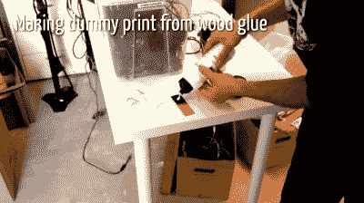
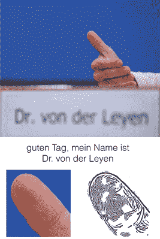
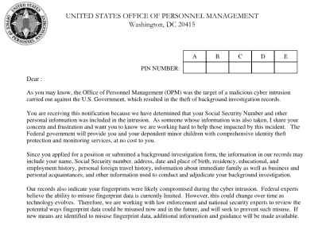
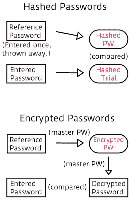
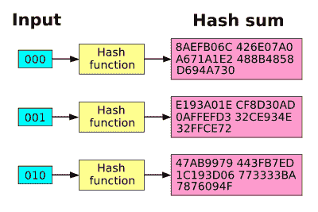
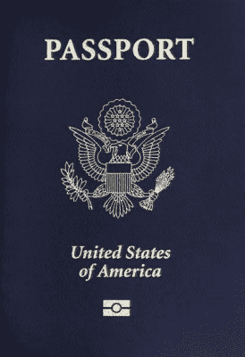

# 你那不可磨灭的指纹什么也保护不了

> 原文：<https://hackaday.com/2015/11/10/your-unhashable-fingerprints-secure-nothing/>

密码是垃圾。没有人会挑选好的密码，当他们挑选好的密码[时，他们会跨站点重复使用这些密码](https://www.lightbluetouchpaper.org/2011/02/09/measuring-password-re-use-empirically/)，如果你使用甚至是值得信赖的密码管理器[，他们也会被黑客攻击](http://arstechnica.com/security/2015/11/hacking-tool-swipes-encrypted-credentials-from-password-manager/)。但你知道什么比密码更糟糕吗？一个指纹。指纹有太多的问题，它们不应该在任何有密码的地方使用。

密码应该是保密的，就像你童年宠物的名字一样。相比之下，无论你去哪里，你都会在户外带着你的手指。密码也需要可撤销。在你的密码*被泄露的情况下，能够简单地选择另一个是很棒的。你不会想收回你的手指的。最后，也是最重要的一点，您希望您的密码是可散列的，以保护密码数据库本身不被窃取。*

在本文的其余部分，我将分别介绍这三种情况，并希望让您相信用指纹代替密码比一开始就使用密码更不安全。(你在听[苹果](http://www.digitaltrends.com/opinion/apple-iphone-5s-fingerprint-scanner/)和[谷歌](http://bgr.com/2015/05/28/android-m-fingerprint-password-manager-app/)？不，我不认为你是。)

## 指纹不是秘密

第一个，也可能是最明显的，用指纹代替密码的问题是它们根本不是秘密。想想警察在审问中给坏人一杯咖啡，然后把杯子拿到法医实验室读取他的指纹的比喻。终结了。

但比那更糟。你到处都留下你的指纹。它们可以从纸张、键盘和桌面上捡起来。你不会把你的密码写在工作时贴在显示器上的便利贴上吧？如果您的工作人员使用您的指纹进行身份验证，您的密码可能现在就在您的显示器上。

 德国黑客【Jan Krissler】，别名【starbug】，一有机会就攻击这个家。早在 iPhone 5 的 touchID 系统刚刚公布的时候，[starbug]就开始垂涎三尺了。他立即买了一个，玩了两天，并演示了他可以在苹果商店周围的队伍清空之前伪造出指纹识别器。在接受 Ars Technica 采访时，starbug 抱怨说这太简单了。一位未透露姓名的苹果消息人士称，他们预计这需要两个月，而不是两天。

## 如何模仿指纹

他模仿指纹的技术非常简单。他复制了一个指纹，然后将其蚀刻成铜(就像制作 PCB 一样)，用石墨喷涂蚀刻，最后用一层木胶或乳胶覆盖。在铜被蚀刻掉的地方，胶水和石墨手指模具更深，模拟你手指上的隆起。石墨喷雾给了它合适的体积电容。用肤色乳胶做这件事，你就用 5 美元的材料和一个下午的时间做出了一件值得完成的不可能完成的任务。你所需要的只是一张从杯子或书上取下的指纹图像。

## 从照片上提取指纹

不要在照片上显示你的指纹。从一张在新闻发布会上拍摄的照片中复制了德国国防部长乌尔苏拉·冯·德·莱恩的指纹。拇指指纹是否足以解锁整个德国军队仍未得到验证，但你明白了；希望*他们没有用指纹作为秘密密码。*

[Starbug]在[混沌通信大会(德语)](https://media.ccc.de/v/gpn15-6728-ich_sehe_also_bin_ich_du#video)上的这个精彩演讲中讨论了所需的分辨率和更多针对生物识别的黑客攻击，但重点是，只要有足够的分辨率和/或足够好的镜头，就可以从舒适的距离采集指纹。主要的限制因素是焦深和照明，这对坐在灯光明亮的舞台上面对一堆摄像机的政治家来说是个坏消息。不管是不是政客，除非你总是戴着手套，否则你的指纹不是什么好秘密。

## 指纹是不可撤销的

假设你的正常密码不知何故被泄露了。有多糟糕？在理想的世界里，被黑过的网站让你知道，让你改密码。你把你的狗的名字换成你的猫的名字，把你出生的年份换成你妹妹的。问题解决了！

但是如果你的指纹就是你的密码，它们被泄露了，你就“不可能”改变它们。事实上，在传统的指纹应用中，唯一性和不变性是关键所在——例如，将罪犯与犯罪现场联系起来。如果你能在每次抢劫后改变你的指纹，你就不用戴那副笨拙的手套了。

指纹会伴随你一生。一旦我窃取了您的指纹，我就可以解锁您当前的指纹安全设备以及您将来购买的所有指纹安全设备。指纹是不可更改的半机密，因此是糟糕的密码。关于这一点没有太多要说的，这是相当糟糕的，但它值得强调，因为坏政策的盛行。

 例如，敏感的政府机构一直在使用包含员工指纹副本的个人身份验证(PIV)卡。除了正确的密码之外，接受 PIV 的联邦雇员必须刷他们的手指，指纹将与存储在卡中的指纹进行比较。这个想法是使用密码和指纹匹配作为一种形式的[双因素认证](https://en.wikipedia.org/wiki/Two-factor_authentication)。

然后[美国人事管理办公室(OPM)被黑](http://www.tomshardware.com/news/opm-5.6-million-stolen-fingerprints,30154.html)560 万(！)政府雇员的指纹被取走了，可能是被外国政府的间谍机构取走了。所以现在[国土安全部可能不得不转向“三因素认证”](http://www.biometricupdate.com/201506/expect-three-factor-authentication-to-be-implemented-following-opm-hack)，因为他们的一个因素完全烧毁了。如果政府为 PIV 卡选择了一个可撤销的第二因素，至少那部分泄漏会更容易清理。

密码需要更改以保持秘密和安全。指纹不会改变。

## 指纹是不可篡改的

指纹的问题在于，接近*就足够好了，而且需要如此。如果我在一个阅读器上比在另一个上更用力地按手指，或者用不同的方式滑动，或者有一个切口，我仍然希望阅读器接受我的指纹。训练有素的联邦调查局特工一直在用“部分指纹”进行匹配，而且相当准确。对于人肉和现实世界的扫描仪来说，势均力敌是生活的现实。但是一个有微小缺陷的指纹将会散列成与参考版本完全不同的东西。这意味着指纹是不可散列的。散列法使密码变得更强，如果没有散列法，指纹保护就会变得更弱。*

如今，当一个负责任的网站遭到黑客攻击时，窃贼带走了密码数据库，他们实际上根本没有任何密码列表。相反，他们得到的是用户名列表和密码的单向散列。

 当你输入密码时，网站会对结果进行哈希处理。如果试用哈希与存储的哈希匹配，他们就可以确定密码是正确的。因为哈希本质上是单向的，所以任何人都很难从哈希开始计算出你的密码。事实上，从哈希回到密码的最简单的方法是开始猜测每个可能的密码，计算它的哈希，并检查匹配。

相比之下，一个简单的实现是网站存储每个人的密码，但用主密码加密。如果黑客可以破解主密码，他或她就可以解密整个数据库和所有密码。因为每次验证普通密码时都必须使用这个主密码，所以它将非常脆弱，也非常有价值。用不同的主密码加密每个用户的数据意味着他们必须维护一个巨大的主密码数据库，这也于事无补。这就是为什么每个负责任的网站只存储用户密码的散列值。

尽管如此，哈希仍然可以比加密做得更好。如果安全人员在做他们的工作，在散列之前，密码被[加盐](https://en.wikipedia.org/wiki/Salt_(cryptography))给每个用户不同的东西(但不一定是秘密的);这减缓了暴力大规模破解的尝试，因为每个人的密码本质上是不同的散列。

如果你和我都使用密码！密码 123”，但是我的密码前面加了“elliot ”,而你的密码前面加了“joe_user ”,所以我们的散列值会有所不同。一旦黑客最终猜出你的密码，因为盐，他们不会自动知道我的。

如果网站的安全性真的很好，这个散列过程将会用一个更慢的算法重复数千次，从而进一步减缓暴力攻击。如果需要半秒钟来验证您的登录，这对您来说没什么大不了的，但对于依靠每秒数百万次尝试的暴力尝试来说，这是一个障碍。作为最佳实践的一个例子，当密码管理器 [LastPass 被黑](https://blog.lastpass.com/2015/06/lastpass-security-notice.html/)时的披露是相当可靠的。他们被黑客攻击仍然很糟糕，你仍然应该更改你的主密码，但是如果它是一个好密码，没有人会很快就强行破解它。

### 指纹和雪崩效应

 这跟指纹有什么关系？指纹不能很好地散列，所以在数据库中只存储加盐的散列密码的所有上述安全优势都不适用。这是因为除了单向之外，一个好的散列还表现出[雪崩效应](https://en.wikipedia.org/wiki/Avalanche_effect):密码的一个小变化会使散列产生大得多的差异。

字符串”！password123 "使用 MD5 散列函数散列的是`b3a2efccbe10c39f2119979a6f9a3ab2`，但是"！密码 123”是`d2583f9c75fbc22890d39e7241927511`。这两个字符串只差一个字母，即大写的“P”，但是哈希却非常不同。这防止了黑客，谁是暴力强制潜在的密码，以获得散列匹配，知道他或她什么时候接近。如果密码中的每个正确字母都使哈希更接近目标哈希，他们很快就会猜到。雪崩效应意味着猜测“接近”密码一点帮助都没有。

我之前提到过，指纹技术需要“足够接近”。一旦失手，就像一英里。这意味着指纹必须以明文或加密的形式存储，但不能被有效地散列，因为好的散列会雪崩。指纹数据库必然是一个薄弱环节；无论你的指纹存储在哪里，在你的 iPhone 或 PIV 卡上，或者在你的电子护照里，都有你指纹的一个版本，如果有人知道主密码，他就可以解密。

### 电子护照

电子护照是散列和加密的一个很好的例子。它们包含你的指纹和虹膜图像的加密表示，因为它们被认为是敏感信息。但是这些只能被加密，因为护照阅读器需要能够解密它们，以便与你真实的手指和眼睛进行比较。

 除此之外，你所有的非敏感信息和加密包都被散列在一起，这使得在不改变散列的情况下篡改任何信息变得更加困难。你可能认为你可以在这里调整一点，在那里应用一个抵消调整，但雪崩效应挫败了这个计划。

不过，归根结底，这意味着你护照上的指纹只能通过加密来防止被读取，而不是通过哈希函数。这对海关来说没问题，因为他们只关心你的指纹是否被修改过。对他们来说，你的指纹实际上只是用来验证你是不是你，如果不破坏将它与你的其他信息联系在一起的散列，这是很难篡改的。

另一方面，对于注重隐私的人来说，只对你的指纹进行加密会更令人担心。一个坏人拿着你的护照和正确的密码就能解开加密程序并提取你的指纹。尽管从护照封面上提取你的指纹可能更容易——指纹不是好的秘密，记得吗？

## 结论

不要把指纹当成密码来用。永久和相对容易验证和获取使它们非常适合刑事调查或证明你是你所说的那个人。但它们不是密码，因为它们不是秘密的，不可撤销的，并且很难安全地存储。