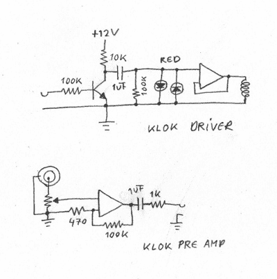

# 模拟时钟播放自己的节拍

> 原文：<https://hackaday.com/2015/11/10/analog-clocks-play-their-own-beat/>

播放下面的演示视频，尽量不要让节奏钻进你的大脑。你听到的是一串钟的声音，被放大了。他们谁也不守墙时间，但他们都在一起玩。

制造疯狂的乐器。除了这个项目的一段视频和几张示意图，他没给我们更多的东西，所以这个项目仍然有点神秘，但以下是我们整理的内容。

Klok slave unit schematic

该视频看起来像八个相同模块的相同版本。输入端接收电压，并将上升沿和下降沿转换成脉冲，以驱动 el-cheapo 时钟的线圈。随着时钟的极点切换到即将到来的节拍，led 会发出脉冲。输出来自贴在每个时钟背面的放大压电传感器。也就是说，你听到的是每个时钟在滴答作响，但被放大了。如果你看着表盘旋转，它们看起来都不像是在报时。

到目前为止一切顺利，与示意图相符。但是前面那个开关是怎么回事？它不会在任何地方出现。

是什么推动了这场表演？[Gijs]用一个主时钟模块(在同一页上)吸引我们，看起来它*确实*保持时间，并输出其中的细分。但那太慢了，不像视频里用的那样。他换了水晶让它跑得更快了吗？这是一个谜。

当然，我们对那些把厨房定时器或齿轮马达安装到合成器架上的人的期望也不会低。我们在过去报道过更多[Gijs]的作品，从[他的视频混合器](http://hackaday.com/2012/09/07/mixing-video-for-old-school-effects/)到[这个硬盘驱动的合成器振荡器](http://hackaday.com/2012/01/27/synthesize-with-a-hard-drive/)，但是这一次他让我们有点挠头，也有点跺脚。

 [https://www.youtube.com/embed/70dY8BBg1_c?version=3&rel=1&showsearch=0&showinfo=1&iv_load_policy=1&fs=1&hl=en-US&autohide=2&wmode=transparent](https://www.youtube.com/embed/70dY8BBg1_c?version=3&rel=1&showsearch=0&showinfo=1&iv_load_policy=1&fs=1&hl=en-US&autohide=2&wmode=transparent)

