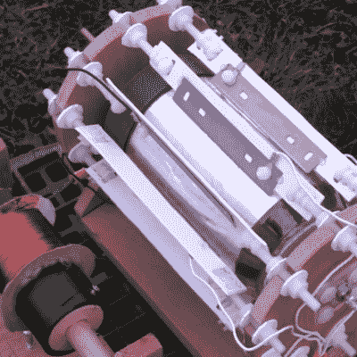

# “约翰·高尔特是谁？”终于回答了

> 原文：<https://hackaday.com/2015/11/22/who-is-john-galt-finally-answered/>

对于那些没有读过[安·兰德]的哲学巨著*阿特拉斯耸耸肩*的人来说，在长达 100 页的独白之间，有一篇相当酷的工程学文章。虽然是虚构的，但一个角色设法利用大气静电并将其转化为动能(剧透！)革命世界。然而，利用大气静电不仅仅是幻想小说的内容。这是一个现实世界的现象，而且[实际上有可能制造这种马达](http://rimstar.org/science_electronics_projects/atmospheric_electricity_powering_corona_electrostatic_motor.htm)。

[正如【理查德·费曼】向](http://www.feynmanlectures.caltech.edu/II_09.html)展示的那样，大气中存在一个可利用的电势梯度。通过在空中悬挂一根高导线，有可能获得数万伏的电压。在这个特别的演示中，一架直升机被用来悬挂一根末端有一组针的电线。这些针有助于促进电子流进入大气，驱动电流旋转电线底部的电晕马达。

没有多少扭矩或功率产生，但概念证明是非常有趣的。当然，你能达到的高度越高，你能获得的电压就越多，所以也许未来像这样的设备可以利用大气中的电来超越演示，做有用的工作。我们实际上已经[展示了之前在这个演示](http://hackaday.com/2014/08/09/funky-looking-motor-is-powered-by-static-electricity/)中使用的电机，所以如果你对电晕电机如何工作感到好奇，你应该去那里看看。

 [https://www.youtube.com/embed/qhXxSAv6rMg?version=3&rel=1&showsearch=0&showinfo=1&iv_load_policy=1&fs=1&hl=en-US&autohide=2&wmode=transparent](https://www.youtube.com/embed/qhXxSAv6rMg?version=3&rel=1&showsearch=0&showinfo=1&iv_load_policy=1&fs=1&hl=en-US&autohide=2&wmode=transparent)

