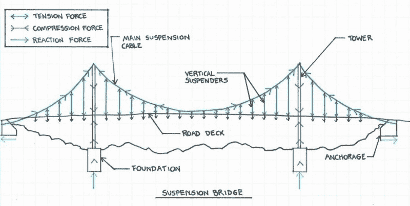
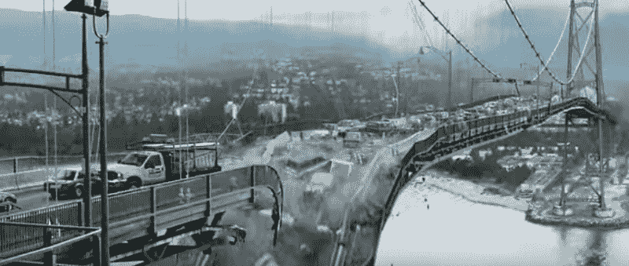
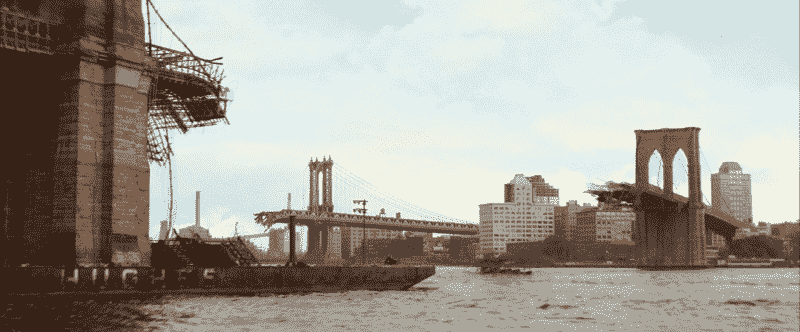
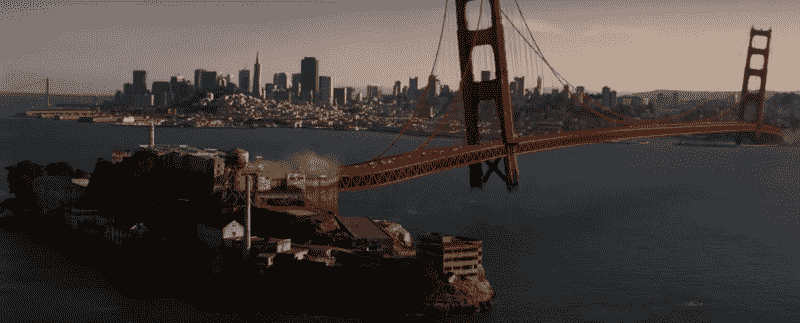
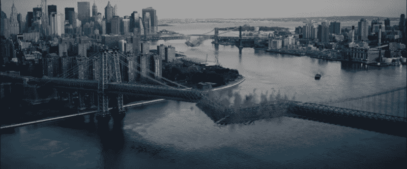

# 怀疑的吊桥

> 原文：<https://hackaday.com/2015/11/18/suspension-bridges-of-disbelief/>

吊桥无疑是美国动作大片的首选目标。在过去的三年里，金门大桥已经被怪兽、哥斯拉、天网引发的核爆炸和海啸摧毁。美国人不再建造真正的桥梁，也不再维护我们现有的桥梁，但我们肯定喜欢在电影中炸毁它们。

这里有一个逻辑:一个涉及一座著名桥梁的灾难场景既让电影植根于现实世界，又展示了威胁的巨大性和紧迫性。这些巨大建筑的拆除令我们震惊，因为许多桥梁在我们的集体意识中获得了永久的光环。虽然我们知道布鲁克林大桥是什么时候建造的，是谁建造的，但我们觉得它一直都在那里，而且会一直存在下去。我们熟悉的人类地形的破坏甚至比 CGI 受害者的死亡更令人不安，我不只是作为一个热爱桥梁的厌世者这么说。

然而，在这些特效镜头的所有计划、故事板、渲染和合成中，没有人停下来考虑吊桥实际上是如何工作的。我可以接受救世主般的外星孤儿超级英雄和摩天大楼大小的战斗机器人，但我不会容忍对结构力学的不准确描述。如果情节允许，扭曲物理定律是没问题的，但大多数吊桥错误是如此的不必要和愚蠢，以至于它们唯一的功能似乎是激怒工程师。

### 吊桥实际上是如何工作的

建造一座吊桥是一项艰巨的任务，但基本的物理原理相当简单:首先，建造两座塔(有时甚至更多)。一对粗钢缆(由数千股更细的钢缆组成)从一个海岸串到另一个海岸，搁置在每个塔顶部的大鞍座上。这些主缆将形成一条抛物线，支撑一系列垂直吊杆索，吊杆索反过来支撑路面。在每个海岸，巨大的锚碇将主缆固定在适当的位置。

当你驶过一座吊桥时，汽车的重量会拉下垂直的吊杆电缆，使它们处于张紧状态。然后，拉力被传递到主缆上，主缆也处于拉伸状态。主缆在塔上向下拉，塔通过将垂直压力带入地基来抵抗垂直压力。最后，在主悬索的末端，巨大的锚碇会化解张力。

在大银幕上，这些基本概念并不适用。大多数结构元素没有目的，桥反而是由令人困惑的奇思妙想、导演的无知和什么都没有的混合体支撑着。我看了一些著名的悬索桥灾难场景，并把它们从最糟糕到最糟糕排列如下:

### ***最终目的地 V***

最真实的桥梁倒塌场景不知何故来自一部电影，在这部电影中，人们经常被失控的风筝切成两半。在这一章中，山姆·劳顿被困在纽约西部的北部湾大桥(由温哥华狮门大桥扮演，是本榜单中唯一的非标志性桥梁)的交通中，他注意到裂缝从一些工人正在切割道路的某一点向外张开。这些裂缝变宽，很快垂直缆索开始从它们与主悬索和桥面下横梁的连接处弹出。随着每根垂直吊杆都无法补偿相邻吊杆的损失，逐渐倒塌随之而来。

 这种情况下结构性故障的起因是相当荒谬的，因为交通桥上的沥青行驶面是非结构性的。道路本身建在一个钢结构上，在沥青上的一些锯和手提钻可能不会严重损坏它。此外，很难想象这种情况会导致垂直吊杆顶端的故障。但是谁知道呢，也许在钢铁中有一些对剧情有利的腐蚀。不管失败的最初原因是什么，坍塌以一种令人半信半疑的方式进行:路面坍塌了，但是主悬链电缆和桥塔还在。没有路支撑，垂直的电缆无声地在空中摇摆。

从书生气的角度来看(所有最好的笔记都是如此)，电影中显示的坍塌并没有准确反映真实抛物线电缆的形状变化。如果没有主跨的自重，主缆在塔之间的下垂会明显减少，因为它们只承受自身的重量。由于缆索本身的长度不会发生明显的变化，因此在仍然承受载荷的外跨度处，缆索会下垂得更多。在电影中，完整的路面应该下垂得更低。这是一个罕见的虚构的倒塌场景，我们有一个现实世界的比较，1940 年的塔科马海峡大桥倒塌。

### ***我是传说***

政府炸毁了布鲁克林和曼哈顿大桥，以阻止电影中神秘病毒的爆发。爆炸切断了主缆索，桥的中心部分坠入东河，而双塔依然屹立不倒。除了塔和海岸之间的跨度没有受到影响之外，这将是对悬索桥物理特性的相当准确的描述。

Image Source: [Land of Whimsy](http://whiggles.landofwhimsy.com/archives/2009/01/i_am_legend_bluray_impressions.html)

然而，主缆抗拉能力的丧失将导致整个桥面板的整体坍塌，而不仅仅是中心桥跨。外跨处的桥面仍在向下拉主缆，主缆通常会处于张紧状态并承受载荷。但是，由于那些主缆索被切断，就没有东西可以拉拽，必要的结构能力就无法发展。( *Pacific Rim* 犯了同样的错误，展示了被摧毁的金门大桥的闪光，其中心桥被摧毁，而外部桥仍然存在。)

### ***《x 战警:最后一战***

万磁王的变异力量支配着所有金属，[将金门大桥从地基上扯下](https://www.youtube.com/watch?v=ITMren3I3WM)，飞过旧金山湾，将它放置在城市和恶魔岛之间。(这种疯狂的破坏行为只是为了将他的变种人军队从 A 点运送到 B 点，这是一项基本的后勤任务，他可以通过举起几辆公共汽车来完成)。万磁王拉起桥塔，直接在锚定处切断悬索，有效地消除了结构将负荷转移到地面的任何手段。然而，如果我们首先给万磁王提升桥的能力，那么也可以假设他有能力解决桥内所有的结构力。到目前为止，一切顺利。

然而，当万磁王拆除阿卡特兹和码头区之间的桥梁时，同样的结构问题仍然存在，尽管他实际上不再支持它了。桥面从海岸到海岸形成一个弧形，塔怪异地悬浮在水面上，主悬索仍然承载着负荷。我们可以说服自己，万磁王在高潮的战斗中优雅地支撑着桥梁，但当万磁王“治愈”了他的突变并因此失去了控制金属的能力时，这种逻辑就瓦解了。整个桥梁装置应该会在一堆无用的瓦砾中坠入旧金山湾。(并不是说这真的很重要，因为显然什么都不重要，但即使结构力可以解决，金门大桥也不够长，不足以跨越所描绘的距离。)

### ***哥斯拉* (2014)**

一枚失控的陆军导弹完全切断了金门大桥两条主缆中的一条。失去支撑路面右侧的电缆，将导致灾难性的坍塌:如果没有两个垂直支撑中的一个，路面将像活板门一样向下铰接，所有的坦克和校车都将落入下面的水中。

然而，在电影世界里，桥悬索是纯粹的装饰元素，可以被破坏而不会产生后果。士兵们继续与哥斯拉战斗，司机们开车过桥到安全的地方，所有人都忘记了让他们幸免于难的物理错误。哥斯拉甚至拽着剩下的电缆，这至少应该导致不可能漂浮的道路甲板摇摆，但它没有。即使当哥斯拉冲过主桥的中心时，桥梁的功能也不会受到影响。

### ***黑暗骑士升起***

贝恩[炸毁了一系列桥梁](https://youtu.be/g8evyE9TuYk?t=45s)(实际上是一些纽约市的桥梁加上一些虚构的 CGI 附加物)来切断哥谭市与世界的联系。爆炸一下子切断了悬索和桥面，每座桥整齐的一部分落入下面的河中。其他什么都没发生。就是这样。完全切断吊桥上的主要结构元件对整个结构的完整性没有影响。电影魔术。(我必须指出，电影高潮部分的桥是一座悬臂桥，因此不在本文讨论范围之内。)

想象一下，在两栋建筑之间挂一根晾衣绳，然后把一些衬衫拿出去晾干。现在，从中间剪断这条线。在我们的世界里，线失去了所有的能力，衬衫都掉到了地上。在克里斯托弗·诺兰的世界里，晾衣绳不会受到伤害，谁知道呢，也许会变得更结实。

我认为这是电影史上最糟糕的吊桥破坏场景。在*核心*的金门大桥倒塌不知何故比这更现实。诺兰聘请了著名的天体物理学家基普·索恩为《T2 星际 3》提供黑洞方面的建议，却没有聘请一名大二的工科学生来解释地球上的常规重力。

### 一座太远的桥

在美国一年一度的夏季桥梁拆除比赛中，这些错误不断发生，原因有几个。我勉强承认，一个导演的首要任务是讲述一个故事，而不是呈现一个技术上准确的桥梁力学演示。此外，吊桥在现实世界中并不经常倒塌，这意味着公众没有实际的倒塌图像作为参考点。最后，这些电影是为想看爆炸的青少年制作和销售的。华纳兄弟公司的头面人物并不是真的为了那一大笔结构工程师的钱。

然而，由于我们处在一个时代，许多电影制作人正在制作更坚韧、更现实的动作电影，我仍然希望有人能把这件事做好。如果有任何好莱坞编剧、导演或特效艺术家莫名其妙地阅读这篇文章，请帮我一个忙:下次你炸毁一座桥时，为实际建造它们的人想想。

* * *

亚历克斯·温伯格是一名居住和工作在纽约市的结构工程师。你可以在 a@alexweinberg.com 给他发电子邮件。