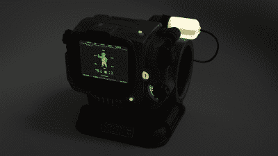

# 迄今为止最值得流口水的皮普男孩可能是你的

> 原文：<https://hackaday.com/2015/11/16/the-most-drool-worthy-pip-boy-to-date-can-be-yours/>

Pip-Boy 道具在制作界并不是什么新鲜事，尤其是 3D 打印机的可用性和价格让这项工作变得更加简单。将辐射宇宙的一部分带入现实世界是非常吸引人的——以至于辐射 4 珍藏版包括了一个 Pip-Boy 手机壳。然而，由于实际限制，这些道具通常只是容纳手机的塑料外壳。[zapwizard]并不满足于一个纯粹的美学道具，所以他决定[从头开始设计他自己的 Pip-Boy 3000 Mk4](http://www.therpf.com/showthread.php?t=245034)，同时保留尽可能多的功能。

对于不熟悉的人来说，Pip-Boy 是《辐射》系列游戏中的一款腕戴式电脑。从游戏的角度来看，它是用来管理你的角色的库存，统计数据，任务数据等等。因为你在整个游戏中经常与 Pip-Boy 互动，它已经变得非常接近和亲爱的辐射粉丝的心，这推动了它在道具制作方面的流行。

这也难怪，过去我们在 Hackaday 的栏目中有[的](http://hackaday.com/2012/04/24/pip-boy-2000-build-goes-for-function-over-form/)[号](http://hackaday.com/2011/09/06/fallout-brought-to-life-with-this-working-pip-boy-3000/)和号。所有这些建设都令人印象深刻，但[zapwizard]将它带到了一个全新的水平。作为一名产品工程师，他当然有必要的经验来实现这一点，他不会跳过任何细节。他开始用 Solid Edge 在 CAD 中对所有东西建模。每一个旋钮、按钮、表盘和插销都经过了细致的复制，并将与完全定制的电子设备配合使用。[zipwizard]仍处于设计阶段，但他应该很快就能开始实际构建了。他也在考虑提供有限的销售单位，所以如果你喜欢，一定要和他联系！

[谢谢丹尼尔·肯尼迪]