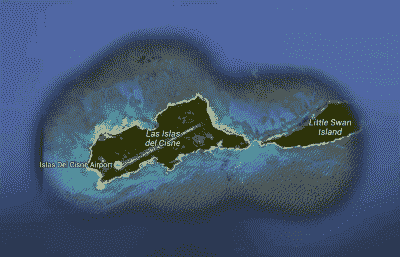

# 天鹅、猪和中央情报局:一个不太可能的广播故事

> 原文：<https://hackaday.com/2015/11/23/swans-pigs-and-the-cia-an-unlikely-radio-story/>

短波广播很无聊吧？也许不是。你永远不知道你可能会拦截什么阴谋和兴奋。我们最近报道了[秘密数字站](http://hackaday.com/2015/10/29/secret-radio-stations-by-the-numbers/)，虽然没有人确切知道它们的目的是什么，但几乎肯定与斗篷和匕首有关。然而，有一些更明显的间谍电台，如天鹅电台。

天鹅并不是指这种动物，而是指洪都拉斯附近的一个岛屿，直到 1972 年，洪都拉斯和美国一直有争议。据报道，该岛因在 17 世纪被用作一个名叫斯旺的海盗的基地而得名。美国政府也曾长期使用该岛。农业部用它来检疫进口牛肉，许多政府部门在那里设有气象站。

你可能想知道为什么美国声称一个小岛离它的海岸这么远。事实证明，这完全是因为海鸟粪。1856 年的《鸟粪岛法案》允许总统将原本无人认领的领土指定为美国的一部分，用于收集鸟粪，鸟粪除了是鸟的排泄物外，也很重要，因为它含有用于肥料和火药的磷酸盐。(老实说，如果你试了，你也编不出这种东西。)

然而，天鹅岛上最著名的居民是天鹅电台，它通过 AM 波段和短波进行广播。该站为直布罗陀轮船公司所有，办事处位于纽约第五大道。然而奇怪的是，该公司实际上并没有任何蒸汽船。它所拥有的是自由欧洲电台使用过的、由美国海军带到该岛的一些无线电发射机。我有没有提到直布罗陀轮船公司实际上是中央情报局的一个幌子？

Swan Island (From Google Earth (c) 2015 DigitalGlobe, Data SIO, NOAA, U.S. Navy, NGA, GEBCO, Google)

1960 年，美国和古巴彼此并不愉快。卡斯特罗的革命将美国公司赶出了这个岛国(同时保留了他们的资产)，并与苏联保持友好关系。这并不是说卡斯特罗没有他的理由(如果你想了解一些背景，请参见下面的卡恩学院视频)。中央情报局决定使用天鹅电台(就在古巴最西端的南方)向古巴广播宣传，尽管其 50，000 瓦的调幅发射机和 7，500 瓦的短波发射机也播放广告。

然而，在 1961 年，该电台宣布它将不再进行政治广播，并在多个频率上切换到全新闻格式。然而，这条新闻带有加密信息，可能是发给古巴持不同政见者的。

然后在 1961 年 4 月 17 日，美国试图利用一个由中央情报局资助的名为 2506 旅的军事组织开始反抗卡斯特罗。天鹅电台也起了作用。取决于你相信谁，天鹅电台要么广播了开始起义的密码命令，要么它发送了一个神秘的信息来迷惑古巴政府，使其认为更需要担心的是内部的持不同政见者。毫无疑问，这条信息是你通常在收音机里听不到的:

> 警惕！警惕！好好看看彩虹。鱼很快就会浮上来。奇科在房子里。去拜访他。天空是蓝色的。鱼不会花太多时间浮起来。这条鱼是红色的。

之后，天鹅电台明确指示古巴人加入起义。他们都没有，入侵是一场灾难，美国的参与变得清晰。

惨败后，直布罗陀轮船公司转型为先锋服务公司，天鹅电台最终成为美国电台。它于 1968 年停止传输。

所以下次你觉得听短波广播很无聊的时候，记住你永远不知道你会听到什么。一艘遇险的船，一个勇敢的南极操作员，或者一个开始革命的间谍。世事难料。

下面的视频很好地讨论了猪湾及其周围的环境。猪湾事件直接推动卡斯特罗对美国更加不信任，并巩固了他与苏联的关系。这将最终导致古巴导弹危机，这可能很容易升级为全球核战争(特别是当查尔斯·莫尔茨比意外驾驶 U-2 间谍飞机进入苏联领空时；不过那是[后话](http://blogs.discovermagazine.com/crux/2013/03/11/how-the-aurora-borealis-nearly-started-world-war-iii/#.Vkqi1N0rIUE)。

 [https://www.youtube.com/embed/XmkbAduMD_E?version=3&rel=1&showsearch=0&showinfo=1&iv_load_policy=1&fs=1&hl=en-US&autohide=2&wmode=transparent](https://www.youtube.com/embed/XmkbAduMD_E?version=3&rel=1&showsearch=0&showinfo=1&iv_load_policy=1&fs=1&hl=en-US&autohide=2&wmode=transparent)

