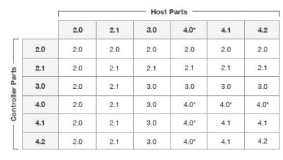
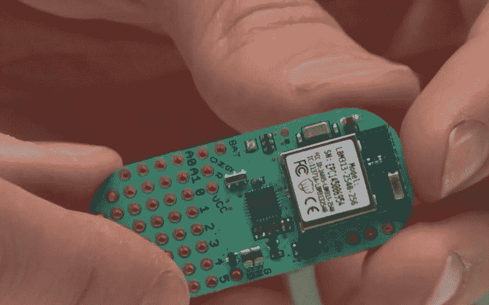

# 黑客字典:蓝牙低能耗

> 原文：<https://hackaday.com/2015/12/02/hackaday-dictionary-bluetooth-low-energy/>

蓝牙是移动设备世界的支柱之一，它允许移动设备在短距离内轻松通信。这就是你的无线耳机如何与你的手机通话，而没有 WIFi 的复杂性和功率要求。尤其是，蓝牙低能耗(BLE)组件对那些制造便携式设备的人来说很有意思，因为它需要非常少量的功率。

**什么是蓝牙 LE？**

蓝牙 LE 又称蓝牙智能，是第四版蓝牙标准的一部分。2010 年定型，蓝牙 4.0 之后更新了几次，目前的版本是 [4.2，发布于 2015 年 7 月](https://www.bluetooth.org/en-us/specification/adopted-specifications)。这个版本创建了三个不同类别的设备:蓝牙，蓝牙智能就绪和蓝牙智能。其基本思想是，蓝牙智能表示计步器或心脏监护仪等设备只能发送和接收蓝牙 le 信号，而智能就绪设备可以处理 LE 和标准蓝牙信号。标准的蓝牙 4.2 设备(如手机或 USB 加密狗)也可以发送和接收蓝牙 le 信号。

至少，理论上是这样。因为蓝牙已经发展了很多年，所以实际的兼容性通常很难确定。电脑和手机操作系统对蓝牙的零星支持对此也无济于事:例如，对安卓系统的蓝牙支持直到 4.3 版本才被包括进来，所以仍然有许多安卓设备不支持它。苹果一直比较主动:[iOS 6 版和 10.9 版](https://developer.apple.com/library/ios/documentation/NetworkingInternetWeb/Conceptual/CoreBluetooth_concepts/AboutCoreBluetooth/Introduction.html) 中包含了蓝牙 le 支持。

The Bluetooth Special Interest Group (SIG) offers this guide to understanding the compatibility of different versions of Bluetooth

蓝牙 LE 的目的是为一类新的设备打开标准:那些不经常发送少量数据的设备，以及使用小电池的设备。Bluetooth LE 运行在与标准蓝牙相同的频段上:2.4GHz ISM(工业、科学和医疗)频段，无需许可证即可使用。ISM 频段被划分为 40 个信道，LE 设备在这些信道之间跳跃以避免干扰。为了降低功率要求，蓝牙 LE 比标准蓝牙具有更低的传输功率(在 0.01 和 10mW 之间)，标准蓝牙允许 1 类设备的功率高达 100mW，3 类设备的功率为 1mW。数据以同样的方式发送(使用高斯频移键控)，但数据速度较低:最大 1 兆位每秒(Mb/s)，而标准蓝牙的最大值为 24MB/s。蓝牙 LE 设备还可以比标准设备更快地在待机和活动模式之间切换，通过允许发送少量突发数据来节省电力。

蓝牙根据用途对设备进行分类，为耳机、头戴式耳机和人机界面设备(如鼠标和键盘)创建了许多配置文件。蓝牙 LE 新增了一组这样的配置文件，叫做 [【通用属性】(GATT)配置文件](https://developer.bluetooth.org/TechnologyOverview/Pages/Profiles.aspx) 。其中包括 [血压计](https://developer.bluetooth.org/TechnologyOverview/Pages/BLP.aspx) 等设备的配置文件，以及更通用的智能钥匙等设备的配置文件( [接近配置文件](https://developer.bluetooth.org/TechnologyOverview/Pages/PXP.aspx) )。大多数蓝牙 LE 设备都支持许多这样的配置文件，启用的特定配置文件由设备上的固件控制。

蓝牙 LE 设备使用非常少的能量，并且被设计成使用电池。例如，[Nordic Semiconductor NRF 52](https://www.nordicsemi.com/Products/Bluetooth-Smart-Bluetooth-low-energy/nRF52832)系列芯片可以在 1.7 至 3.6V 的电压下运行，当系统处于空闲模式时仅消耗 1.2μA。这已经足够低了，它可以在硬币电池上运行至少一年。

对于硬件黑客来说，蓝牙 LE 无疑是一个有趣的协议，但它也有批评者。迈克·瑞安已经用标准的 演示了 [的众多安全问题，破解了协议使用的加密，并演示了如何使用蓝牙无线电远程崩溃 Android 手机。](https://lacklustre.net/bluetooth/)

 [https://www.youtube.com/embed/dYj6bpDzID0?version=3&rel=1&showsearch=0&showinfo=1&iv_load_policy=1&fs=1&hl=en-US&autohide=2&wmode=transparent](https://www.youtube.com/embed/dYj6bpDzID0?version=3&rel=1&showsearch=0&showinfo=1&iv_load_policy=1&fs=1&hl=en-US&autohide=2&wmode=transparent)

**如何使用蓝牙 LE**

开始使用 Bluetooth LE 最简单的方法是获得一个开发工具包。这些在制造蓝牙芯片的公司里随处可见，比如 [北欧半导体](http://www.nordicsemi.com/eng/Products/Bluetooth-Smart-Bluetooth-low-energy)[德州仪器](http://www.ti.com/lsds/ti/wireless_connectivity/bluetooth_bluetooth-ble/overview.page?DCMP=BluetoothLowEnergy&HQS=Bluetoothlowenergy) 和[CSR](http://www.csr.com/products/bluetooth-smart-starter-development-kit)。Adafruit 还提供了一款基于北欧半导体收音机 的 [工整分线板。对于制作独立设备来说，](http://www.adafruit.com/products/1697)[light blue Bean](http://legacy.punchthrough.com/bean/)是一个很好的起点，因为它将蓝牙 LE 无线电与 Arduino 相结合，便于编程和控制。

The Lightblue Bean, a small (and very hackable) Bluetooth LE device.