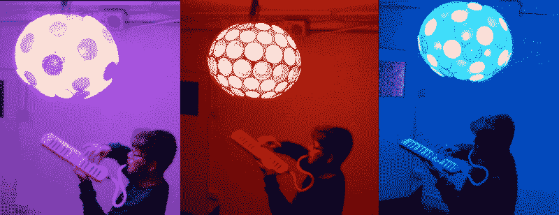
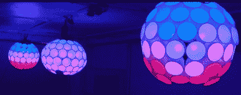
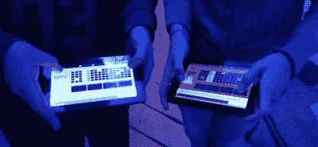

# LED 圆形系统

> 原文：<https://hackaday.com/2015/12/02/the-led-roundsystem/>

加文·莫里斯一直致力于他那令人敬畏的声音感应 LED 雕塑。从技术上来说，这个雕塑是 WS2812 RGB LEDs、树莓 pi 和大量聚苯乙烯泡沫杯和花盆的有趣应用。然而艺术的发展和这个项目的灵感是同样有趣的。加文分享了他的想法和下面对该项目的简要技术描述。

* * *

今年，我是英国萨默塞特郡约维尔的一个新艺术空间伊斯特维尔项目空间[的常驻艺术家。在实习期间，我创造了 LED 圆形系统，一系列照明吊灯。他们的灵感来自艺术空间的创始人之一佐伊·李的作品，他的](http://eastvilleproject.org.uk/)[花盆雕塑](https://www.flickr.com/photos/gusset/9981566496/in/album-72157636010266215/)我在[“打捞-黑客农场实地考察”](http://hackerfarm.net/salvage-2013/)看到过，这是一种由[乐队/噪音集体](http://hackerfarm.net/)组织的神奇神秘之旅，佐伊的丈夫法默·格林奇当时是其中的一员。他的[汽油罐合成器](http://manyandvaried.org.uk/wordpress/wp-content/uploads/2015/06/18772123415_5c91822baa_z.jpg)当然令人惊叹，但我立即被花盆吊灯吸引，从我看到它的那一刻起就想在里面放上 led 灯。

过了很长时间，这一切才走到一起。令我惊讶的是，佐伊和斯蒂芬开创了一个新的艺术空间，并为我提供了一个实习机会来构思一些想法。几个月后，LED 圆形系统诞生了…球体对音量和音高做出反应，为每个音符点亮不同的颜色。他们也有能力记录和回放现场声音。

[https://player.vimeo.com/video/144352275](https://player.vimeo.com/video/144352275)

从表面上看，这只是一些漂亮的灯光，但幕后发生了很多事情。

地球仪本身是由泡沫聚苯乙烯杯子制成的。使用聚苯乙烯泡沫塑料创作有趣的艺术品已经有很长的历史了。一般来说，杯子和碗是用无溶剂粘合剂粘合在一起的。我在哪里读到过，用错误的胶水融化泡沫会产生氰化物，所以我想你得小心一点！我用空心冲头在每个杯子上打了一个洞，把它们粘在一起，然后把一个 WS2812 像素穿过每个杯子；每个地球大约 80 像素(有一些稍微不同的形状)。

The LED round system in action. The spheres colour changes based on the tones it hears.

每个地球仪都有一个树莓皮，里面有一个 wifi 加密狗和一个 USB 声卡。我正在运行卫星图像。该图像基于 [Raspbian](https://www.raspbian.org/) ，对音频的使用进行了一些优化，并添加了纯数据和 Node.js，我在这个项目中使用了这两者。我对使用 Pi 来做这种事情有一种复杂的感觉，它能工作是令人惊奇的，但这是一个有点痛苦的开发过程。

A set of Roundsystems at the Eastville project space.

我学了很多命令行 Linux 的东西。有相当多的障碍需要克服，也需要变通的方法——但我猜总是这样！

如视频中所述，地球仪有几种不同的操作模式。首先，它们是 OLA ( [开放式照明架构](https://www.openlighting.org/))节点，这意味着我可以通过 Artnet over WiFi 从照明软件控制它们。我一直在用 Jinx！因为它有一些漂亮的图案和很好的价格。为了让 Pi 控制 WS2812 像素，我一直在使用[马丁·舒福斯的节点模块](https://github.com/beyondscreen/node-rpi-ws281x-native)，它提供了对杰瑞米·加夫的 [rpi-ws281x 库](https://github.com/jgarff/rpi_ws281x)的本地绑定。这有点拗口，但是到目前为止对我来说它是完美的，Martin 鼓励我进行一些非常小的修复，以使库与我的设置一起工作。

正如我所说的，这些地球仪都配有 USB 声卡和麦克风。其中一些被设置为检测环境噪声，而其他的被设置为检测更本地化的声音(例如歌手或乐器演奏者)。一个纯数据草图使用 Miller Puckette 的惊人的 [Sigmund~](http://vud.org/max/) 外部分析传入音频的音高，然后为每个音高选择硬编码的颜色。然后，它通过 OSC 将颜色和体积数据发送到 Pi 上运行的 Node.js 脚本。有许多不同的照明模式可供选择，这些模式是随机选择的，或者可以通过手机或平板电脑上的 [TouchOSC](http://hexler.net/software/touchosc) 进行设置。节点脚本运行灯光，根据输入的数据设置颜色和强度。

其中两个地球仪还具有 looper 功能，可以录制音频，分层并播放伴随的灯光图案。同样，有些参数可以在演奏中通过 TouchOSC(循环长度、反馈以及各种阈值和增益)进行设置。或者，一般设置可以应用于安装中。这是一个非常基本的循环，但它很有趣——你可以建立声乐循环，beatbox 节奏，或演奏一点吉他或旋律。然后，您可以在另一个地球仪上添加更多循环，然后从顶部玩到中间的那个。这是一个非常有趣的效果，对我来说有点像教堂。但也很容易陷入混乱的噪音，特别是如果一群学生出现并开始与他们玩耍。

我意识到许多人也羞于在公共场合发声，所以我开发了一个平板电脑界面来控制地球仪。来自平板电脑上的序列发生器的输入被传递到服务器，服务器更新所有的球。用户输入的节拍会立即在所有连接的 round 系统中更新。也有一些一次性按钮，声音可以立即触发。这些对于不熟悉步进序列格式的人来说更容易理解，尽管人们通常很快就能搞清楚。

Tablets used to control the Roundsystem

暂时就这样了。尽管肯定还有潜在的发展空间。我正在考虑带他们上路，作为我的数字游乐场秀的一部分。令人担忧的是，游乐场是一个相当繁忙的环境，地球仪在一点安静和黑暗的情况下工作得最好。希望会有意想不到的事情发生。欢迎大家的建议！