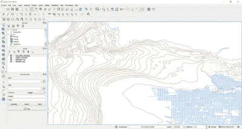

# 激光切割测深图

> 原文：<https://hackaday.com/2015/11/23/laser-cutting-bathymetric-maps/>

水深测量在水下相当于地形学。有了正确的地图数据，你可以制作出一些令人惊叹的 3D 激光切割地图，既展示了陆地，也展示了海底的细节。[Logan]刚刚学会如何做到这一点，并与我们分享他的知识。

[Logan]持有典型的黑客信念:学习东西的最好方法就是开始这个项目，并在进行过程中解决它。这也使他成为帮助他人学习什么不该做的绝佳人选。他的项目目标是创建一个视觉上令人惊叹的温哥华地图，有助于强调海岸外海洋的深度。

为了做到这一点，他从加拿大[渔业和海洋](http://www.charts.gc.ca/data-gestion/bathy/nr-rm-lic-eng.asp)获得了测深数据，从[开放街道地图](https://www.google.ca/url?sa=t&rct=j&q=&esrc=s&source=web&cd=1&cad=rja&uact=8&ved=0ahUKEwiL4sqm-Z7JAhVMkx4KHQfKCwsQFggcMAA&url=https%3A%2F%2Fwww.openstreetmap.org%2F&usg=AFQjCNGHQQ0k_T71PA0hYchKbiPIyaQHeQ&sig2=JJmWVXHBeUFfb3RiGduWgA)获得了城市地图数据，这是一项我们非常熟悉的服务，已经为许多酷的黑客[提供了数据，比如这位跑步者的 GPS 单元](https://hackaday.com/2014/11/23/a-simple-runners-gps-logger/)。现在棘手的部分是合并数据以便激光处理。

 进入 [QGIS](http://www.qgis.org/en/site/) ，一个免费开源的地理信息系统，可以让你编辑和组合地图数据，最棒的部分——导出到. dxf

他对自己的新地图文件感到满意后，就该开始裁剪了。这将是相当乏味的，取决于你决定使用多少细节，但最终结果是非常值得的。

完成后，他还将海洋图层染成蓝色，以增加深度——如果你想变得更有创意，你也可以用染蓝的环氧树脂填充，这样你仍然可以看到细节——但看起来像水！

关于如何制作你的城市的激光切割地图的更多信息，请查看我们去年报道过的另一个项目——非常有趣——也是在温哥华。