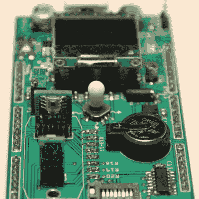

# 地下室生物黑客的基本工具包

> 原文：<https://hackaday.com/2015/11/27/basic-toolkit-for-the-basement-biohacker/>

对于我们报道的大多数黑客来说，找到货源一天比一天容易。敲几下键盘，半打电路板或芯片就装在一个电子包里，从中国送到你家门口，几乎不用花钱。但是如果你热衷于黑客生活，你将会花费大量的时间和金钱来收集必要的工具。除非你从零开始建立自己的迷你基因工程实验室。

采用 Arduino 巨型防护罩的形式，支持酸度计、分光光度计和 PID 控制的热板，[M. Bindhammer]的设计拥有在地下室开始生物黑客所需的仪器的漂亮横截面。由于盾牌搭载在 Arduino 上，所有数据都可以被记录，并且可以根据收集到的数据做出决定。一个例子是当达到某一 pH 值时改变热板的温度。不用照看你的实验对地下室生物黑客来说是一个巨大的福利。

生物黑客即将成为黑客运动中的下一个大事件，而[M. Bindhammer]的设计远非该领域的唯一参与者。从[孵化器](http://hackaday.com/2015/07/25/get-biohacking-with-a-diy-co2-incubator/)到[蠕动泵](http://hackaday.com/2014/09/16/a-3d-printed-peristaltic-pump/)到[盒子里的完整实验室](http://hackaday.com/2015/10/23/amino-wants-to-bring-bioengineering-to-your-workbench/)，改变生命的工具开始达到临界质量。我们迫不及待地想看到这些工具的发展方向。