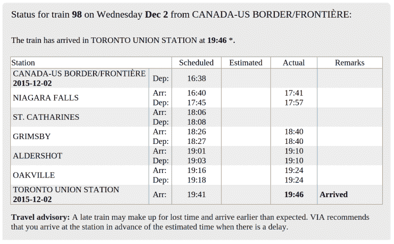

# Via 铁路准时吗？

> 原文：<https://hackaday.com/2015/12/04/is-via-rail-on-time/>

我个人是火车迷。虽然速度慢，但这是一种不错的游览方式。考虑到海岸之间相当大的空间，加拿大不是轨道交通的最佳候选地，但是 Via Rail 确实在温莎和魁北克市之间的走廊上运营定期列车服务。

不幸的是，在加拿大客运铁路不得不让位于商业铁路，这经常造成延误。在注意到一些列车经常晚点后，了解每趟列车的平均表现似乎是有用的。Via 不公开提供这一数据。

然而，它们确实提供了一些关于到达和离开时间的数据。通过浏览 Via Rail 网站的任何浏览器深入研究可用数据，可以查询过去的预定/实际到达数据。结果是 [TrainStats.ca](http://www.trainstats.ca/) ，显示 Via 的准时性能。休息之后，请加入我，我将讨论这一切是如何运作的，以及在购买下一张火车票时如何挑选赢家。

## 获取数据

 Via 确实在他们的[状态页面](http://reservia.viarail.ca/tsi/tsiresult.aspx?l=en&from=iframe)上提供了前一天、当前和第二天的日程数据。这将让我们建立一组旅行数据，但一次只能建立一天。幸运的是，我们可以启动 Chrome 的 inspector 并找到这个 get 请求:

`[http://reservia.viarail.ca/tsi/GetTrainStatus.aspx?l=en&TsiCCode=VIA&TsiTrainNumber=87&DepartureDate=2015-12-01&ArrivalDate=2015-12-01&TrainInstanceDate=2015-12-01&t=1449033500354](http://reservia.viarail.ca/tsi/GetTrainStatus.aspx?l=en&TsiCCode=VIA&TsiTrainNumber=87&DepartureDate=2015-12-01&ArrivalDate=2015-12-01&TrainInstanceDate=2015-12-01&t=1449033500354)`

这里有一些有趣的参数。显然是我们看到的车次。`DepartureDate`是火车离开的日期，`ArrivalDate`是火车到达的时间。`TrainInstanceDate`似乎也被设定为火车离开的日期。考虑到这一点，是时候进入 Python 并使用奇妙的[请求](http://docs.python-requests.org/en/latest/)库来伪造一些请求了。

<template class="js-file-alert-template"></template>