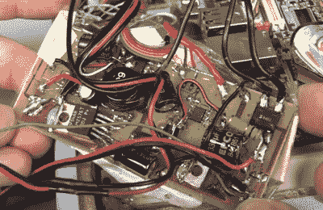

# 本周失败:达夫·琼斯和可怕的平板电脑事件

> 原文：<https://hackaday.com/2015/11/26/fail-of-the-week-dave-jones-and-the-case-of-the-terrible-tablet/>

没有什么比一个沮丧的工程师在他的 YouTube 视频博客频道上的义愤填膺更能给一个安静的下午增添情趣了，尤其是如果这个工程师不是别人，正是达夫·琼斯的话。本周[戴夫]有充分的理由感到不安。一位观众发给他一个看起来毫无特色的 2010 年平板电脑，来自一家名为 Esinomed 的公司。从外面看，它就像一个标准的医疗设备。打开后面板却讲述了一个完全不同的故事。这很可能是[戴夫](和我们)见过的最糟糕的黑客工作。这显然是某种销售演示或贸易展览模型。即使考虑到这一点，这个东西也是失败的。

这款平板电脑基于现成的嵌入式 PC 主板和触摸屏控制器。[Dave]对触摸屏上被黑掉的 USB 连接器有些反感。在这里，我们不得不有点不同意[Dave]的观点，因为视频似乎表明标准的 mini-b 连接器不适合放在平板电脑的外壳中。不过，没有理由将 USB 电缆屏蔽罩盖在裸露的触摸控制器板上。事情从那里开始走下坡路。这款平板电脑的电源最好被描述为一团奇怪的乱麻。而不是使用预制的直流到 DC 转换器，无论是谁建立了这个旋转自己的开关模式电源在家里蚀刻板。蚀刻工作看起来很好，但其他一切，包括焊接工作，都非常糟糕。所有的跳跃和奇怪放置的组件使它看起来像是垃圾箱中的随机板被用来建立这个供应。

有了电池，情况变得更糟。平板电脑上到处都是可怕的手工焊接的镍氢电池。大多数电池显示收缩包装开裂——这是它们过热的明显迹象。从视频中很难看出，但似乎有几个电池的顶部安装了覆盖有焊料的通气孔。这是把简单的充电电池变成管状炸弹的好方法。电池可以安全地手工焊接——在脂肪细胞取代之前，无线电控制建模师已经这样做了几十年。

我们都在最后一刻一起破解了项目；这是我们在 Hackaday 庆祝的事情之一。然而，由于这是一个商业医疗设备(序列号不低于 11)，我们不得不把这个标记为失败。

 [https://www.youtube.com/embed/2o8MDCIlOEk?version=3&rel=1&showsearch=0&showinfo=1&iv_load_policy=1&fs=1&hl=en-US&autohide=2&wmode=transparent](https://www.youtube.com/embed/2o8MDCIlOEk?version=3&rel=1&showsearch=0&showinfo=1&iv_load_policy=1&fs=1&hl=en-US&autohide=2&wmode=transparent)

