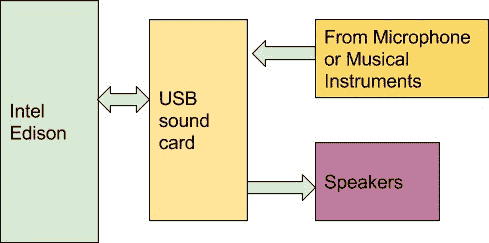

# 英特尔 Edison 上的音频效果

> 原文：<https://hackaday.com/2015/12/02/audio-effects-on-the-intel-edison/>

由于能够运行完整的 Linux 操作系统，英特尔 Edison 主板拥有足够的计算能力来进行实时数字音频处理。[Navin]使用基于 Atom 的模块构建了[效果器](https://navinbhaskar.wordpress.com/2015/11/12/effects-processor-on-intel-edison/):一个数字特效处理器。

Effecter 是用 C 编写的，使用了两个库。英特尔的 [MRAA 库](http://iotdk.intel.com/docs/master/mraa/)提供了访问 Edison 模块 I/O 端口的 API。 [PortAudio](http://www.portaudio.com/) 是用于采集和回放音频样本的库。

 为了允许音频输入和输出，需要声卡。廉价的 USB 声卡可以解决这个问题，因为爱迪生没有内置的音频硬件。爱迪生本身安装在[爱迪生 Arduino 分线板](https://www.arduino.cc/en/ArduinoCertified/IntelEdison)上，并与 Seeed 的 [Grove shield](http://www.seeedstudio.com/wiki/Grove_-_Base_Shield) 结合。使用 Grove 系统，添加了按钮、电位计和 LCD 进行控制。

代码可以在 [Github](https://github.com/navin-bhaskar/Effecter/) 上获得，并且非常容易理解。PortAudio 在需要样本播放时调用 effecter.cc 中的`audioCallback`函数。这个函数从输入缓冲区获取样本，通过一个效果函数运行它们，并将结果样本发送到输出缓冲区。所有的效果代码都可以在“效果”文件夹中找到。

休息后，您可以查看将效果应用到键盘的演示效果器。如果你想自己动手，一个[指令器](http://www.instructables.com/id/Effecter-A-simple-guitar-effects-processor/?ALLSTEPS)会给出所有的步骤。

 [https://www.youtube.com/embed/qJF1BddpQ30?version=3&rel=1&showsearch=0&showinfo=1&iv_load_policy=1&fs=1&hl=en-US&autohide=2&wmode=transparent](https://www.youtube.com/embed/qJF1BddpQ30?version=3&rel=1&showsearch=0&showinfo=1&iv_load_policy=1&fs=1&hl=en-US&autohide=2&wmode=transparent)

