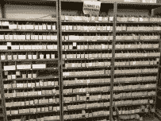
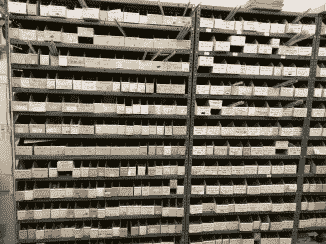
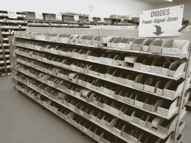
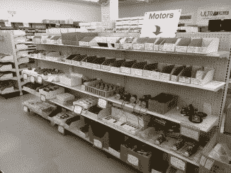
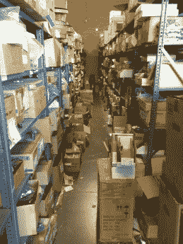
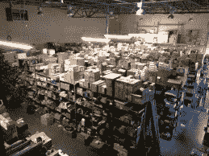
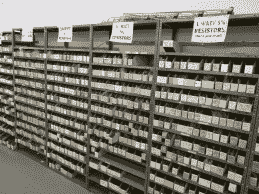
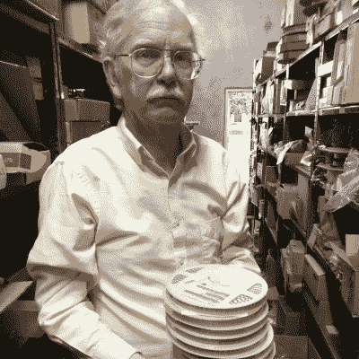
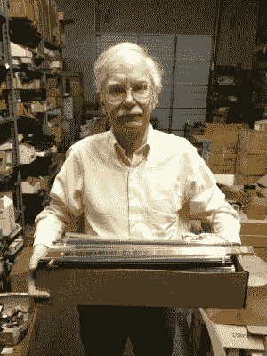

# 过剩的死亡

> 原文：<https://hackaday.com/2015/12/07/the-death-of-surplus/>

我认为达拉斯过剩的电子产品市场是当地制造业的副产品，毕竟我们后院有一些重量级的公司:德州仪器、Maxim(达拉斯半导体)、ST Micro(一度)、Diodes Incorporated。如果我们将半径扩大到包括奥斯汀(3 小时车程)，我们可以列出一个更令人印象深刻的列表，包括:国家仪器公司、飞思卡尔半导体公司，更好的是，我将插入我从这里提取数据的图表:

Texas Electronics Map Source: [Texas.gov](http://gov.texas.gov/files/ecodev/Texas_Electronics_Report.pdf)

当然，并不是所有这些公司都生产硅，甚至在德克萨斯州都有生产设施。盈余的存在并不一定有关系。回到我关于盈余起源的观点。虽然我并没有完全错(这些公司肯定有助于过剩的电子产品市场)，过剩店面的开始可以追溯到第二次世界大战。有人预见到了吗？我也不知道。不管这有没有道理，美国政府在战争结束时会有大量的“东西”要处理掉。

在全国范围内出售政府剩余物资，通常是在空军基地附近。这就是剩余商店这个更广义的概念是如何产生的；再加上 20 世纪 70 年代国内的电子产品制造业，我们有大量的电子产品剩余商店。

## 我的第一手经验

直到看了邦尼工作室的 [啤酒——工作室视频#36，我才真正意识到我当地的电子商店是多么有价值。](https://www.youtube.com/watch?v=Zt7WVF5UfnA) 如果你没有看过视频，你只需要知道危险原型的【伊恩】和安德鲁的【邦尼】黄的【邦尼】正站在【邦尼】在新加坡的工作空间里喝着啤酒，谈论着实验室，那是【邦尼】的生活。你现在和我在一起吗？好的，在视频中有一点，两人讨论了跑到街上买一个只有在新加坡或深圳才有的连接器的能力。让我在这里暂停一下，澄清一下，我不是把我当地的电子产品商店与深圳市场或新加坡的 Sim Lim Tower 进行比较，只是说我也可以在购买之前将零件拿在手中。我也不是危险原型的[布兰登]或安德鲁[布兰登]黄，很明显。

然而，在你去西海岸商店之前，我确实有一个无可匹敌的电子产品可供选择。我和当地商店[坦纳电子公司]的老板[吉姆·坦纳]进行了一次冒险，拍摄了一些零售场所的照片和一些幕后(仓库)镜头，休息后你可以看看。

Storefront Panorama

  32,900 NJM4565 Op Amps  Resistors  Z80 and friends  bound datasheets  74LSXX, 74HCXX, 74CHTXX, etc.  diodes  assorted DC and stepper motors  looking down a row of treasures  warehouse  Resistors of various flavors

## 最后剩下的一个

坦纳电子公司是达拉斯仅有的三家仍在运营的剩余电子商店之一。然而，在 70 年代中期到后期有相当多的:

*   现成的组件
*   EPO(休斯顿工厂仍在运营)
*   电子折扣销售(最近结束)
*   朗杜尔的
*   Electrotex
*   [BG 微](http://www.bgmicro.com)(仍在营业:在线盈余)
*   横幅电视
*   奥尔森电子公司
*   罗克韦尔出口
*   [塔克电子](http://www.tucker.com/)(仍在经营:在线销售测试设备和手册)
*   克拉布特里
*   威尔金森兄弟
*   批发电子产品
*   R&R 电子公司
*   [坦纳电子](http://www.tannerelectronics.com)(仍在营业:零售店面)。

另一个相当受欢迎的是查理·威尔森的 15/磅剩余堆。我不知道这种事情会在达拉斯发生，但听起来确实如此。查理·威尔森会租一辆大卡车，装上多余的电子产品，然后扔到停车场，让顾客仔细检查，然后按磅付款。

自 70 年代初以来，达拉斯还有一种人行道上的拍卖。每个月的第一个星期六，小贩们会在达拉斯市中心集会，出售早期的火腿，但现在已经发展到你可以在跳蚤市场看到的各种各样的商品。大多数小贩都在卖电子产品，但也可以看到流浪的香水摊或名牌假冒服装小贩。小贩们早在周五晚上 9 点就开始摆摊，一直开到周六下午 2 点。我不止一次在半夜去过市区。最难忘的一次是我去拿备用服务器，当我把它搬到车上时，天开始下雨了。现在是凌晨 4 点，我带着一台 2U 的 Dell PowerEdge 在达拉斯市中心跑步(好吧，也许这不是视觉上令人愉快的一大步，但这是我用那么大的机器所能做的一切努力)。是的，你可以在凌晨 4 点在达拉斯的一座桥下买一台服务器没问题，因为今天是这个月的第一个星期六，而且你有现金。

## 购物盈余

【吉姆·坦纳】在他的仓库里，他向每一个询问 SMD 零件的人打听，他总是回答:“我们没有任何表面贴装零件。”

走进这些商店与我们已经习惯的网上订购零件截然不同。他们是多余的商店，他们只有多余的商品出售。那是什么意思？这意味着你可以买到任何数量的商品，而这些商品在你下次来商店时可能已经没有了。事实上，你可以买一个马达或马达组件，但再也找不到了。你也有可能永远找不到关于发动机的数据，我知道你在想什么:“我的谷歌搜索引擎很强大。我能找到别人找不到的零件和数据。”是的，我也是这么想的，但事实是，其中一些零件是为特定设计定制的，即使打电话给制造商也没有任何数据。

然而，该系统产生了同等程度的优势。剩余商店以极低的价格获得零件和组件，这意味着我们可以从商店购买它们，价格比其他人要求的相同产品低几个数量级。

德州仪器也有定期拍卖，在那里你可以买到任何东西，从部件到电机组件到测试设备。在这些拍卖会上，你唯一找不到的东西就是标有“德州仪器”的东西。

## 适应生存

显然，自 70 年代以来，国内电子产品制造业已经几次从一个大陆转移到另一个大陆。这使得主要与过剩供应商打交道的商店面临关门的严重危险。随着剩余油井的枯竭，情况不得不发生变化。以前，您只能购买作为剩余产品出售给商店的电阻值，现在，您可以购买各种额定功率的任何通用电阻值的电阻器，以及各种材料的通用电阻值的电容器。

最初是通过填充电阻值来满足客户需求，现在是专为爱好者打造的展示柜和货架。Arduino 和 Raspberry Pi 兼容的小部分可以在 Makezine 的当前版本中找到，不用太费力。然而，敏锐的眼睛会发现微控制器显示器后面有一排标有“Z80A”、“Z80B”、“Z80 DMA”、“Z80 PIO”、“1 兆 D-RAM”的盒子。它距离最初的 7400 系列只有几行之遥，不要与 74LS、74HC、74HCT、ALS 或 4000 系列 CMOS 相混淆，它们都可以在柜台后面的通孔封装中找到，并按件出售。

## 与老前辈谈论生意

【吉姆的】末日藏匿=他接触过的每一管 TTL IC。

作为一名电子工程专业的大四学生，我每天都会接触到相当多的信息，其中大部分我都记不住(我的教授不读这些，是吗？).但是在[坦纳的]我受制于来自老前辈的无与伦比的信息。我并不是说你应该辍学去观看 YouTube，而是有一种通过分享经验获得的教育，这是你在教室里找不到的。如果你不相信我，去[狂看【Bil Herd】视频](http://hackaday.com/2015/05/28/from-gates-to-fpgas-part-1-basic-logic/)告诉我这是不是和读教科书一样。或者，如果你有一百万个小时的空闲时间，打开[达夫·琼斯]的 YouTube 频道，看看它和《电路 101》课程相比如何。

前面提到的两个人有一群书呆子追随者是有原因的，当你仍然有数据手册，你不能用一句“好的，谷歌…”来回答模糊的问题时，他们就在你身边。我提到他们只是因为你肯定知道他们是谁，但是请放心，在你附近也有能力相似的人。这些老兵将大量的信息记在了记忆中，当店面关闭时，这是我们失去的一种资源。

过剩的商店正在消失。但最大的损失不是库存的可用性，而是文化的损失。如果你不知道在你所在的地区哪里可以找到它们，那就从寻找当地的业余无线电或复古计算俱乐部开始。如果你能激励你所在地区的本地人才，在问他们“嘿，什么是曲线跟踪器？”之后，让他们坐下来，探索他们的缓存。相信我，你正在进行一场不会很快忘记的谈话。