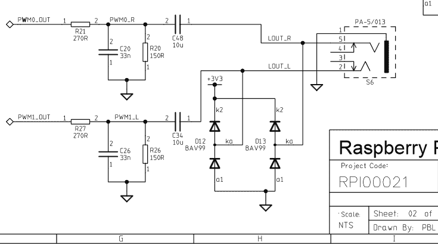

# 将 Pi 零点上的 GPIO 引脚交换为音频

> 原文：<https://hackaday.com/2015/12/05/swapping-gpio-pins-on-the-pi-zero-for-audio/>

新的 Raspberry Pi Zero 引发了很多讨论，尤其是“他们为什么不包括…？”一个具体的抱怨是音频只能通过 HDMI 端口获得。正如 Adafruit 的 Ada 女士指出的那样，这并不完全正确。

关于整个 Pi 系列，需要记住的是 Broadcom 处理器上的引脚是多用途的。它增加了困惑还是能力？你挑吧。但是关键的好处是[不同的引脚可以处理相同的目的](http://elinux.org/RPi_BCM2835_GPIOs)。对于音频，大于零的 pi(GTZPi)使用处理器 GPIO 引脚 40 和 45 上的 PWM0_OUT 和 PWM1_OUT。在 GRZPis 上，这些为一个二极管、电阻和电容网络供电，网络端接音频输出插孔。它们没有出现在 GPIO 连接器上，所以不能在 Zero 上使用。

Broadcom 处理器[的多引脚、多用途功能允许您将](https://www.raspberrypi.org/documentation/configuration/pin-configuration.md) PWM0_OUT 切换到 GPIO 18，将 PWM1_OUT 切换到 GPIO 13 或 19。从 Adafruit 笔记中添加网络，或者从 Raspberry Pi 网站查看这个[示意图——请看第二页的右下角。](https://www.raspberrypi.org/documentation/hardware/raspberrypi/schematics/Raspberry-Pi-Rev-2.0-Model-AB-Schematics.pdf)

当你在 Adafruit 查看音频时，通读介绍树莓派 Zero 的整个。Ada 女士提供了一个很好的关于零的描述，以及开始使用它需要什么。

如果你在寻找零黑客的想法，你可以查看我们关于零黑客的公告中的评论或者我们收到的关于 T2 第一次黑客攻击的文章。这里面有很多适合黑客磨的谷物。